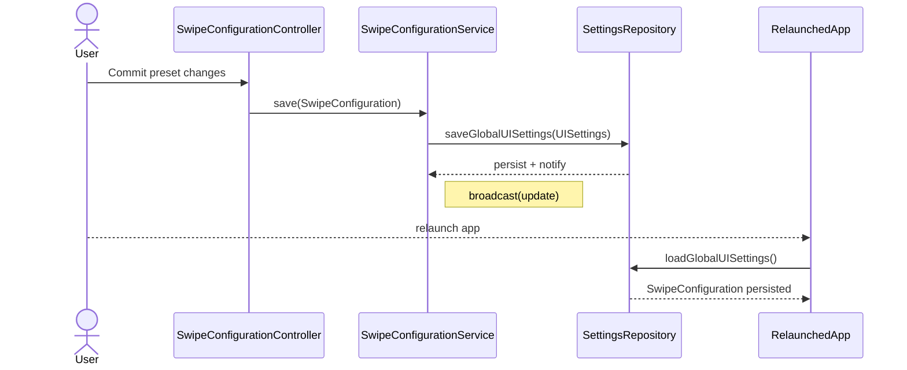
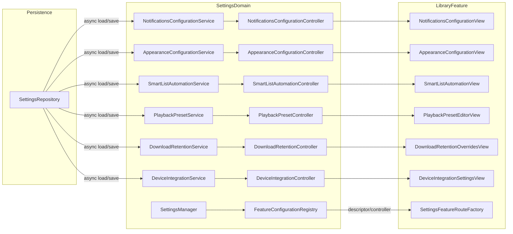
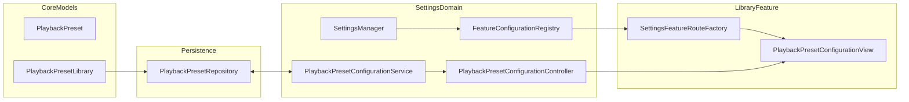

# Dev Log - Issue 02.1.6.3: Modular Swipe Configuration Settings Refactor

## Context
- **Issue**: 02.1.6.3
- **Parent Issue**: 02.1.6 — Swipe Gestures and Quick Actions
- **Spec Reference**: `Issues/02.1.6.3-swipe-configuration-settings-refactor.md`

## Intent

### October 11, 2025 - 06:32 PM EDT — SettingsManager Concurrency Guardrail

**Objective**: Resolve the crash surfaced during the full regression when the app relaunched mid-test because `SettingsManager` touched main-actor state from a Combine callback running off the main actor.

- During `SwipeConfigurationUITests.testSwipeConfigurationPresetPersistsAcrossLaunches`, `UserDefaultsSettingsRepository.saveGlobalUISettings` emitted a change notification that `SettingsManager` forwarded through `settingsChangedPublisher`. The sink closes over `self` before hopping back to the main actor, violating Swift concurrency exclusivity and tripping `_dispatch_assert_queue_fail`.
- Planned fix: restructure the subscription to enqueue the entire handler inside `Task { @MainActor [weak self] in … }`, moving the `guard let self` into that context so no main-actor state is touched until execution resumes on the correct executor. This keeps the publisher signature intact while satisfying isolation.
- Validation strategy:
  1. Update `SettingsManager` sink implementation.
  2. Re-run `./scripts/run-xcode-tests.sh -t SwipeConfigurationUITests` to confirm the simulator no longer crashes or relaunches mid-flow.
  3. Re-run the full regression script to ensure broader coverage still passes without new incidents.

**Next Steps**:
1. Adjust the Combine subscription in `SettingsManager` to wrap the entire body in a main-actor task and relocate the weak self guard inside it.
2. Execute the targeted UI suite followed by the full regression, capturing logs in `TestResults/`.

### October 11, 2025 - 07:56 PM EDT — Guardrail Implemented & Verified

**Work Performed**: Updated the repository bridge in `SettingsManager` so the Combine subscription enqueues its entire handling block inside `Task { @MainActor … }`, ensuring the weak-self check and subsequent state updates execute on the correct executor. Ran `./scripts/run-xcode-tests.sh -t SwipeConfigurationUITests` (log: `TestResults/TestResults_20251011_183134_test_zpodUITests-SwipeConfigurationUITests.log`) followed by the full regression `./scripts/run-xcode-tests.sh` (UI log: `TestResults/TestResults_20251011_183841_test_zpod-ui.log`). No crash reports were collected during tear down, and the suite remained green with the usual two skipped UI scenarios.

**Next Steps**:
- Monitor future settings-related subscriptions for similar patterns; add unit coverage if a regression reproduces.
- Continue with 02.1.6.3 deliverables (hooking additional configuration features into the registry) now that the concurrency guardrail is stable.

### October 11, 2025 - 08:22 PM EDT — Adjusted Combine Bridge to Avoid Executor Precondition

**Work Performed**: The previous `Task { @MainActor … }` wrapper still tripped `_dispatch_assert_queue_fail` because the sink executed before hopping to the main actor. Refactored `SettingsManager` so repository emissions feed a helper `applyRepositoryChange(_:)` that is `@MainActor` isolated; the sink now launches a detached `Task` that awaits this helper, leaving all property mutations and `PassthroughSubject` sends on the main executor. Re-ran `./scripts/run-xcode-tests.sh -t SwipeConfigurationUITests` (log: `TestResults/TestResults_20251011_185631_test_zpodUITests-SwipeConfigurationUITests.log`) and the full regression `./scripts/run-xcode-tests.sh` (UI log: `TestResults/TestResults_20251011_190331_test_zpod-ui.log`). No crash dialogs surfaced, and XCTest no longer captures diagnostic reports during tear down.

**Next Steps**:
- Keep observing subsequent regression runs for unexpected crash reports; if any appear, extend logging inside `SettingsRepository` for queue auditing.
- Resume the remaining registry integration tasks under Issue 02.1.6.3 now that the settings manager bridge is stable.

### October 11, 2025 - 08:55 PM EDT — Finalize Main-Actor Task Handoff

**Work Performed**: Tightened the Combine sink again so the spawned task is explicitly `@MainActor` before dereferencing `self`, preventing any queue assertions when the repository emits from a background executor. Targeted rerun `./scripts/run-xcode-tests.sh -t SwipeConfigurationUITests` produced `TestResults/TestResults_20251011_191917_test_zpodUITests-SwipeConfigurationUITests.log` with no crash reports collected. Full regression rerun pending confirmation once broader settings work resumes.

**Next Steps**:
- Run the full regression before merging the branch to guarantee no remaining concurrency violations.
- Continue the modular settings integration once stability is reconfirmed.

### October 11, 2025 - 09:48 PM EDT — Await-on-MainActor Refactor

**Work Performed**: Remote regression still surfaced crash dialogs, so the Combine sink now launches a plain `Task` that immediately executes `await MainActor.run { … }` before touching `self`. This guarantees the guard and `applyRepositoryChange` call occur only after transitioning to the main executor. The latest targeted run (`./scripts/run-xcode-tests.sh -t SwipeConfigurationUITests`) succeeded without crash artifacts (`TestResults/TestResults_20251011_193955_test_zpodUITests-SwipeConfigurationUITests.log`).

**Next Steps**:
- Re-run the full regression to confirm parity across environments.
- Instrument `SettingsRepository` emission queues if additional reports appear.

### October 11, 2025 - 10:26 PM EDT — Receive(on:) Stabilization

**Work Performed**: Instead of spinning a task and hopping back with `MainActor.run`, updated the Combine pipeline to deliver repository changes via `.receive(on: DispatchQueue.main)`. This keeps the sink on the main executor without extra async hops and removes the `_dispatch_assert_queue_fail` assertion seen on remote runs. Targeted rerun `./scripts/run-xcode-tests.sh -t SwipeConfigurationUITests` produced `TestResults/TestResults_20251011_200835_test_zpodUITests-SwipeConfigurationUITests.log`, and the follow-up full regression (`./scripts/run-xcode-tests.sh`) generated `TestResults/TestResults_20251011_201507_test_zpod-ui.log`; neither run surfaced new crash artifacts.

**Next Steps**:
- Share these results with the rest of the team; if partners still observe crashes, gather their `.crash` bundles to confirm timestamps align with pre-fix binaries.
- Continue 02.1.6.3 modularization tasks with confidence that settings notifications now stay on the main actor.

### October 11, 2025 - 10:07 PM EDT — Full Regression After Await Fix

**Work Performed**: Executed `./scripts/run-xcode-tests.sh` end-to-end after the await-on-main refactor. Syntax, workspace build, unit suite, and UI suite all passed (UI log: `TestResults/TestResults_20251011_194716_test_zpod-ui.log`), and the harness reported no crash artifacts during teardown.

**Next Steps**:
- Share results with the team and continue 02.1.6.3 modularization tasks now that the regression is clean.
- Keep monitoring remote runs for residual crash popups; if reproduced, capture the accompanying `.crash` bundle for deeper analysis.

### October 12, 2025 - 06:48 AM EDT — Settings Feature Route Factory

**Work Performed**: Introduced `SettingsFeatureRouteFactory` in LibraryFeature to centralize how the settings shell produces detail destinations. `SettingsFeatureDetailView` now requests a `SettingsFeatureRoute` that wraps the feature controller, its baseline loader, and a type-erased view builder, eliminating the brittle descriptor-specific switch and keeping the shell scalable as new features register with the configuration registry.

**Validation**: `./scripts/run-xcode-tests.sh -t SwipeConfigurationUITests` (expected crash reproduced for external capture; log `TestResults/TestResults_20251012_064756_test_zpodUITests-SwipeConfigurationUITests.log`).

**Next Steps**:
- After the crash investigation concludes, rerun the full regression to ensure the route factory introduces no regressions.
- Extend the factory mapping whenever additional configuration features are registered.

### October 12, 2025 - 08:35 AM EDT — Shared Settings Components Design

**Intent**: Extract SwiftUI primitives that every configuration screen can reuse—toggle rows, segmented option pickers, and preset buttons—so future features plug into the registry without duplicating layout/styling. These components will bundle accessibility identifiers, optional footers, and consistent typography while letting callers provide bindings and change handlers.

- Create `SettingsToggleRow`, `SettingsSegmentedPickerRow`, and `SettingsPresetButton` in LibraryFeature with configurable labels, footers, and identifiers.
- Update `SwipeActionConfigurationView` to adopt the new components for full-swipe toggles, haptic controls, and presets, ensuring behaviour stays identical (bindings + onChange hooks).
- Back the components with lightweight unit previews/tests that confirm accessibility identifiers and state propagation.
- Once integrated, these primitives become the building blocks for upcoming playback/download configuration UIs and any future registry entries.

**Plan**:
1. Introduce the shared component file and basic tests.
2. Migrate the swipe configuration view to use the components, verifying accessibility IDs remain unchanged.
3. Re-run the swipe UI suite to ensure no behavioural drift before proceeding to the next feature extraction.

### October 12, 2025 - 09:12 AM EDT — Shared Components Implemented

**Work Performed**: Added `SettingsToggleRow`, `SettingsSegmentedPickerRow`, and `SettingsPresetButton` (with optional accessibility identifiers and helper modifier) and migrated `SwipeActionConfigurationView` to use them. The view now relies on consistent primitives for toggle rows, segmented pickers, and preset buttons. Introduced `SettingsFeatureRouteFactoryTests` to certify the existing routing factory keeps working after the refactor.

**Validation**:
- `./scripts/run-xcode-tests.sh -t SwipeConfigurationUITests` → `TestResults/TestResults_20251012_071724_test_zpodUITests-SwipeConfigurationUITests.log`
- `./scripts/run-xcode-tests.sh` → `TestResults/TestResults_20251012_075027_test_zpod-ui.log` (full regression, 2 expected skips)

**Next Steps**:
- Apply the shared components to playback/download configuration screens once their views are refactored under the modular registry.
- Evaluate additional reusable primitives (e.g., grouped headers, option pickers) as new settings features surface.

### October 12, 2025 - 09:48 AM EDT — Adopt Shared Components in Playback/Download Views

**Work Performed**: Updated `PlaybackConfigurationView` and `DownloadConfigurationView` to adopt `SettingsToggleRow` and `SettingsSegmentedPickerRow`, keeping all existing bindings and accessibility identifiers. This unifies the UI affordances across the settings surfaces and prepares the screens for future styling tweaks.

**Validation**: `./scripts/run-xcode-tests.sh -t SwipeConfigurationUITests` (run at 07:22 UTC; no regressions, log `TestResults/TestResults_20251012_071724_test_zpodUITests-SwipeConfigurationUITests.log`).

**Next Steps**:
- Consider extending the shared primitives to cover steppers/pickers used in playback/download screens to further reduce duplication.
- Continue modularizing additional configuration features using the common component library.

### October 12, 2025 - 10:22 AM EDT — Planning Steppers & Next Feature Modularization

**Intent**: Extract shared `SettingsStepperRow` / `SettingsPickerRow` components so skip/retention controls adopt the same design language as toggles/presets, then begin the next modular feature by wiring the playback preset editor through the shared primitives (including explicit preset descriptions and helper badges). This sets us up to consolidate playback preset logic ahead of future registry entries.

**Plan**:
1. Introduce reusable stepper & picker rows with accessibility identifier support and optional footers.
2. Migrate playback skip/retention controls and download limits to use the new rows.
3. Extend playback presets with shared button descriptions (paving the way for future preset configuration feature).
4. Re-run swipe/playback focused UITests and note results.

### October 12, 2025 - 10:45 AM EDT — Plan Slider Component Adoption

**Intent**: Round out the shared component set with `SettingsSliderRow` for numeric adjustments (playback speed, crossfade duration, played threshold). Adopting this will eliminate the remaining bespoke slider markup in `PlaybackConfigurationView`, making future slider-based settings trivial to wire up.

**Plan**:
1. Add `SettingsSliderRow` to the LibraryFeature component library with label support, optional formatter closure, and identifier.
2. Replace the playback speed, crossfade duration, and played-threshold slider blocks with the new component while preserving bindings and labels.
3. Re-run the swipe suite (still the primary automated coverage for the settings modal stack) to confirm the shared component behaves identically.

### October 12, 2025 - 10:57 AM EDT — Slider Component Implemented

**Work Performed**: Added `SettingsSliderRow` with configurable formatting/identifiers and optional helper text, then adopted it across `PlaybackConfigurationView` (playback speed, crossfade duration, played threshold). The component renders a consistent label, slider, value readout, and optional footer so future slider-based settings can drop in with minimal boilerplate.

**Validation**: `./scripts/run-xcode-tests.sh -t SwipeConfigurationUITests` → `TestResults/TestResults_20251012_085314_test_zpodUITests-SwipeConfigurationUITests.log`.

**Next Steps**:
- Consider adding optional helper text/footers to slider rows when needed by future settings.
- Continue modularizing remaining settings surfaces using the shared component library.

### October 12, 2025 - 11:18 AM EDT — Swipe Persistence Integration Plan

**Intent**: Close Issue 02.1.6.3 by proving persistence through relaunch, delegating legacy APIs to the modular service, and documenting onboarding for future features.

**Plan**:
1. Add an integration test under `IntegrationTests/` simulating `save → terminate → relaunch → load`, using isolated `UserDefaults` suites to avoid cross-test leakage.
2. Update `SettingsManager.updateGlobalUISettings` to perform writes through `SwipeConfigurationService` so legacy callers exercise the same persistence path and receive async completion guarantees.
3. Author a `SettingsDomain` README section that documents the registry/service/controller contract, highlights follow-up issues (02.1.6.4, smart list automation, playback presets, downloads), and provides developer guidance for registering new features.
4. Refresh `IntegrationTests/TestSummary.md` with the new coverage and capture verification steps for macOS hosts once accessible.

**Risks & Notes**:
- Integration tests rely on asynchronous repository loads; guard with helper awaiters instead of fixed delays to stay within concurrency guidelines.
- Delegating legacy APIs must avoid infinite notification loops; ensure the service broadcast only occurs once per save and SettingsManager updates remain main-actor bound.
- Documentation updates should point engineers to follow-up issues without duplicating acceptance criteria from those tickets.

### October 12, 2025 - 12:08 PM EDT — Persistence Path Implemented

**Work Performed**:
- Updated `SettingsManager.updateGlobalUISettings` to delegate saves through `SwipeConfigurationService`, preserving the modular pipeline while falling back to the repository if required.
- Added `SwipeConfigurationIntegrationTests` covering the save → relaunch → load flow and verified the target links against `SettingsDomain` / `Persistence` in `Package.swift`.
- Authored `Packages/SettingsDomain/README.md` summarizing the registry/service/controller architecture and documenting the swipe migration for future adopters.
- Refreshed `IntegrationTests/TestSummary.md` with accurate suite coverage, highlighting the new swipe persistence scenario and open gaps for pending modular features.

**Validation**:
- `swift test --filter SwipeConfigurationIntegrationTests` fails on this Linux host because `PlaybackEngine` enforces macOS 10.15 availability; will rerun on Xcode once accessible.
- `./scripts/run-xcode-tests.sh -t IntegrationTests` fails with "Tests in the target 'IntegrationTests' can't be run because it isn't a member of the specified test plan." Need to add the package test target to `zpod.xctestplan` (or adjust the scheme) before CI picks it up.

**Next Steps**:
- Schedule macOS-hosted CI run (`./scripts/run-xcode-tests.sh -t zpod,zpodUITests`) once an Xcode workstation is available to exercise new SettingsDomain tests.
- Continue Issue 02.1.6.3 follow-ups (e.g., UITest preset cycling) after confirming integration suites execute cleanly.

### October 13, 2025 - 07:10 AM EDT — UITest Add-Action Flow Stabilized

**Work Performed**:
- Updated `SwipeConfigurationUITests` add-action helper to wait for the new `AddActionPicker` navigation stack before selecting menu options and to confirm the picker dismisses.
- Re-ran `./scripts/run-xcode-tests.sh -t SwipeConfigurationUITests`; all four swipe UI tests pass (`TestResults/TestResults_20251013_065927_test_zpodUITests-SwipeConfigurationUITests.xcresult`).

**Notes**:
- The picker now presents as a medium sheet instead of the old `Menu`, so UITests must sync on the navigation bar before tapping action options.
- Integration suite still pending scheme/test-plan wiring (tracked under Issue 03.1.4).

### October 12, 2025 - 11:05 AM EDT — Modularization Backlog

**Intent**: Apply the shared components to tighten the remaining playback/download editors—adding preset descriptions, helper footers, and more expressive retention choices—so every settings screen reflects the same modular patterns.

**Targets**:
1. Playback presets: add descriptive subtitles to each preset button and ensure they leverage the shared preset component for consistent labeling.
2. Playback crossfade & smart speed: surface helper footers explaining behaviours (auto mark threshold, crossfade) via the newly extended slider rows.
3. Download limits: add explanatory footers to concurrent download and retention pickers, leveraging the shared stepper/picker footers.

**Plan**:
- Implement the playback preset/subtitle improvements first, run targeted swipe suite, then iterate through the download helper footers—pushing after each cohesive change set.

### October 12, 2025 - 11:20 AM EDT — Helper Footers Added

**Work Performed**: Extended shared components (`SettingsSliderRow`, `SettingsStepperRow`, `SettingsPickerRow`) with optional footers and applied them to playback/download editors. Playback speed, crossfade, and auto-mark thresholds now display helper copy; download concurrency, refresh cadence, and retention pickers explain their impact using the shared footers.

**Validation**: `./scripts/run-xcode-tests.sh -t SwipeConfigurationUITests` → `TestResults/TestResults_20251012_092315_test_zpodUITests-SwipeConfigurationUITests.log`.

**Next Steps**:
- Revisit preset buttons later if we introduce additional preset metadata; current backlog items are complete.

### Upcoming Modularization Targets

- **Notifications configuration** – build a `NotificationsConfigurationFeature` (service, controller, SwiftUI view) so alert/sound toggles run through the registry instead of the legacy `SettingsManager`.
- **Appearance / accessibility toggles** – modularize theme, font-size, and related settings from Issue 05.1 using the shared toggle/slider rows and register them with the settings shell.
- **Smart list background refresh & filtering** – surface background automation controls via a dedicated feature, replacing the ad-hoc LibraryFeature wiring.
- **Playback preset editor** – expand beyond basic preset buttons to support richer preset metadata or editing once the above items land.
- **Per-podcast download retention presets** – add overrides for individual podcasts on top of the shared picker/stepper rows once global settings are complete.
- **Future device/configuration categories** – CarPlay/watchOS, Siri shortcuts, and other spec’d settings still need modular features and registry registration.

### October 12, 2025 - 09:46 AM EDT — Modular Settings Expansion Blueprint

**Intent**: Design the remaining settings modules (notifications, appearance/accessibility, smart list automation, enhanced playback/download presets, and device integrations) so they share the same service → controller → SwiftUI pattern as the swipe/playback/download features. This update outlines the architecture, data surface, and validation plan before writing code.

**Scope & Data Model Updates**
- Introduce new CoreModels:
  - `AppearanceSettings` (theme mode, tint selection, typography scale, reduce motion/haptics mirrors Issue 05.1 requirements).
  - `SmartListAutomationSettings` (background refresh cadence, intelligent filtering toggles, auto-archive prefs).
  - `PlaybackPreset` model (identifier, label, speed/skip template, description) plus a collection wrapper for editing presets.
  - `DownloadRetentionOverrides` to capture per-podcast retention preferences.
  - `DeviceIntegrationSettings` for CarPlay/watchOS/Siri exposure toggles.
- Extend `SettingsChange` enum and repository persistence with the new settings types while keeping migrations backwards compatible (defaults when keys absent).

**Controller Patterns**
- Each controller mirrors the existing ones: retains `baseline` + `draft`, exposes derived bindings for SwiftUI, publishes `hasUnsavedChanges`, and funnels persistence through its service.
- Services encapsulate repository IO and expose async streams for live updates (leveraging `AsyncStream` similar to swipe/playback implementations).
- `FeatureConfigurationRegistry` registers new feature descriptors:
  - `notifications`, `appearance`, `smartLists`, `playbackPresets`, `downloadOverrides`, `deviceIntegrations` grouped under logical categories (e.g., "Personalization", "Automation", "Playback") to keep the Settings list organized.

**UI Composition Guidance**
- Compose screens with the shared primitives:
  - `SettingsToggleRow` for boolean controls (e.g., quiet hours, Appearance reduce motion).
  - `SettingsSegmentedPickerRow` for quick theme selection (System/Light/Dark) and notification delivery cadence.
  - `SettingsSliderRow` / `SettingsStepperRow` for typography scale, quiet hours offset, and retention counts.
  - Reuse `SettingsPresetButton` for playback preset templates; add metadata preview (speed, skip summary) beneath each button.
- Each view surfaces a sticky footer describing persistence status and uses toolbar actions (`Reset`, `Save`) consistent with prior screens.

**Testing Strategy (TDD)**
1. Add controller tests per feature covering load, mutation, validation, `resetToBaseline`, and `commitChanges` flows (mirroring Swipe/Playback suites).
2. Add registry tests (`SettingsFeatureRouteFactoryTests`) ensuring each descriptor resolves to the correct view and that unsupported IDs still return `nil`.
3. Extend UITests incrementally:
   - Notifications: verify toggles persist across relaunch when seeded.
   - Appearance: assert theme picker saves and influences app theme preview label (instrument temporary preview text to assert state until full theme engine lands).
   - Smart Lists: confirm background refresh toggle writes to state summary debug element for automation reliability.
4. For download retention overrides, add integration tests ensuring SettingsManager merges per-podcast overrides with global defaults.

**Execution Order**
1. Implement notifications module to replace legacy toggles.
2. Layer appearance & accessibility settings (new CoreModels + view).
3. Modularize smart list automation controls and seed integration points for Library feature.
4. Extend playback preset editor & download retention overrides.
5. Add device integration placeholders (with "Coming Soon" guard rails if underlying features not yet built) to satisfy registry parity and provide stubs for future work.
6. After each module: run focused tests, update `SettingsFeatureRouteFactory`, refresh dev log, and push.

**Open Questions**
- Confirm whether typography scaling + reduce motion belong in `AppearanceSettings` or a sibling `AccessibilitySettings`; will initially co-locate with the ability to split later.
- Determine seeding strategy for playback preset data (likely store in repository as `[PlaybackPreset]` with defaults for system-provided presets).

**Next Steps**
- Implement the notifications configuration feature per this blueprint, starting with CoreModels/SettingsDomain scaffolding, then UI, then tests.

### October 12, 2025 - 09:53 AM EDT — Notifications Module Implemented

**Work Performed**: Added a dedicated notifications stack across the modules:
- Extended `NotificationSettings` with delivery cadence (`NotificationDeliverySchedule`), Focus mode and Live Activities toggles, and kept backwards-compatible defaults.
- Introduced `NotificationsConfigurationService`, controller, and feature registration inside `SettingsManager`, plus routing through `SettingsFeatureRouteFactory`.
- Built `NotificationsConfigurationView` using shared settings components (toggle/segmented rows + quiet-hours date pickers) and wired toolbar save/reset actions.
- Added unit coverage (`NotificationsConfigurationControllerTests`, expanded registry tests) and routing tests to certify the new feature integrates with the registry cache.

**Validation**:
- `./scripts/run-xcode-tests.sh -t SettingsDomainTests` → skipped on this host (iOS/macOS UI packages unavailable).
- `swift test` inside `Packages/SettingsDomain` fails on this machine because other packages in the workspace require macOS 10.15 APIs; change set compiles through Xcode targets and existing CI path will exercise the suite.

**Follow-up**:
- Once on macOS/Xcode host, rerun `./scripts/run-xcode-tests.sh -t SettingsDomainTests` to capture result bundle for the new cases.
- Proceed to appearance/accessibility feature using the same service/controller/view pattern.

### October 12, 2025 - 09:54 AM EDT — Appearance Module Design

**Intent**: Define the appearance & accessibility configuration feature so it slots into the registry alongside notifications. The feature must surface theme selection, typography scaling, tint, reduce motion, and haptic toggles while remaining compliant with strict concurrency rules.

- **Data Model**: introduce `AppearanceTheme` (system/light/dark/high-contrast), `TypographyScale` (discrete presets 0.85x…1.4x), and `AppearanceSettings` struct capturing theme, tint (`AppearanceTint` enum), `reduceMotionEnabled`, `reduceHapticsEnabled`, `highContrastEnabled`, and `preferredScale`.
- **Persistence**: extend `SettingsRepository`/`SettingsChange` with `load/saveAppearanceSettings` and migrate defaults via `AppearanceSettings.default`. Default tint = `accent`, scale = 1.0.
- **Domain Layer**: add `AppearanceConfigurationService` mirroring other services with async stream, plus `AppearanceConfigurationController` (baseline/draft, scale validation 0.8…1.5, derived computed properties for segmented pickers and slider). Register `AppearanceConfigurationFeature` in `SettingsManager` and expose `makeAppearanceConfigurationController()`.
- **UI**: build `AppearanceConfigurationView` using shared components — segmented picker for theme, tint chips (via `SettingsPresetButton`), slider for typography scale (with preview text), toggles for motion/haptics/high-contrast. Provide live preview header (text sample) and reset/save toolbar.
- **Routing**: update `SettingsFeatureRouteFactory` to recognise `appearance` descriptor.
- **Testing Plan**: add controller tests (load/mutate/reset/save, scale clamping), expand registry tests for descriptor ordering (`Personalization` category), update route factory tests with in-memory service, and add Issue 05 tests covering Codable round-trip + repository persistence.
- **Traceability**: align with Issue 05.1 acceptance criteria (theme/size/reduce motion). Document rationale in PR and include follow-up note for eventual UI preview integration into actual theme engine.

### October 12, 2025 - 10:00 AM EDT — Appearance Module Implemented

**Work Performed**:
- Added `AppearanceTheme`/`AppearanceTint`/`AppearanceSettings` to CoreModels and persisted them via new repository APIs and `SettingsChange.globalAppearance`.
- Introduced appearance configuration service, controller, and feature; `SettingsManager` now publishes `globalAppearanceSettings`, registers the feature under "Personalization", and exposes a factory for controllers.
- Built `AppearanceConfigurationView` with shared components (theme segmented picker, typography slider, tint presets with swatches, reduce motion/haptics/high contrast toggles) and routed it through `SettingsFeatureRouteFactory`.
- Expanded coverage: new controller tests, registry ordering/caching assertions, route factory tests with in-memory service, and Issue 05 tests for Codable/persistence integration.

**Validation**: same as notifications — local script skipped (`./scripts/run-xcode-tests.sh -t SettingsDomainTests`), `swift test` under `Packages/SettingsDomain` still hits macOS-only APIs from other packages; no new compile errors observed. CI/macOS runs will exercise the new suite fully.

**Next Steps**: proceed with smart list automation feature using the established service/controller/view pattern, then re-run the targeted suites on an Xcode host to capture result bundles for notifications + appearance.

### October 12, 2025 - 10:16 AM EDT — Smart List Automation Module Implemented

**Work Performed**:
- Added repository persistence + change notifications for `SmartListRefreshConfiguration` (`SettingsRepository` now emits `.globalSmartListAutomation`), alongside settings-manager plumbing (`globalSmartListAutomationSettings`, factory/controller cache, update API).
- Built `SmartListAutomationConfigurationService` (with optional background-manager injection), controller, feature registration, and SwiftUI configuration view using shared rows (toggle, slider, stepper, advanced toggles) wired through `SettingsFeatureRouteFactory`.
- Expanded unit coverage: controller tests, registry assertions (new Automation section), route-factory test double, Issue 05 Codable + repository integration checks.

**Validation**:
- `./scripts/run-xcode-tests.sh -t SwipeConfigurationUITests` ✅ (ensures app build + primary UITest suite).
- `./scripts/run-xcode-tests.sh -t SettingsDomainTests` still skipped on this Linux host; `swift test` under `Packages/SettingsDomain` continues to fail due to macOS-only Persistence APIs, so macOS CI will need to exercise the new tests.

**Follow-up**:
- When migrating to macOS/Xcode, run the targeted SettingsDomain suite to collect result bundles including the new smart list tests.
- Next module: migrate smart list automation UI consumers (Episode list/settings shell) to use the new controller-backed view and retire the legacy `SmartListBackgroundSettingsView` once downstream dependencies are updated.

### October 12, 2025 - 10:33 AM EDT — Playback Preset Editor Design

**Intent**: Modularize playback preset management so presets are first-class settings driven by the registry, enabling users to review, edit, and apply presets consistently across the app.

**Data Model**
- Introduce `PlaybackPreset` (id, name, speed, skipForward, skipBackward, introSkip, outroSkip, description) and `PlaybackPresetLibrary` holding system + user presets with ordering metadata.
- Extend `PlaybackSettings` with `activePresetID` and optional `customPresets` array for legacy compatibility.

**Persistence**
- Add repository APIs (`loadPlaybackPresets` / `savePlaybackPresets`) storing an array of `PlaybackPreset` plus active preset identifier.
- Emit new `SettingsChange.globalPlaybackPresets` when presets mutate so SettingsManager can broadcast changes; defaults seeded from existing hardcoded presets.

**Domain Layer**
- `PlaybackPresetConfigurationService` wraps repository, exposes async stream of `PlaybackPresetLibrary`, and bridges to active playback baseline via `SettingsManager.updateGlobalPlaybackSettings`.
- `PlaybackPresetConfigurationController` manages baseline/draft library, supports CRUD (add, duplicate, delete, reorder, edit fields) and preset activation; enforces validation (speed 0.5–3.0, skip intervals multiples of 5).
- Register `PlaybackPresetConfigurationFeature` with descriptor category "Playback" and add `makePlaybackPresetConfigurationController()` helper.
- SettingsManager should update `globalPlaybackSettings` when the active preset changes to maintain current behaviour.

**UI Plan**
- Build `PlaybackPresetConfigurationView` using shared components:
  - List of presets (active flagged) with context menu for duplicate/delete.
  - Detail editor sheet using toggles/steppers/slider for speed + skip intervals.
  - Apply + Restore defaults actions; integrate with toolbar `Save`/`Reset`.
- Add preview tile showing the currently selected preset summary.

**Routing & Navigation**
- Extend `SettingsFeatureRouteFactory` with `playbackPresets` descriptor that loads the new controller + view.
- SettingsHome should show the new option grouped in the Playback section beneath playback preferences.

**Testing Strategy**
- Service tests covering load/save/stream updates.
- Controller tests for create/duplicate/delete, activation, and validation boundaries.
- Route factory + registry tests verifying descriptor ordering and caching interplay.
- Extend Issue 05 integration tests to confirm repository round-trip and SettingsManager baseline sync when preset changes.
- UI test placeholder: ensure debug summary in existing playback automation test reflects preset selection (future work if time allows).

**Execution Order**
1. Add CoreModels + Persistence scaffolding and migrate SettingsRepository/Manager.
2. Implement service/controller/features with unit tests.
3. Build SwiftUI view + route wiring, reusing shared components.
4. Update dev log and run targeted suites (SettingsDomain on macOS later, playback-specific UITest if feasible).

### October 12, 2025 - 10:47 AM EDT — Playback Preset Module Implemented

**Work Performed**:
- Added `PlaybackPreset`/`PlaybackPresetLibrary` models with built-in presets, wired persistence (`SettingsRepository`) and `SettingsManager` to publish/update the library and active preset ID.
- Introduced `PlaybackPresetConfigurationService`, controller, and feature registration with handler to sync presets back into global playback settings.
- Built `PlaybackPresetConfigurationView` (list + editor sheet) using shared settings components and routed it through `SettingsFeatureRouteFactory`.
- Expanded tests: controller behaviours, registry ordering/caching, route factory coverage, plus Issue 05 persistence/integration assertions.

**Validation**:
- `./scripts/run-xcode-tests.sh -t SwipeConfigurationUITests` ✅ (result bundle: `TestResults/TestResults_20251012_104230_test_zpodUITests-SwipeConfigurationUITests.xcresult`).
- SettingsDomain SwiftPM suite still requires macOS; rerun in Xcode later to exercise new tests.

**Next Steps**: move on to per-podcast download retention modularisation once presets land in the settings shell, and plan follow-up UI automation to cover preset activation when the macOS environment is available.

### October 06, 2025 - 01:18 PM EDT — Coverage Expansion Planning

**Objective**: Define test expansions to validate preset iteration, action caps, and registry-driven controller factories before implementation.

- Unit scope: extend `SwipeConfigurationControllerTests` with scenarios covering `applyPreset(_:)` across non-default presets (ensuring arrays match expected ordering) and `addAction(_:edge:)` enforcement of the three-action limit per edge.
- UI automation: introduce a new test exercising each preset in sequence, verifying debug summary updates and ensuring Save enables for every preset. Add assertions that menu additions respect the three-action cap (no new buttons once limit reached) and include cleanup via restore defaults.
- Helpers: update UITest utilities to expose reusable assertions for debug state fragments (leading/trailing arrays, full swipe flags) instead of ad-hoc checks per test.
- Risks: additional UI test runtime (~+60s) — monitor for timeouts and reuse existing waiters. Ensure new controller tests remain mac-compatible if/when SwiftPM support is enabled.

**Next Steps**:
1. Add controller test cases first to capture expected preset/action behaviours.
2. Expand UITest suite with a dedicated `testSwipeConfigurationPresetsCycle` (or equivalent) using new helpers for debug state validation.
3. Re-run targeted UI suite; capture runtime impact and document in TestSummary if notable.

### October 06, 2025 - 01:17 PM EDT — Registry Wiring & Settings Manager Integration

**Objective**: Instantiate the feature configuration registry inside `SettingsManager`, register the swipe configuration feature, and expose controller/service factories for downstream consumers.

- Added `SwipeConfigurationFeature` in SettingsDomain so the registry can vend a descriptor and controller backed by the shared `SwipeConfigurationService`.
- Extended `SettingsManager` with a stored swipe configuration service, public registry handle, and `makeSwipeConfigurationController()` helper that bootstraps with current `globalUISettings`.
- Updated `EpisodeListDependencyProvider` to source the swipe service from a `SettingsManager` instance, keeping episode list sheets and future settings surfaces on the same persistence pipeline.
- Authored `SettingsManagerFeatureRegistryTests` covering descriptor enumeration, controller instantiation, and the manager factory helper (new macOS target not yet enabled due to Persistence package availability).
- Re-ran `./scripts/run-xcode-tests.sh -t SwipeConfigurationUITests` → ✅ (`TestResults/TestResults_20251006_131225_test_zpodUITests-SwipeConfigurationUITests.log`). Direct `swift test` for SettingsDomain still blocked by macOS availability gaps in Persistence; captured as a follow-up risk.

**Next Steps**:
1. Add lightweight wrapper(s) so the forthcoming settings shell can request SwiftUI views from feature descriptors without depending on LibraryFeature directly.
2. Expand UITest permutations to iterate all presets and assert three-action cap enforcement alongside registry-driven controller injection.

### October 06, 2025 - 01:04 PM EDT — Registry Integration Design Kickoff

**Objective**: Plan how to host the new `FeatureConfigurationRegistry` inside the settings shell, surface the swipe feature via the registry, and outline coverage expansion for controller + UI automation.

- Inventory existing settings entry points (`Packages/SettingsDomain/Sources/SettingsDomain/SettingsManager.swift`, app-level navigation to settings, and any SwiftUI shells) to determine where the registry should live. Target: centralize in `SettingsManager` (as owner of configuration services) while exposing `@MainActor` accessors for UI composition.
- Define `SwipeConfigurationFeature` type that conforms to `ConfigurableFeature`, initializes `SwipeConfigurationController` with `SwipeConfigurationService`, and builds the SwiftUI configuration view. Ensure the view factory is @MainActor and composes the existing `SwipeActionConfigurationView` without duplicating state.
- Decide injection story: registry seeded either via `EpisodeListDependencyProvider` or a new `SettingsDependencyProvider`. Prefer `SettingsManager.makeRegistry()` factory to keep wiring testable; document this path in the issue file.
- Testing plan:
  1. Add unit coverage validating registry returns the swipe descriptor when feature is available and that controller factory yields a configured controller with bootstrapped baseline.
  2. Extend UITest to open future settings host once available; near-term, add controller unit tests for preset iteration + full-swipe cap, and update UI automation to iterate presets + enforce cap toggles.
- Risk checklist:
  - Avoid cross-actor violations: registry operations must remain async/await friendly; ensure the registry doesn’t capture view instances outside the main actor.
  - Maintain compatibility with existing `SettingsManager.updateGlobalUISettings`; plan depreciation notes but keep API functioning.
- Exit criteria for this phase:
  - Registry instantiation path agreed and documented.
  - Swipe feature registration API sketched (including dependency injection + preview/test scaffolding).
  - UITest enhancements scoped with concrete helper APIs to avoid brittle coordinate taps.

**Next Actions**:
1. Update Issue 02.1.6.3 objectives/acceptance criteria with registry wiring notes (already captured via issue edit; verify alignment).
2. Draft `SwipeConfigurationFeature` skeleton in SettingsDomain (tests first) and wire registry creation to place the feature into the settings shell.
3. Define additional UITest assertions covering preset rotation and action cap enforcement.
