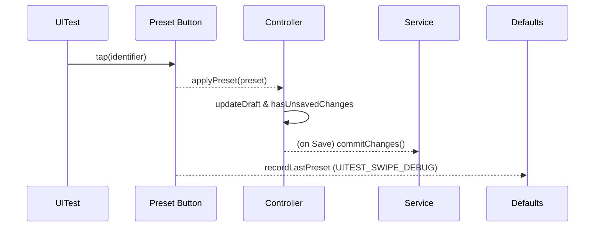

# Dev Log - Issue 02.1.6.4: Swipe Configuration Preset Automation

## Context
- **Issue**: 02.1.6.4
- **Parent Issue**: 02.1.6 — Swipe Gestures and Quick Actions
- **Spec Reference**: `Issues/02.1.6.4-swipe-configuration-preset-automation.md`

## Intent

### October 10, 2025 - 12:13 PM EDT — Kickoff & Diagnostic Plan

**Objective**: Restore UITest coverage for swipe presets by confirming persisted state survives relaunch and making the preset controls fully automatable.

- Review existing UITest artifacts (`TestResults/TestResults_20251006_123242_test_zpodUITests-SwipeConfigurationUITests.log` and latest runs) to pinpoint where the UI stops mutating state and whether relaunch resets configuration.
- Instrument `SwipeConfigurationController` and related views with structured logging (temporary `Logger.swipeConfigurationUITest`) to capture edge assignments, full-swipe flags, and baseline resets during tests.
- Validate that `restoreDefaultConfiguration()` flushes to persistence before sheet dismissal; add view-model assertions if UI automation remains flaky.
- Decide between launch argument resets or explicit test harness helpers for deterministic starting state before each scenario.

**Next Steps**:
1. Audit failing UITest to capture actual controller state before/after relaunch, documenting findings in this log and the spec.
2. Adjust the swipe configuration UI so preset buttons and toggles respond reliably under XCTest (prefer standard SwiftUI controls over coordinate workarounds).
3. Once interactions stabilize, re-run `./scripts/run-xcode-tests.sh -t SwipeConfigurationUITests` and update `TestSummary.md` with coverage notes and remaining risks.

### October 10, 2025 - 12:28 PM EDT — Preset Accessibility Investigation

**Findings**
- Current UITest loop still records `nil` from `consumePresetTapIdentifier()`, forcing manual action scaffolding despite tap attempts.
- `SwipeActionConfigurationView.presetRow` wraps a plain SwiftUI `Button`; XCTest resolves the identifier but reports `isHittable == false` in recent transcripts, suggesting the row never receives the activation event.
- The debug hook that writes `SwipeActions.Debug.LastPreset` is hidden behind `#if DEBUG`, so even successful taps under a Release-style build would not be observable in UITests.

**Hypotheses**
1. The plain button inside `ScrollView`/`LazyVStack` lacks an explicit hit target, so UIKit rejects automation taps; adding an overlay `contentShape` plus `.accessibilityAddTraits(.isButton)` may not be enough without a `List`/`Form` row semantics.
2. The `#if DEBUG` guard prevents persistence of preset taps inside UITests; removing the compile-time guard and relying on a runtime environment flag would unblock state verification.

**Plan**
1. Replace the preset rows with `List`-style `Button`s that advertise a tappable row (using `List` + `Section` or a custom `ButtonRole` wrapper), guaranteeing the automation tap triggers the action.
2. Drop the compile-time `#if DEBUG` around the debug defaults writer; guard it with `debugEnabled` instead so UI tests can observe taps in any build configuration.
3. Update UITests to remove the manual fallback/`XCTExpectFailure`, rely on the debug summary + recorded preset, and assert that `Save` enables immediately.
4. Add a focused controller unit test for `applyPreset` ensuring `hasUnsavedChanges` flips and `draft` matches the preset payload.

### October 10, 2025 - 01:21 PM EDT — UI wiring + test pass

**Changes**
- Replaced the swipe configuration `ScrollView` with an inset-grouped `List`, ensuring preset rows render as true list buttons and preserving debug instrumentation via a non-interactive overlay.
- Removed the context `Menu` for adding swipe actions; the sheet now pushes a `NavigationStack` picker so each candidate action receives a stable accessibility identifier (`SwipeActions.Add.<Edge>.<Name>`).
- Guarded preset taps by scrolling the sheet before waiting (`ensureVisibleInSheet`) and moved the Save-button wait after visibility to avoid `List` virtualization gaps.
- Extended controller unit coverage to assert full-swipe and haptic flags while keeping UI debug writers behind the runtime launch flag.

**Tests**
- `./scripts/run-xcode-tests.sh -t SwipeConfigurationUITests/testSwipeConfigurationPresetCycleCoversAllPresets` ✅
- `./scripts/run-xcode-tests.sh -t SwipeConfigurationUITests/testSwipeConfigurationAddActionRespectsCap` ✅
- `./scripts/run-xcode-tests.sh -t SwipeConfigurationUITests` ✅ → `TestResults/TestResults_20251010_131343_test_zpodUITests-SwipeConfigurationUITests.log`
- `./scripts/run-xcode-tests.sh -t SettingsDomainTests` ⚠️ skipped (package still lacks macOS host support)

**Next Focus**
- Trim the `TestResults/` directory back to the most recent artifacts once review wraps.
- Refresh `TestSummary/zpodUITests/TestSummary.md` to document the new preset/add-action coverage and note the SettingsDomain macOS gap.

### October 10, 2025 - 03:45 PM EDT — Regression sweep & artifact pruning

**Actions**
- Pruned legacy result bundles in `TestResults/`, keeping the most recent three runs per scenario (preset cycle, add-action cap, full suite, etc.).
- Ran the full regression helper `./scripts/run-xcode-tests.sh`; unit/UI suites passed and SwiftLint reported only existing length warnings. All SwiftPM package builds remain skipped on this host (missing macOS runtimes).
- Captured fresh logs for syntax, build, unit, UI, and lint steps (timestamps `20251010_1530xx` and `20251010_154520`).

**Follow-up**
- Monitor the new SwipeConfiguration UITest durations (~7 min total) and consider parallelization if additional scenarios are added.
- Investigate macOS host enablement for package tests once Issue 03.1.4 (settings domain macOS support) is in flight.
