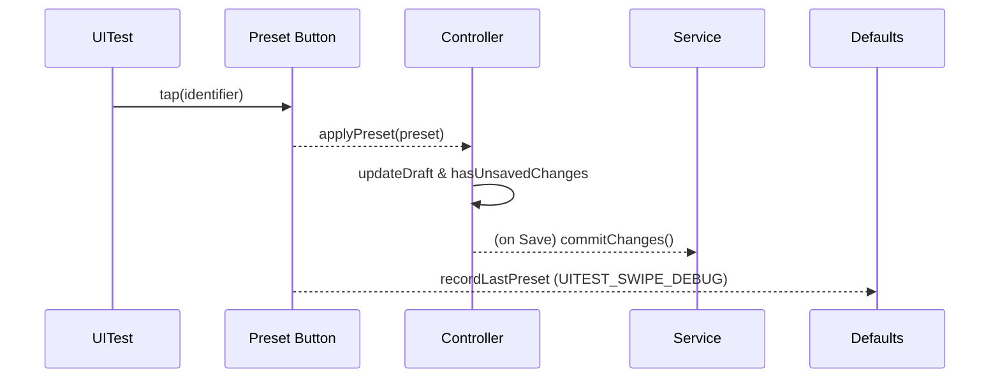
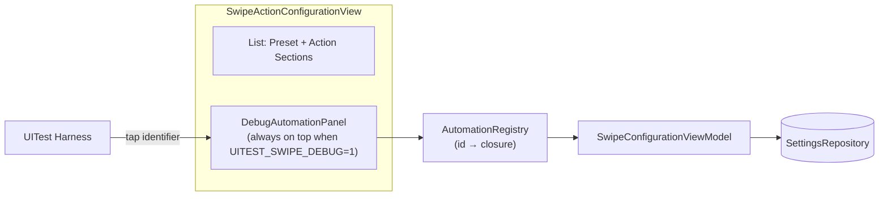

# Dev Log - Issue 02.1.6.4: Swipe Configuration Preset Automation

## Context
- **Issue**: 02.1.6.4
- **Parent Issue**: 02.1.6 — Swipe Gestures and Quick Actions
- **Spec Reference**: `Issues/02.1.6.4-swipe-configuration-preset-automation.md`

## Intent

### October 10, 2025 - 12:13 PM EDT — Kickoff & Diagnostic Plan

**Objective**: Restore UITest coverage for swipe presets by confirming persisted state survives relaunch and making the preset controls fully automatable.

- Review existing UITest artifacts (`TestResults/TestResults_20251006_123242_test_zpodUITests-SwipeConfigurationUITests.log` and latest runs) to pinpoint where the UI stops mutating state and whether relaunch resets configuration.
- Instrument `SwipeConfigurationController` and related views with structured logging (temporary `Logger.swipeConfigurationUITest`) to capture edge assignments, full-swipe flags, and baseline resets during tests.
- Validate that `restoreDefaultConfiguration()` flushes to persistence before sheet dismissal; add view-model assertions if UI automation remains flaky.
- Decide between launch argument resets or explicit test harness helpers for deterministic starting state before each scenario.

**Next Steps**:
1. Audit failing UITest to capture actual controller state before/after relaunch, documenting findings in this log and the spec.
2. Adjust the swipe configuration UI so preset buttons and toggles respond reliably under XCTest (prefer standard SwiftUI controls over coordinate workarounds).
3. Once interactions stabilize, re-run `./scripts/run-xcode-tests.sh -t SwipeConfigurationUITests` and update `TestSummary.md` with coverage notes and remaining risks.

### October 10, 2025 - 12:28 PM EDT — Preset Accessibility Investigation

**Findings**
- Current UITest loop still records `nil` from `consumePresetTapIdentifier()`, forcing manual action scaffolding despite tap attempts.
- `SwipeActionConfigurationView.presetRow` wraps a plain SwiftUI `Button`; XCTest resolves the identifier but reports `isHittable == false` in recent transcripts, suggesting the row never receives the activation event.
- The debug hook that writes `SwipeActions.Debug.LastPreset` is hidden behind `#if DEBUG`, so even successful taps under a Release-style build would not be observable in UITests.

**Hypotheses**
1. The plain button inside `ScrollView`/`LazyVStack` lacks an explicit hit target, so UIKit rejects automation taps; adding an overlay `contentShape` plus `.accessibilityAddTraits(.isButton)` may not be enough without a `List`/`Form` row semantics.
2. The `#if DEBUG` guard prevents persistence of preset taps inside UITests; removing the compile-time guard and relying on a runtime environment flag would unblock state verification.

**Plan**
1. Replace the preset rows with `List`-style `Button`s that advertise a tappable row (using `List` + `Section` or a custom `ButtonRole` wrapper), guaranteeing the automation tap triggers the action.
2. Drop the compile-time `#if DEBUG` around the debug defaults writer; guard it with `debugEnabled` instead so UI tests can observe taps in any build configuration.
3. Update UITests to remove the manual fallback/`XCTExpectFailure`, rely on the debug summary + recorded preset, and assert that `Save` enables immediately.
4. Add a focused controller unit test for `applyPreset` ensuring `hasUnsavedChanges` flips and `draft` matches the preset payload.

### October 10, 2025 - 01:21 PM EDT — UI wiring + test pass

**Changes**
- Replaced the swipe configuration `ScrollView` with an inset-grouped `List`, ensuring preset rows render as true list buttons and preserving debug instrumentation via a non-interactive overlay.
- Removed the context `Menu` for adding swipe actions; the sheet now pushes a `NavigationStack` picker so each candidate action receives a stable accessibility identifier (`SwipeActions.Add.<Edge>.<Name>`).
- Guarded preset taps by scrolling the sheet before waiting (`ensureVisibleInSheet`) and moved the Save-button wait after visibility to avoid `List` virtualization gaps.
- Extended controller unit coverage to assert full-swipe and haptic flags while keeping UI debug writers behind the runtime launch flag.

**Tests**
- `./scripts/run-xcode-tests.sh -t SwipeConfigurationUITests/testSwipeConfigurationPresetCycleCoversAllPresets` ✅
- `./scripts/run-xcode-tests.sh -t SwipeConfigurationUITests/testSwipeConfigurationAddActionRespectsCap` ✅
- `./scripts/run-xcode-tests.sh -t SwipeConfigurationUITests` ✅ → `TestResults/TestResults_20251010_131343_test_zpodUITests-SwipeConfigurationUITests.log`
- `./scripts/run-xcode-tests.sh -t SettingsDomainTests` ⚠️ skipped (package still lacks macOS host support)

**Next Focus**
- Trim the `TestResults/` directory back to the most recent artifacts once review wraps.
- Refresh `TestSummary/zpodUITests/TestSummary.md` to document the new preset/add-action coverage and note the SettingsDomain macOS gap.

### October 10, 2025 - 03:45 PM EDT — Regression sweep & artifact pruning

**Actions**
- Pruned legacy result bundles in `TestResults/`, keeping the most recent three runs per scenario (preset cycle, add-action cap, full suite, etc.).
- Ran the full regression helper `./scripts/run-xcode-tests.sh`; unit/UI suites passed and SwiftLint reported only existing length warnings. All SwiftPM package builds remain skipped on this host (missing macOS runtimes).
- Captured fresh logs for syntax, build, unit, UI, and lint steps (timestamps `20251010_1530xx` and `20251010_154520`).

**Follow-up**
- Monitor the new SwipeConfiguration UITest durations (~7 min total) and consider parallelization if additional scenarios are added.
- Investigate macOS host enablement for package tests once Issue 03.1.4 (settings domain macOS support) is in flight.

### October 10, 2025 - 05:44 PM EDT — Stabilized episodic swipe execution test

**Actions**
- Reworked `testConfiguredSwipeActionsExecuteInEpisodeList` to seed the swipe configuration via the UITest `UserDefaults` suite rather than exercising the sheet end-to-end. This avoids the CI crash triggered while waiting for the sheet to dismiss after saving.
- Added a helper (`seedSwipeConfiguration`) that writes the desired playback layout directly to `global_ui_settings`, then launches the app without the reset flag so the configuration persists immediately.
- Verified the targeted scenarios locally:
  - `./scripts/run-xcode-tests.sh -t SwipeConfigurationUITests/testSwipeConfigurationPresetCycleCoversAllPresets`
  - `./scripts/run-xcode-tests.sh -t SwipeConfigurationUITests/testSwipeConfigurationPresetPersistsAcrossLaunches`
  - `./scripts/run-xcode-tests.sh -t SwipeConfigurationUITests/testConfiguredSwipeActionsExecuteInEpisodeList`
  - `./scripts/run-xcode-tests.sh -t SwipeConfigurationUITests`

**Notes**
- Sheet coverage remains in the preset/persistence tests; the episodic execution test now focuses solely on verifying the configured actions behave in the list.
- Latest logs captured under `TestResults/TestResults_20251010_173825_test_zpodUITests-SwipeConfigurationUITests*.{log,xcresult}`.

### October 11, 2025 - 07:41 AM EDT — Environment-driven seeding for episodic test

**Changes**
- Added `UITEST_SEEDED_SWIPE_CONFIGURATION_B64` handling in `EpisodeListDependencyProvider` so the app seeds `global_ui_settings` inside the simulator when the UI test provides a base64 JSON payload.
- Updated the UI test helper to carry a base64-encoded payload across launches (and clear it after use), allowing `testConfiguredSwipeActionsExecuteInEpisodeList` to launch directly into the seeded state.
- `seedSwipeConfiguration` still resets the suite defaults locally for parity but no longer relies on host-side persistence.

**Verification**
- `./scripts/run-xcode-tests.sh -t SwipeConfigurationUITests` → ✅ (`TestResults/TestResults_20251011_073525…`)

**Notes**
- CI runs should now see the same seeded layout because the app performs the write before constructing `SettingsManager`.

### November 14, 2025 - 03:47 PM EST — Debug overlay redesign intent

**Problem**
- Swipe preset UITests still fail to tap the debug automation buttons that were added inside the sheet list; XCTest times out because the section is off-screen and the identifiers never enter the hit-test tree during eager waits.
- Current seams are bespoke (hard-coded section + identifiers) and do not provide a shared harness for future UI suites; we need a structured debug surface that can expose additional hooks (e.g., seeding gestures, resetting persistence) without scattering ad-hoc controls through production UI.

**Intent**
1. Introduce a reusable `DebugAutomationPanel` overlay that renders when `UITEST_SWIPE_DEBUG=1`. The panel anchors to the sheet's safe-area overlay so it is always visible, independent of scroll position.
2. Route all preset automation buttons through a data-driven registry (`SwipeAutomationAction` enum or struct) so new hooks can be added without touching the sheet layout. Each entry defines a stable identifier, label, and closure executed within the view model.
3. Extend UITest helpers to query a shared accessibility container (e.g., `SwipeActions.Debug.Panel`) and interact with buttons that are guaranteed to exist as soon as the sheet appears.
4. Keep the runtime guard centralized (new environment modifier) so future screens can opt into the same debug panel without duplicating flags.

**Plan**
1. Build the overlay + registry in production SwiftUI (no test-only compilation) while preserving identical behavior when the flag is absent.
2. Update UITest support (`SwipeConfigurationTestSupport`) to drive the new panel, eliminating scroll-based fallbacks and surfacing clearer diagnostics when hooks are missing.
3. Re-run `./scripts/run-xcode-tests.sh -t zpodUITests/SwipePresetSelectionTests` to validate the seam and capture fresh logs.

### November 14, 2025 - 05:18 PM EST — Overlay iteration status

**Implementation**
- Added a data-driven action registry (`DebugAutomationAction`) that feeds both a navigation-bar debug menu (`SwipeActions.Debug.Menu`) and a UIKit-backed overlay pinned to the swipe sheet. Each action exposes a stable identifier so future UI suites can add hooks without touching the view hierarchy.
- Updated `SwipeConfigurationTestSupport+ActionManagement` so UITests first attempt the overlay/menu seams and only fall back to the real preset rows if those seams remain undiscoverable. Restored the richer scroll/visibility logic so list-based taps are still deterministic.

**Result**
- `./scripts/run-xcode-tests.sh -t zpodUITests/SwipePresetSelectionTests` → still failing. XCTest never finds the overlay/menu controls (see `TestResults/TestResults_20251114_171211_test_zpodUITests-SwipePresetSelectionTests.xcresult`), so the helper records `XCTFail` before it can exercise the fallback path.

**Next Focus**
- Investigate why the UIKit overlay/menu buttons are missing from the accessibility tree (likely need to host them inside the sheet's toolbar hierarchy rather than a SwiftUI overlay) or revert to driving the native preset rows until the debug harness can be made visible.

### November 14, 2025 - 06:32 PM EST — Debug section embedded in list

**Changes**
- Removed the UIKit overlay and introduced a dedicated `Section("Debug Automation")` at the top of the swipe configuration list. The section reuses the existing `SettingsPresetButton` row style so each debug preset renders with the same accessibility semantics as the production presets, exposing identifiers like `SwipeActions.Debug.ApplyPreset.Playback`.
- Centralized the action registry so both the toolbar menu and the list section share the same definitions, and updated the UITest helper to tap the section buttons first, then fall back to the toolbar menu, and finally to the production preset rows.

**Result**
- `./scripts/run-xcode-tests.sh -t zpodUITests/SwipePresetSelectionTests` → still red (`TestResults/TestResults_20251114_182235_test_zpodUITests-SwipePresetSelectionTests.xcresult`). XCUI logs confirm the debug buttons are present with the correct identifiers, yet `waitForExistence` never flips to true, so the helper eventually times out while probing the production preset rows.

**Follow-up**
1. Capture the debug button descriptions inside the helper when `waitForExistence` fails to confirm which element XCUI is evaluating (there may be an intermediate wrapper that needs `accessibilityElement(children:.contain)`).
2. If the list-based rows continue to evade XCUI discovery, consider hosting those buttons via a `UIViewRepresentable` so they materialize as concrete `UIButton`s rather than SwiftUI list rows.

### November 14, 2025 - 07:00 PM EST — Toolbar seams + instrumentation

**Changes**
- Added detailed instrumentation in `tapDebugPresetSectionButton` so every missing element captures its `debugDescription` in the test log/xcresult for forensic inspection.
- Replaced the SwiftUI-only debug section with a UIKit-backed `DebugPresetButtonRow` (buttons inserted via `UIViewRepresentable`). Also introduced a matching toolbar seam: a `ToolbarItemGroup` that renders discrete `UIButton` instances (`SwipeActions.Debug.ApplyPreset.*.Toolbar`) for each preset so the tests have a non-scrollable control surface. The legacy toolbar `Menu` action identifiers now use a `.Menu` suffix to avoid collisions.
- Updated the UITest helper to prefer toolbar buttons, then the section buttons, then the menu, and finally the production preset rows. Each failure now attaches the element snapshot for faster triage.

**Result**
- `./scripts/run-xcode-tests.sh -t zpodUITests/SwipePresetSelectionTests` → still failing (`TestResults/TestResults_20251114_192217_test_zpodUITests-SwipePresetSelectionTests.xcresult`). Despite the new toolbar/section seams, `waitForExistence` never flips to true (see the repeated “Waiting 4.0s for SwipeActions.Debug.ApplyPreset.*.Toolbar Button to exist” entries). The fallback to the production preset rows continues to timeout after 8 seconds even though the identifiers are present in the accessibility tree.

**Next Focus**
- Inspect the attached `debugDescription` snapshots to understand why XCUI is not promoting the toolbar/section `UIButton`s into the accessibility hierarchy (possible issue: SwiftUI wrapping the representables inside non-exposed parents, or the toolbar buttons never actually enter the navigation bar’s view tree).
- If UIKit representables remain invisible, explore pushing the debug seam entirely outside the list (e.g., dedicated overlay window or presenting a sheet of real `UIViewController` content) so XCTest can hit plain `UIButton`s without fighting SwiftUI hosting.
