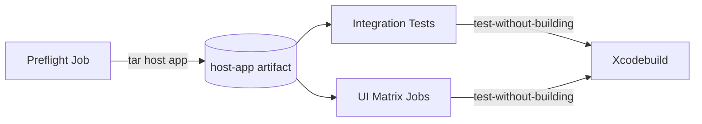

# Dev Log: Issue 02.2.3 - DefaultEpisodeFilterService Slimming

## Issue
DefaultEpisodeFilterService was a 700+ line monolithic actor with a `// swiftlint:disable type_body_length` suppression, making it difficult to maintain and test. The goal was to decompose it into smaller, composable, Sendable collaborators while maintaining backward compatibility.

## Implementation Approach

### Architecture Decision
Instead of splitting the actor into multiple actors (which would complicate isolation), I extracted the business logic into **Sendable value types (structs)** that can be safely called across actor boundaries. This approach:
- Avoids actor isolation complexity
- Allows `nonisolated` methods in DefaultEpisodeFilterService
- Makes helpers independently testable
- Maintains thread-safety through immutability

### Helper Services Created

1. **EpisodeSortService** (86 lines)
   - Handles all episode sorting logic
   - Implements all `EpisodeSortBy` cases
   - Contains helper methods for status value calculations
   - Pure functions with no state

2. **EpisodeFilterEvaluator** (64 lines)
   - Evaluates filter conditions against episodes
   - Applies filter logic (AND/OR)
   - Handles archived episode exclusion
   - Stateless evaluation logic

3. **EpisodeSearchHelper** (55 lines)
   - Basic text search matching
   - Title and description searching
   - Integrates with filter and sort services
   - Minimal, focused responsibility

4. **AdvancedSearchEvaluator** (258 lines)
   - Advanced search with scoring and highlighting
   - Boolean operator support (AND/OR/NOT)
   - Field-specific search (title, description, podcast, etc.)
   - Context snippet generation
   - Most complex helper but still well-scoped

5. **SmartListRuleEvaluator** (211 lines)
   - Evaluates smart list rules
   - Supports all rule types (playStatus, downloadStatus, dates, numbers, strings, booleans)
   - Handles nested rule logic
   - Comparison operators (equals, contains, before, after, etc.)

### Refactored DefaultEpisodeFilterService (147 lines)
- Maintains the same public API
- Delegates to helper services
- Private helper instances (all Sendable)
- All methods remain `nonisolated` for easy consumption
- **No SwiftLint suppression needed!**

## Results

### Line Count Reduction
- **Before**: 700 lines (exceeding 500-line warning threshold)
- **After**: 147 lines (71% below threshold!)
- **Total code**: ~820 lines across 6 files (better organized)

### File Structure
```
CoreModels/Sources/CoreModels/
├── EpisodeFilterService.swift (147 lines) - Protocol + DefaultImplementation
├── EpisodeSortService.swift (86 lines)
├── EpisodeFilterEvaluator.swift (64 lines)
├── EpisodeSearchHelper.swift (55 lines)
├── AdvancedSearchEvaluator.swift (258 lines)
└── SmartListRuleEvaluator.swift (211 lines)
```

### Testing
- Added `EpisodeSortServiceTests` (7 tests covering all sort criteria)
- Added `EpisodeFilterEvaluatorTests` (9 tests covering conditions, negation, AND/OR logic)
- All 254 CoreModelsTests pass
- Existing consumers (LibraryFeature, SmartEpisodeListViewModel) unaffected

### Bonus Fixes
Fixed cross-platform compatibility issue in `SmartEpisodeListRules.swift`:
- Replaced `DateComponentsFormatter` (unavailable in swift-corelibs-foundation)
- Used existing `TimeInterval.abbreviatedDescription()` extension instead

## Concurrency Safety

All helpers are:
- `Sendable` structs (value types)
- Immutable (no mutable state)
- Safe to use across actor boundaries
- Can be stored in actors as `let` properties

DefaultEpisodeFilterService remains an actor but all methods are `nonisolated` because they delegate to stateless helpers.

## Backward Compatibility

✅ **Zero API changes**
- EpisodeFilterService protocol unchanged
- DefaultEpisodeFilterService public API identical
- All consumers continue to work without modification
- Dependency injection still supported (protocol-based)

## Future Considerations

1. **Additional Tests**: Could add tests for AdvancedSearchEvaluator and SmartListRuleEvaluator
2. **Performance**: Helpers are value types, so there's minimal overhead
3. **Maintenance**: Each helper is now independently testable and modifiable
4. **Documentation**: Could add more inline comments for complex search scoring logic

## Lessons Learned

1. **Value types over actors for stateless logic**: When the logic doesn't need to maintain state, Sendable structs are simpler than actors
2. **Composition over inheritance**: Breaking monoliths into focused helpers improves testability
3. **Keep the public API stable**: Internal refactoring shouldn't break consumers
4. **Test incrementally**: Adding tests for each helper during extraction catches issues early

## Timestamp
Completed: 2025-10-29 20:15 ET

## Related Issues
- Issue 02.2.2: EpisodeListViewModel Modularization (coordinate to avoid duplication)
- Issue 02.2: Oversized Type Refactors (parent tracking issue)

## 2025-10-29 20:33 ET – CI Flake Investigation Kickoff
- Goal: understand the last two GitHub Actions runs for branch `copilot/slim-default-episode-filter-service` (Issue 02.2.3) and explain the sporadic UI failures.
- Pulled Run 18924584166 (failed) and 18920886765 (passed) via `gh run view` to compare job outputs.

### Key Findings (Run 18924584166)
- Only `ui-tests (UITests-BatchOperations)` failed; all other matrix legs succeeded.
- `xcodebuild` aborted while linking `IntegrationTests.xctest` with `ld: file cannot be open()ed, errno=2` pointing to the host executable `.../zpod.app/zpod` inside the UI job’s dedicated DerivedData directory.
- The build log shows the host app bundle being assembled (`builtin-copy` of frameworks into `zpod.app/Frameworks`) immediately before the linker failure, which implies the bundle directory exists but the actual executable binary is missing at link time.
- `ensure_host_app_product` left no warning in the logs, meaning the script believed the host app already existed prior to the UI run.

### Comparison With Run 18920886765 (Success)
- Same command line (`./scripts/run-xcode-tests.sh -t zpodUITests/BatchOperationUITests`) and dedicated derived-data root per matrix entry.
- Link step for `IntegrationTests.xctest` completed successfully, so the host app binary was present in that earlier run.

### Hypotheses To Validate
1. **Ephemeral host binary** – Our UI harness copies the integration bundle frameworks out of the host app; the repeated `builtin-copy -remove-static-executable` operations may briefly strip the main executable when multiple jobs race, leaving the linker with an empty placeholder.
2. **Parallel scheme build contamination** – The UI suite still builds the `IntegrationTests` target even with `-skip-testing`. Without an explicit dependency on the host app, Xcode might fire the test bundle link before the host target finishes when the build graph is heavily parallelised.
3. **DerivedData lifecycle** – The scripts nuke and recreate `tmp_ci/DerivedData/<suite>` per job, but `ensure_host_app_product` only rebuilds the host if the binary is missing at the start of the UI command. Subsequent `xcodebuild` invocations might clean the product out from under later link steps.

### Next Steps
- Pull recent integration/UI logs to verify whether the host executable is always produced as `zpod.app/zpod` (vs. `zpod.debug.dylib`) and whether the file is removed between stages.
- Inspect the xcresult bundle from the failed run to confirm the absence of the executable artifact.
- Draft a hardening plan that pre-builds and caches the host app per CI run, then reuses it across integration + UI jobs to avoid repetition and race windows.

### Hardening Plan Sketch


- Produce a single `zpod.app` bundle during preflight using a fixed derived-data path.
- Upload the entire `Debug-iphonesimulator` payload (app + frameworks) as `host-app` artifact.
- Integration/UI legs download the artifact, hydrate their job-scoped `ZPOD_DERIVED_DATA_PATH`, and run `xcodebuild test-without-building` so the host bundle is reused rather than rebuilt.
- Tighten `scripts/run-xcode-tests.sh` so UI/integration helpers fail fast when the host executable is missing while `ZPOD_TEST_WITHOUT_BUILDING` is enabled.
- Ensure the workflow cleans up job-specific simulators/derived data as today.

## 2025-10-30 06:30 ET – Implementation & Verification
- Updated `scripts/run-xcode-tests.sh` to honour `ZPOD_TEST_WITHOUT_BUILDING`; UI/Integration helpers now fail fast when the host binary is missing and switch to `test-without-building` when prebuilt artifacts are available.
- CI workflow adjustments:
  - Preflight now builds into `tmp_ci/DerivedData/HostPrebuild`, runs `xcodebuild build-for-testing` to produce test bundles, packages the entire `Debug-iphonesimulator` payload, and uploads it as a `host-app` artifact.
  - Integration and UI matrix jobs download the artifact, hydrate their job-scoped derived data, and execute tests with `ZPOD_TEST_WITHOUT_BUILDING=1` to reuse the shared bundle.
- Local smoke tests:
  - `./scripts/run-xcode-tests.sh -s`
  - `ZPOD_DERIVED_DATA_PATH=tmp_ci/localHost ./scripts/run-xcode-tests.sh -b zpod`
  - `xcodebuild … build-for-testing` (mirrors the new preflight step)
  - `ZPOD_DERIVED_DATA_PATH=tmp_ci/localHost ZPOD_TEST_WITHOUT_BUILDING=1 ./scripts/run-xcode-tests.sh -t AppSmokeTests`
- Next CI run should reuse the `host-app` artifact for Integration/UITest suites, eliminating the linker race on `zpod.app/zpod`.

## 2025-10-30 10:35 ET – Fix CI Preflight Build-for-testing
- Adjusted the preflight `build-for-testing` step to use the shared `zpod` scheme (instead of the project-qualified alias) and added a second pass for the `IntegrationTests` scheme so both test bundles exist in the archived artifact.
- Failure was `xcodebuild: error: The workspace named "zpod" does not contain a scheme named "zpod (zpod project)"` on GitHub; locally the alias resolves, but the canonical shared name is simply `zpod`.
- Confirmed locally:
  - `xcodebuild -workspace zpod.xcworkspace -scheme zpod -sdk iphonesimulator -destination 'generic/platform=iOS Simulator' -derivedDataPath tmp_ci/localHost build-for-testing`
  - `xcodebuild -workspace zpod.xcworkspace -scheme IntegrationTests -sdk iphonesimulator -destination 'generic/platform=iOS Simulator' -derivedDataPath tmp_ci/localHost build-for-testing`
- Added a safety symlink (`zpod` → `zpod.debug.dylib`) after each extraction/build step so the test bundles can still locate the host executable when running with `test-without-building`.
