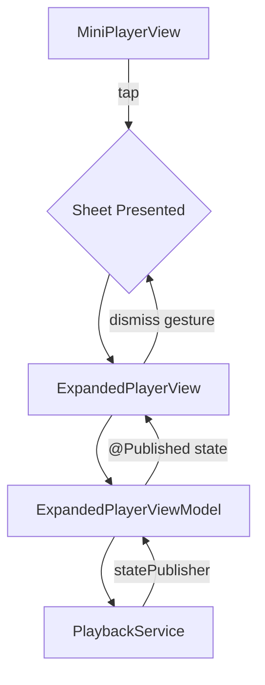

# Dev Log: Issue 03.1.1.2 – Expanded Player Layout & Interaction

## 2025-11-04 00:35 ET – Initial Analysis & Requirements Review

**Intent**: Implement the full-screen expanded player interface that the mini-player expands into, as specified in Issue #109. This builds on the mini-player foundation from Issue 03.1.1.1.

**Spec Alignment**:
- `Issues/03.1.1.2-expanded-player-layout.md` – acceptance criteria for expanded player UI, animations, and interactions.
- `Issues/03.1.1-core-player-interface.md` Scenario 2 (Expanded Player Interface) – Given/When/Then coverage for full player view.
- `zpod/spec/ui.md` – persistent mini-player plus expanded player with full controls.

**Current Findings**:
1. Mini-player from Issue 03.1.1.1 is already integrated in `LibraryFeature/ContentView.swift` and presents `EpisodeDetailView` via sheet when tapped.
2. `EpisodeDetailView` serves a different purpose (comprehensive episode information with notes, bookmarks, transcripts) than a focused playback interface.
3. Need dedicated `ExpandedPlayerView` optimized for playback with large artwork, progress slider, and transport controls.
4. Existing `MiniPlayerViewModel` connects to shared `PlaybackEnvironment` service, same pattern should be used for expanded player.

## 2025-11-04 00:45 ET – Architecture & Implementation Plan

**Design Decisions**:
1. **Dedicated Expanded Player**: Create `ExpandedPlayerView` separate from `EpisodeDetailView` to maintain clear separation of concerns:
   - Expanded player: Large artwork, playback controls, progress scrubbing (playback-focused)
   - Episode detail: Notes, bookmarks, chapters, transcript (content exploration)
2. **View Model Pattern**: Create `ExpandedPlayerViewModel` that:
   - Connects to shared `EpisodePlaybackService & EpisodeTransportControlling`
   - Tracks playback position with real-time updates
   - Handles scrubbing with position clamping and seek coordination
   - Formats time displays (supports both mm:ss and h:mm:ss formats)
3. **UI Design**:
   - Dark gradient background for immersive playback experience
   - Large artwork with loading states and placeholder fallback
   - Custom progress slider with drag gesture for scrubbing
   - Haptic feedback on scrub start/end and control interactions
   - Responsive layout adapting to portrait/landscape and iPad
4. **Sheet Presentation**: Use SwiftUI `.sheet()` modifier with:
   - Hidden system drag indicator (custom drag handle in view)
   - Black presentation background for dark theme consistency
   - Standard dismiss gesture (swipe down) preserved

**Mermaid Diagram**:

## 2025-11-04 01:10 ET – Implementation Details

**Components Created**:

1. **ExpandedPlayerViewModel.swift** (`PlayerFeature/Sources`):
   - Published properties: `episode`, `isPlaying`, `currentPosition`, `duration`, `isScrubbing`
   - Computed properties: `progressFraction`, `formattedCurrentTime`, `formattedDuration`
   - User intents: `togglePlayPause()`, `skipForward()`, `skipBackward()`, `beginScrubbing()`, `updateScrubbingPosition()`, `endScrubbing()`
   - Scrubbing logic prevents automatic position updates while user is actively dragging
   - Time formatting supports both short (mm:ss) and long (h:mm:ss) formats

2. **ExpandedPlayerView.swift** (`PlayerFeature/Sources`):
   - GeometryReader-based layout for responsive sizing
   - Custom drag indicator at top (5pt rounded rectangle)
   - Artwork section with AsyncImage, loading states, and size adaptation
   - Metadata section with episode/podcast titles
   - Progress slider with:
     - Visual track background and progress fill
     - Draggable thumb with DragGesture
     - Haptic feedback on scrub start/end
     - Time labels with monospaced digits
     - Accessibility with adjustable trait
   - Transport controls with visual press feedback
   - Dark gradient background (black with subtle gradient)
   - Safe area handling for Dynamic Island/notch devices
   - Preview variants for playing and paused states

3. **ContentView.swift Integration** (`LibraryFeature/Sources`):
   - Updated mini-player sheet presentation to show `ExpandedPlayerView`
   - Removed conditional check for `currentEpisode` (view handles nil episode)
   - Applied presentation modifiers: `.presentationDragIndicator(.hidden)`, `.presentationBackground(.black)`
   - Maintained `expanded-player-sheet` accessibility identifier for UI tests

4. **ExpandedPlayerViewModelTests.swift** (`PlayerFeature/Tests`):
   - 15 comprehensive test cases covering:
     - Initial state and playback state tracking
     - Progress fraction calculation and clamping
     - Time formatting (with/without hours)
     - Transport actions (play/pause/skip)
     - Scrubbing behavior (prevents updates, seeks on end, clamps position)
   - Recording test double (`RecordingPlaybackService`) to verify delegate calls
   - Async test helpers for state update synchronization

5. **PlaybackUITests.swift** (`zpodUITests`):
   - 3 new UI test scenarios:
     - `testExpandedPlayerDisplaysFullInterface`: Verifies full UI elements present
     - `testExpandedPlayerTransportControls`: Tests play/pause toggle and skip actions
     - `testExpandedPlayerDismissGesture`: Validates swipe-down dismiss returns to mini-player
   - All tests follow Given/When/Then structure aligned with spec
   - Leverage existing test infrastructure and helper methods

**Testing Strategy**:
- Unit tests validate view model logic in isolation with mocked playback service
- UI tests exercise end-to-end user flows from mini-player expansion to dismissal
- Accessibility identifiers ensure VoiceOver compatibility
- Preview variants enable visual design iteration

## 2025-11-04 01:30 ET – Validation & Next Steps

**Validation**:
- ✅ Syntax check passed for all new files
- ✅ 15 unit tests created for `ExpandedPlayerViewModel`
- ✅ 3 UI tests created for expanded player interface
- ⏳ Full test suite run pending (requires macOS/Xcode environment)

**Open Questions / Follow-ups**:
- Skip intervals currently use defaults (15s back / 30s forward); confirm against `PlaybackSettings` when wired
- Scrubbing haptics use `UIImpactFeedbackGenerator` directly; consider shared haptics service from `SettingsDomain` when available
- Artwork size calculation adapts to screen dimensions; may need iPad Pro-specific tuning
- Consider adding matched geometry effect between mini-player and expanded player artwork for smoother transition (future enhancement)

**Remaining Tasks** (tracked in PR):
- Run full test suite on macOS to validate integration
- Update issue status to reflect completion
- Screenshot expanded player UI for documentation (pending macOS environment)
