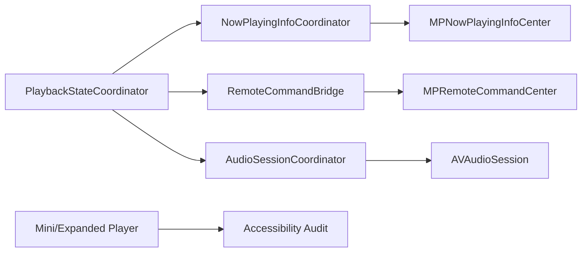

# Dev Log: Issue 03.1.1.4 – System Media Integration & Accessibility

## 2025-12-24 07:20 ET – Plan

**Intent**: Define the implementation plan for system media integration (Now Playing, remote commands, audio session handling) and accessibility compliance for the player surfaces.

**Steps**:
1. **Design + alignment**
   - Re-read `spec/playback.md` and `spec/ui.md` for system media + accessibility expectations.
   - Diagram the integration flow and component ownership.
2. **Now Playing metadata**
   - Implement a `NowPlayingInfoCoordinator` (or equivalent) to build and publish `MPNowPlayingInfoCenter` payloads.
   - Include title, podcast, artwork, duration, elapsed time, and playback rate updates.
3. **Remote command center**
   - Wire `MPRemoteCommandCenter` to playback service actions (play/pause/skip forward/back).
   - Respect configured skip intervals and enabled/disabled states.
4. **Audio session + interruptions**
   - Configure `AVAudioSession` for background playback and routing options.
   - Handle interruptions and route changes (pause/resume behavior).
5. **Accessibility + Dynamic Type**
   - Audit mini/expanded player for VoiceOver labels/hints/values.
   - Verify Dynamic Type sizing and layout resilience.
   - Disable haptics while VoiceOver is active (track `UIAccessibility.voiceOverStatusDidChangeNotification`).
6. **Tests + validation**
   - Unit tests for Now Playing payload builder and remote command handlers.
   - UI tests for accessibility identifiers where feasible.
   - Manual verification of Control Center, lock screen, and headset controls (record outcomes here).

**Mermaid (integration ownership)**:

