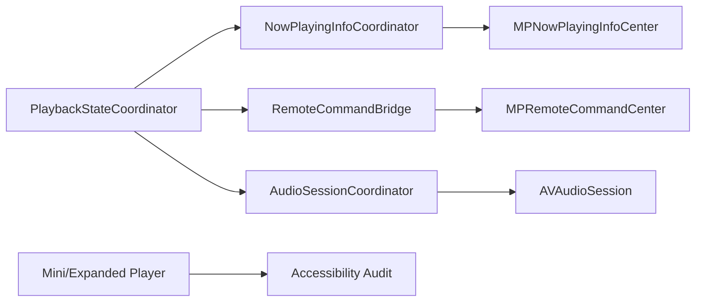

# Dev Log: Issue 03.1.1.4 – System Media Integration & Accessibility

## 2025-12-24 07:20 ET – Plan

**Intent**: Define the implementation plan for system media integration (Now Playing, remote commands, audio session handling) and accessibility compliance for the player surfaces.

**Analysis**:
- No existing `MPNowPlayingInfoCenter` or `MPRemoteCommandCenter` wiring found in app/feature sources.
- No existing `AVAudioSession` configuration or interruption handling in the app shell.
- Mini-player + expanded player already expose accessibility labels for core controls; dynamic type behavior not yet verified.
- Playback state is centralized via `PlaybackEnvironment`/`PlaybackStateCoordinator`, which can drive system media updates.

**Steps**:
1. **Design + alignment**
   - Re-read `spec/playback.md` and `spec/ui.md` for system media + accessibility expectations.
   - Diagram the integration flow and component ownership.
2. **Now Playing metadata**
   - Implement a `NowPlayingInfoCoordinator` (or equivalent) to build and publish `MPNowPlayingInfoCenter` payloads.
   - Include title, podcast, artwork, duration, elapsed time, and playback rate updates.
3. **Remote command center**
   - Wire `MPRemoteCommandCenter` to playback service actions (play/pause/skip forward/back).
   - Respect configured skip intervals and enabled/disabled states.
4. **Audio session + interruptions**
   - Configure `AVAudioSession` for background playback and routing options.
   - Handle interruptions and route changes (pause/resume behavior).
5. **Accessibility + Dynamic Type**
   - Audit mini/expanded player for VoiceOver labels/hints/values.
   - Verify Dynamic Type sizing and layout resilience.
   - Disable haptics while VoiceOver is active (track `UIAccessibility.voiceOverStatusDidChangeNotification`).
6. **Tests + validation**
   - Unit tests for Now Playing payload builder and remote command handlers.
   - UI tests for accessibility identifiers where feasible.
   - Manual verification of Control Center, lock screen, and headset controls (record outcomes here).

**Mermaid (integration ownership)**:

## 2025-12-24 08:05 ET – Design

**Goal**: Add iOS system media integration without breaking non-iOS targets.

**Design choices**:
- Create a lightweight `NowPlayingInfoSnapshot` + `NowPlayingInfoBuilder` (no MediaPlayer dependency) so unit tests can validate payloads.
- Add an iOS-only `SystemMediaCoordinator` in `LibraryFeature` that:
  - Subscribes to `EpisodePlaybackService.statePublisher`.
  - Updates `MPNowPlayingInfoCenter` using the snapshot builder.
  - Manages `MPRemoteCommandCenter` handlers (play/pause/toggle/skip).
  - Configures `AVAudioSession` and handles interruptions/route changes.
- Keep iOS-only imports behind `#if os(iOS)` + `canImport` guards to preserve macOS/watchOS builds.
- Update haptics to respect VoiceOver by centralizing the check in `HapticFeedbackService`.

**Integration points**:
- Instantiate `SystemMediaCoordinator` in `CarPlayDependencyRegistry.defaultDependencies` and store it in `CarPlayDependencies` to keep it alive.
- Use the coordinator’s playback state tracking to resume after interruptions (play + seek to last position).

**Testing strategy (TDD)**:
- Unit tests for `NowPlayingInfoBuilder` (playing/paused/finished/idle cases).
- Unit tests for remote command handlers (verify play/pause/skip closures invoked).
- Manual validation checklist for Control Center, lock screen, and headset controls (record results here).

## 2025-12-24 09:10 ET – Implementation

**Changes**:
- Added `NowPlayingInfoSnapshot` + `NowPlayingInfoBuilder` (pure payload builder for testability).
- Added `RemoteCommandHandler` to centralize play/pause/skip actions for command center wiring.
- Added `SystemMediaCoordinator` (iOS-only) to:
  - Update `MPNowPlayingInfoCenter` metadata and artwork.
  - Register `MPRemoteCommandCenter` handlers with interval preferences.
  - Configure `AVAudioSession` and respond to interruptions/route changes.
- Wired `SystemMediaCoordinator` into `CarPlayDependencyRegistry.defaultDependencies` to keep it alive.
- Centralized haptic suppression for VoiceOver in `HapticFeedbackService`, and routed expanded player haptics through it.

**Tests added (not yet run)**:
- `NowPlayingInfoBuilderTests` (playing/paused/finished/idle snapshots).
- `RemoteCommandHandlerTests` (play/skip forwarding behavior).

## 2025-12-24 08:45 ET – Tests

**Command**: `./scripts/run-xcode-tests.sh -t LibraryFeature`

**Result**: ✅ Passed (6 tests)

**Warnings**:
- `Packages/LibraryFeature/Sources/LibraryFeature/CARPLAY_README.md` is not declared as a resource in the package.
- `Packages/LibraryFeature/Sources/LibraryFeature/DownloadConfigurationView.swift` warns about retroactive `Hashable` conformance on `RetentionPolicy`.

## 2025-12-24 08:52 ET – Warning Fixes

**Updates**:
- Excluded `CARPLAY_README.md` from the `LibraryFeature` target resources to silence SPM warnings.
- Added `@retroactive` to the `RetentionPolicy: Hashable` conformance.

## 2025-12-24 10:50 ET – Tests

**Command**: `./scripts/run-xcode-tests.sh -t LibraryFeature`

**Result**: ✅ Passed (6 tests)
