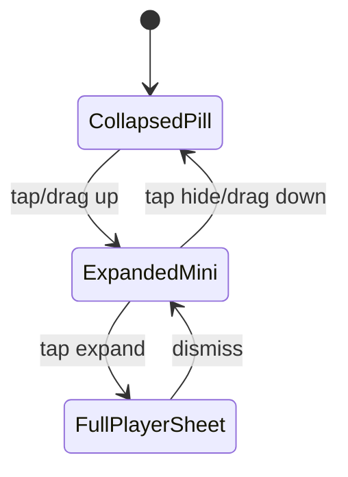

# Dev Log: Issue 03.1.1.6 – Mini-Player Pill Reveal

## 2026-01-01 16:10 ET – Intent & Design Notes

**Intent**: Move the mini-player to a collapsed, always-available pill handle. This reduces persistent height while keeping playback controls discoverable and consistent.

**Design Notes**:
- Pill handle is always visible, even when nothing is playing.
- Swipe up or tap on the pill handle expands the mini-player; swipe down or "Hide mini-player" collapses it.
- Mini-player expansion is independent of playback state (playback can continue while collapsed).
- Full player opens from the mini-player expand action.
- Empty state is required in the mini-player expansion when no episode is active; use a neutral visual treatment.
- Safe-area spacing must keep the pill handle/mini-player above the tab bar without blocking tab taps.
- Expanded mini-player increases the bottom inset so content is pushed up.

**Diagram: Mini-Player Presentation State**



**Diagram: Layout Layers (iPhone)**

```mermaid
flowchart TB
  A[TabView Content] --> B[Tab Bar]
  A --> C[safeAreaInset: pill handle]
  C --> D[Pill Handle]
  A --> E[Expanded Mini-Player (overlay above tab bar)]
```

**Decisions**:
- Expanded mini-player increases bottom inset (content is pushed up).
- Empty/idle presentation should be visually neutral.
