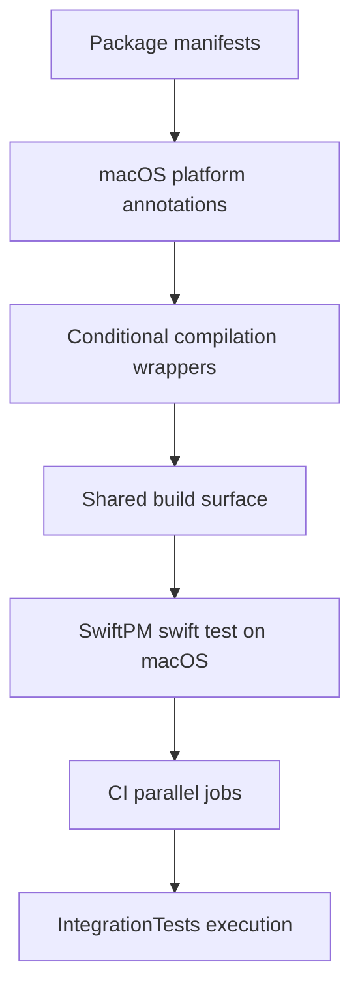

# Issue 03.1.4 - Extend Settings Stack for macOS Support

## 2025-10-13 18:05 ET - Intent
- Confirm the macOS build surface for SharedUtilities, CoreModels, Persistence, and SettingsDomain without regressing iOS-only symbols.
- Wire IntegrationTests into the shared test plan and scheme so helper scripts can target the bundle.
- Update CI to fan out parallel jobs for zpod, zpodUITests, and IntegrationTests while preserving the existing self-check leg.

## Architecture Notes
- macOS platform declarations will originate in Package.swift files and propagate via conditional feature flags when UIKit-only APIs are referenced.
- IntegrationTests bundle will be added to zpod.xctestplan and the workspace scheme to ensure `run-xcode-tests.sh` can discover and execute it.
- CI workflow will adopt a matrix job that runs `./scripts/run-xcode-tests.sh` with target arguments in parallel, collecting xcresult bundles as artifacts.

## Open Questions
- Do any settings-related packages rely on UIKit types beyond availability checks that will require protocol abstractions?
- Will IntegrationTests require additional test data assets when run under macOS destinations?

## Next Steps
- Audit package sources for UIKit-only imports and prepare guard strategy.
- Prototype test plan updates locally and confirm `./scripts/run-xcode-tests.sh -t IntegrationTests` resolves.
- Draft CI workflow changes in a branch-specific yaml update and scope necessary caching tweaks.
