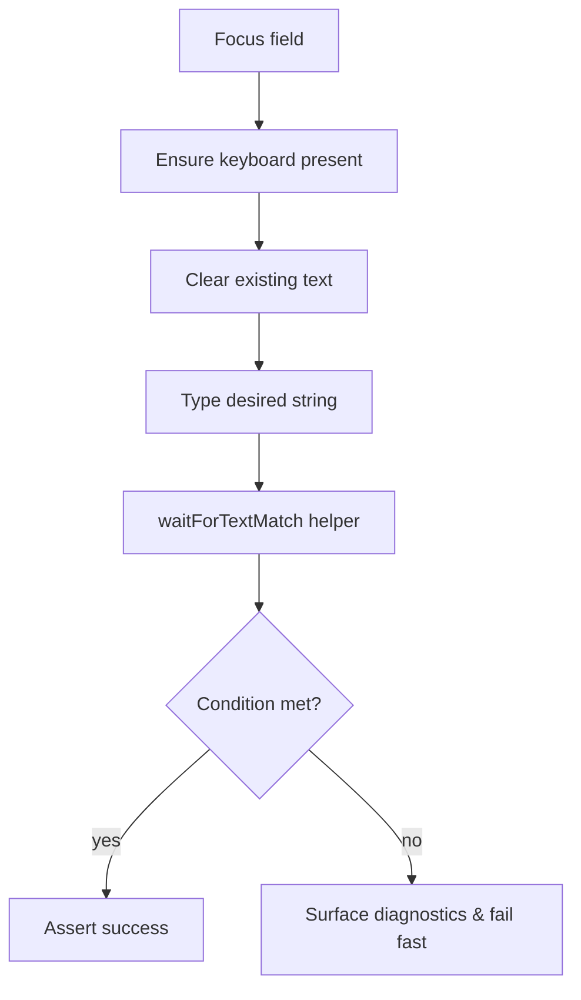
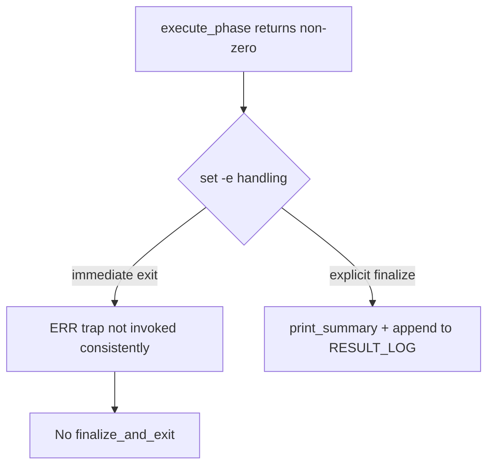

# Dev Log – Issue 03.1.5: Test Infrastructure Separation and Enhanced Reporting

## 2025-10-20 23:05 ET – Intent & Design

### Objective
Bring the run script in line with the remaining acceptance criteria by:
- Allowing each regression phase to complete even if earlier steps fail.
- Printing structured Build/Test/Overall summaries on every exit path, including interruptions.
- Capturing SIGINT/ERR to surface partial progress instead of aborting silently.

### Design Notes
- Introduce a lightweight phase runner that wraps each task (syntax, test-plan, builds, package tests, AppSmoke, Integration, UI, lint) and records success/failure without short-circuiting.
- Track phase results in associative arrays keyed by category so summary formatting can compute totals (success, warn, fail, interrupted).
- Apply `trap` handlers for `ERR` and `INT` that flip an `INTERRUPTED=1` flag, append an interruption summary item, and fall through to unified exit logic.
- Replace the existing free-form `print_summary` output with structured sections matching Issue 03.1.5 expectations.

```mermaid
flowchart TD
    A[Setup & Argument Parsing]
    A --> B{Specific Flags?}
    B -- yes --> C[Run Requested Actions]
    B -- no --> D[Default Regression Phases]
    D --> E[Phase Runner (per step)]
    C --> E
    E --> F[Record Phase Result]
    F --> G[Final Summary Formatter]
    G --> H[Print Build/Test/Overall Sections]
    H --> I[Exit with appropriate status]
    subgraph Traps
      J[SIGINT] --> K[Set INTERRUPTED]
      L[ERR] --> M[Record Failure]
      K --> G
      M --> G
    end
```

### Open Questions
- How granular should interrupted phases be reported (per phase vs overall)? Plan to tag incomplete phases with status `interrupted` in the summary array.
- Exit code strategy: prefer first failing phase's status while still running later phases. Will capture first non-zero exit status and return it at the end.

### Next Steps
1. Update issue status to in-progress.
2. Implement phase runner, traps, and structured summary logic in `scripts/run-xcode-tests.sh`.
3. Backfill this log with implementation notes and verification steps.

## 2025-10-20 23:42 ET – Phase Runner & Reporting Implementation

### Work Completed
- Added phase orchestration helpers (`execute_phase`, `begin_phase`) so the default regression runs every step even when a command fails, capturing the first non-zero exit code for the final status.
- Installed shared signal handling (`trap` on `INT`/`ERR`) to print partial summaries and tag the in-flight phase as interrupted rather than terminating silently.
- Rebuilt `print_summary` into structured Build/Test/Lint/Overall sections with aggregate counts and per-group breakdowns (Unit, Integration, UI, Package).
- Hardened package build/test helpers and lint invocations to detect errors without relying on `set -e`, ensuring summaries get written for both successes and failures.
- Front-loaded regression gating so syntax and AppSmoke tests execute first and halt the remaining phases on failure; mirrored the same gating in CI with a preflight job that runs syntax, clean build, and smoke before fanning out.

### Verification
- `bash -n scripts/run-xcode-tests.sh` ✅
- `bash -n scripts/lib/spm.sh` ✅
- `./scripts/run-xcode-tests.sh --self-check` ✅

### Follow-up
- Monitor a full default run to confirm the new summary formatting looks clean end-to-end.

## 2025-10-21 00:52 ET – CI ordering tweak
- Updated the workflow so the macOS UI/integration matrix waits for the package matrix (`needs: [preflight, package-tests]`). Packages now compile/test immediately after the preflight gate and before any UI suites fan out.

## 2025-10-21 08:02 ET – CI selector inputs
- Added a `matrix` input to the workflow_dispatch trigger so we can run `all`, `packages`, `ui`, or `linux` slices on demand. Each downstream job now checks that input before running.

## 2025-10-21 09:47 ET – Layered CI separation design

### Intent
- Break the current `xcode-tests` matrix into dedicated jobs for `AppSmokeTests`, `IntegrationTests`, and the grouped UI suites so logs remain focused per layer.
- Preserve the existing `preflight` gate for syntax/build health, but make downstream jobs depend on it instead of letting AppSmoke ride inside the gate.
- Update Issue 03.1.5 acceptance criteria to reflect that CI coverage across the layered jobs supersedes the need for a redundant "no-arguments" regression job.

### Job Structure
```mermaid
flowchart LR
    P[preflight]
    P --> U[unit-tests]
    P --> PK[package-tests]
    U --> I[integration-tests]
    U --> UI[ui-tests (matrix)]
    PK --> UI
    PK --> I
```

### Notes
- `unit-tests` provisions its own simulator, runs `./scripts/run-xcode-tests.sh -t AppSmokeTests`, and shares gating status via `needs`.
- `integration-tests` becomes a standalone job (no longer inside the UI matrix) and runs only `-t IntegrationTests`.
- `ui-tests` keeps the existing suite matrix, limited to UI-only bundles, and still fans out after packages to balance runtime.
- Acceptance criteria update will clarify that CI already executes the full regression suite once the three jobs plus packages and Linux syntax pass.

## 2025-10-27 15:48 ET – Playback UI job failure analysis

### Observation
- GitHub Actions `UITests-Playback` job failed with `ld: library '.../zpod.app/zpod' not found` while linking the IntegrationTests bundle, causing xcodebuild to exit with status 65 before any UI cases executed.
- The dedicated UI jobs pass `-only-testing:zpodUITests/...`, but Xcode still schedules the `IntegrationTests` bundle for build because the `zpod` scheme includes it.

### Decision
- When invoking the script for UI-only slices, append `-skip-testing:IntegrationTests` so the Integration test bundle is neither built nor linked in those legs. This keeps the separation we just added and prevents host-app ordering issues from bleeding across layers.

### Next Steps
- Patch `run-xcode-tests.sh` to inject the skip flag for `zpodUITests` targets and rerun the affected suite locally to confirm the linker failure disappears.

## 2025-10-27 16:28 ET – UI suite verification pass
- `./scripts/run-xcode-tests.sh -t zpodUITests/PlaybackUITests` ✅ – confirms the linker skip flag keeps the playback run green.
- `./scripts/run-xcode-tests.sh -t zpodUITests/BatchOperationUITests` ✅ – no build leakage from IntegrationTests.
- `./scripts/run-xcode-tests.sh -t zpodUITests/ContentDiscoveryUITests` ✅ – full suite passes with the new flag.
- `./scripts/run-xcode-tests.sh -t zpodUITests/SwipeConfiguration{Persistence,Execution,PresetCycling,ActionManagement}UITests` ✅ – each long-running swipe configuration scenario completes without the prior status 65 failure.

## 2025-10-27 20:55 ET – Content discovery retries flake

### Failure Snapshot
- CI rerun failed in `zpodUITests/ContentDiscoveryUITests` with two cases timing out:
  - `testRSSURLInput_GivenRSSSheet_WhenEnteringURL_ThenAcceptsInput` spun for ~140s trying to reacquire the URL text field after typing, eventually hitting the XCTest snapshot timeout.
  - `testSearchFieldInput_GivenSearchInterface_WhenTyping_ThenAcceptsInput` typed `"Swift Talk"`, but the predicate waiter never completed even though the field held the value; the fallback static text element also failed to appear before timeout.
- Local reruns pass quickly, pointing to race conditions in CI around focus stabilization and asynchronous field updates.

### Design Notes
- Introduce a reusable helper to assert keyboard focus and wait for text-field value propagation using polling rather than snapshot-heavy predicates, reducing the chances of hitting the 120s timeout path.
- For the RSS sheet scenario, re-query the URL field after typing (the sheet re-renders its hierarchy) and fall back to verifying via `value` or an exact-match static text.
- For search typing, replace the ad-hoc `XCTNSPredicateExpectation` with the shared helper and allow configurable timeouts scaled by `adaptiveTimeout` so slower simulators still meet the condition.
- Add defensive clear-before-type logic so residual text or placeholder ellipses do not interfere with value assertions.

### Planned Implementation


### Next Steps
1. Add a `waitForText` utility (and optional `clearAndType`) in the `SmartUITesting` helpers so all UI suites can reuse the stabilization logic.
2. Refactor the two failing tests to call the new helper instead of bespoke predicates, and rerun the ContentDiscovery suite locally to confirm stability before pushing.
3. Capture one more local `./scripts/run-xcode-tests.sh -t zpodUITests/ContentDiscoveryUITests` run after the refactor to ensure both the RSS and search scenarios finish without timing out.

## 2025-10-27 21:05 ET – Issue closure
- Added polling-based `waitUntil` + `waitForKeyboardFocus` helpers and rewired the ContentDiscovery tests to use them; RSS and search flows now wait on actual values rather than long snapshot crawls.
- Local verification: `./scripts/run-xcode-tests.sh -t zpodUITests/ContentDiscoveryUITests` (post-refactor) ✅.
- Latest GitHub Actions run `18854813018` rerun ✅ – all UI matrices (including ContentDiscovery) green with the new skip guard.
- All acceptance criteria met; updated issue status to complete.

## 2025-11-24 10:18 ET – Regression summary missing on failure

### Intent
- Capture the missing summary output observed in the latest full regression so we can design a fix before touching the scripts.
- Reference run: `TestResults/TestResults_20251123_053306_test_zpodUITests.log` (UI suite failed 1/8; no `Summary/Overall Status` section in stdout or log).
- Goal: ensure every exit path (including failure during default regression) prints the build/test/overall summary and appends it to the active result log.

### Current hypothesis
- Default regression phases after AppSmoke are unguarded under `set -e`; when a later `execute_phase` returns non-zero, the shell exits before reaching `finalize_and_exit`.
- The ERR trap may not fire consistently for those function returns (no `set -E`/`errtrace`), so the trap-based summary printing is skipped.
- Several direct `exit 1` call sites (e.g., `resolve_test_identifier` failure paths) bypass `finalize_and_exit`, leaving no summary when they trigger.
- `finalize_and_exit` relies on the last `RESULT_LOG`; if the script exits mid-phase without hitting the trap, nothing appends to the per-phase log or stdout.



### Next steps
- Inspect top-level control flow to make failure handling explicit (avoid relying on `set -e`/ERR trap for summary emission).
- Identify all early `exit` sites and route them through `finalize_and_exit` with the accumulated SUMMARY_ITEMS.

## 2025-11-24 10:52 ET – Exit handling hardening

### Changes
- Enabled errtrace (`set -Eeuo pipefail`) and added an `EXIT` trap that funnels all termination paths through `finalize_and_exit`.
- Added `exit_with_summary` helper and re-routed direct `exit` callers (argument parse errors, self-check, test resolution) to ensure summaries still print.
- Ensured `finalize_and_exit` updates `EXIT_STATUS` before emitting the summary and clears traps (`ERR`, `INT`, `EXIT`) to avoid recursion.
- Adjusted `handle_unexpected_error` to avoid duplicating “script error” summaries when phase results already exist; only adds a runtime summary when no entries are present.

### Impact
- Any failure (including early argument errors or set -e exits) now prints the Build/Test/Overall summary and appends to the current result log when available.
- Exit codes continue to respect the first non-zero status, but summary emission is guaranteed once per run.

## 2025-11-24 11:26 ET – Suite timing capture + hang guard

### Changes
- Added xcresult parsing to capture per-test-suite timing and pass/fail counts; fall back to log parsing when xcresulttool is unavailable. Timing now appears in both stdout and result logs under “Test Suite Timing,” grouped by target.
- Aggregated suite counts feed the summary when xcresult totals are missing, preventing “0 tests” reports on partial logs.
- Introduced a 30-minute timeout around `xcodebuild` in `scripts/lib/xcode.sh` with SIGTERM/SIGKILL cleanup for the entire process tree to prevent hangs during UI diagnostics. The wrapper forwards interrupts and returns 124 on timeout for downstream handling.
- Hardened error exits to flow through `finalize_and_exit` via `exit_with_summary`, ensuring argument/lookup failures emit a summary before exiting.

### Impact
- Stuck UI test runs now terminate automatically while still producing a summary and timing breakdown.
- Reviewers get suite-level timing even when xcodebuild exits early; CI artifacts show both phase timing and per-suite timing for debugging slow/failing suites.
