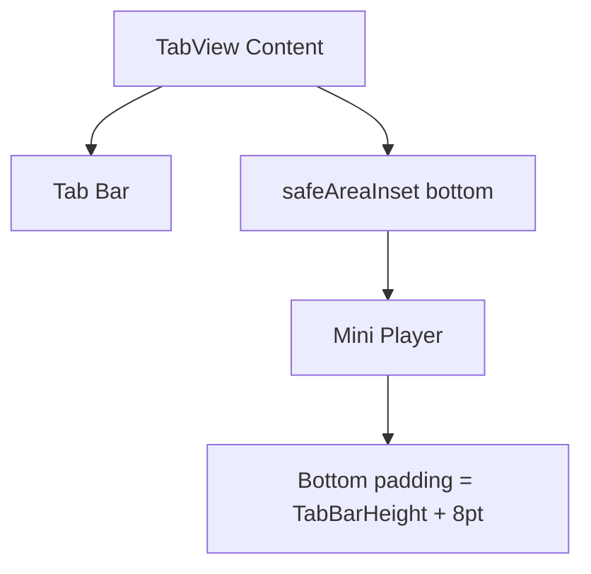

# Dev Log: Issue 03.2 – Mini Player Bottom Overflow

## 2026-01-01 15:30 ET – Completion Plan & Coverage Additions

**Intent**: Close Issue 03.2 by documenting the safe-area positioning fix, updating acceptance criteria status, and adding UI coverage that proves tab bar buttons remain tappable while the mini-player is visible.

**Design Notes**:
- The mini-player is rendered via `safeAreaInset(edge: .bottom)` with dynamic padding derived from the measured `UITabBar` height, preventing overlap with tab controls.
- The test will start playback to display the mini-player, then verify each tab button is hittable and responds to taps.

**Diagram (Layout Layers)**:

**Planned Updates**:
- Update `Issues/03.2-mini-player-bottom-overflow.md` to mark acceptance criteria complete.
- Add a `MiniPlayerPersistenceTests` case verifying tab buttons remain tappable with the mini-player visible.
- Update `zpodUITests/TestSummary.md` with the new coverage entry.

## 2026-01-01 15:45 ET – Implementation Complete

**Updates**:
- Marked Issue 03.2 acceptance criteria complete in `Issues/03.2-mini-player-bottom-overflow.md`.
- Added `testMiniPlayerKeepsTabBarTappable` to ensure tab bar buttons remain hittable while the mini-player is visible.
- Documented the new coverage entry in `zpodUITests/TestSummary.md`.
