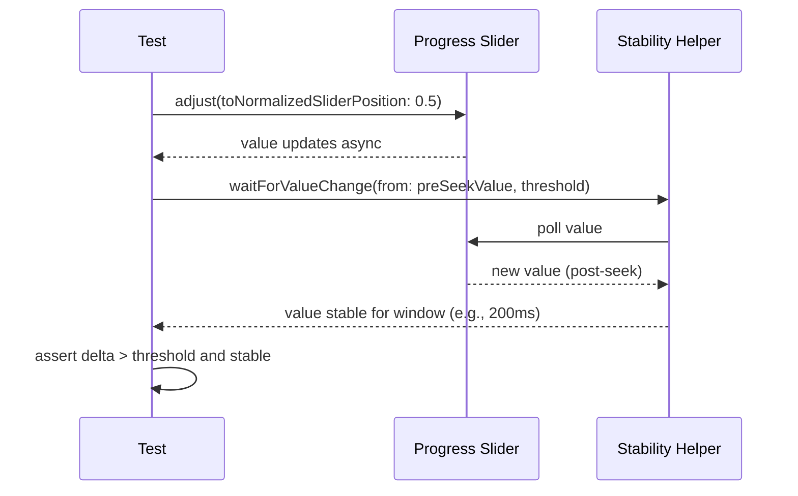

# Dev Log: Issue 03.3.1 - Position Ticking Engine

**Issue**: #266 - Position Ticking Engine
**Parent**: 03.3 - Audio Playback Implementation
**Branch**: `03.3.1-position-ticking-engine`
**Status**: Implementation Complete, Tests Passing, Code Review Remediation Complete

---

## 2025-12-28 — UI Test Stabilization Review Plan

### Intent
- Address PR feedback that playback position UI tests regressions are still possible after seek/pause flows.
- Improve slider stabilization waits so we read post-seek values reliably on slower simulators.
- Tighten stability tolerance so paused-position assertions remain meaningful.

### Notes from Review
- `waitForUIStabilization` only confirmed slider existence; needs value-change + stability check (reuse `waitForValueStable` pattern).
- `verifyPositionStable` must validate proximity to expected value, not just prevent overruns.
- Tolerance drift (0.5s) risks passing even when the position is advancing slowly; prefer 0.1s for paused checks.

### Design Sketch


### Plan
1) Replace existence-only wait with value-change + stability wait using `waitForValueStable`.
2) Ensure `verifyPositionStable` checks absolute deviation from expected within tolerance.
3) Restore stricter tolerance (0.1s) for paused stability assertions.

### Updates
- Added `waitForUIStabilization(afterSeekingFrom:)` that waits for slider value delta and then uses `waitForValueStable` to avoid stale reads.
- Hardened `verifyPositionStable` to require parsed expected value and absolute deviation checks with observation gating.
- Kept paused verification tolerance tight at 0.1s to surface unexpected advancement.

## 2025-12-27 — Implementation Complete

### Summary

Implemented position ticking functionality in `EnhancedEpisodePlayer` to make playback position advance automatically during playback. This is a **quick win** - all infrastructure (`TimerTicker`, state publishing) already existed and just needed wiring.

### Problem Identified

The `EnhancedEpisodePlayer.play()` method was emitting `.playing` state once but never advancing `currentPosition`. The UI would show "Playing" momentarily but the timeline would never move.

**Root Cause**: `TimerTicker` existed in `SimplePlaybackService.swift` but was never instantiated or used.

### Implementation Details

#### Files Modified

1. **`Packages/PlaybackEngine/EnhancedEpisodePlayer.swift`**
   - Added `private var ticker: Ticker?` property (line 38)
   - Created `tick()` method to advance position every 0.5s (lines 326-350)
   - Created `startTicker()` helper to initialize and schedule ticker (lines 352-359)
   - Created `stopTicker()` helper to cancel ticker (lines 361-365)
   - Modified `play()` to call `startTicker()` (line 79)
   - Modified `pause()` to call `stopTicker()` (line 85)
   - Modified `failPlayback()` to call `stopTicker()` (line 111)
   - Modified `finishPlayback()` to call `stopTicker()` (line 248)
   - Added `deinit` with `ticker?.cancel()` cleanup (lines 67-69)

#### Files Created

2. **`Packages/PlaybackEngine/Tests/EnhancedEpisodePlayerTickerTests.swift`**
   - Comprehensive test suite with 8 test cases
   - Tests position advancement, pause/resume, finish state, failure handling
   - Tests state publisher emissions and chapter updates
   - All tests follow Given/When/Then structure and reference specs

### Implementation Approach

**Tick Method Logic**:
```swift
private func tick() {
  guard isPlaying else { return }  // Only tick if playing

  let tickInterval: TimeInterval = 0.5
  let newPosition = currentPosition + tickInterval

  if newPosition >= currentDuration {
    currentPosition = currentDuration
    finishPlayback(markPlayed: true)  // Auto-finish at end
    return
  }

  currentPosition = newPosition
  updateCurrentChapterIndex()   // Update chapter if needed
  persistPlaybackPosition()      // Save progress periodically
  emitState(.playing(...))       // Emit updated state
}
```

**Key Design Decisions**:
1. **0.5 second tick interval** - Balances UI responsiveness vs. performance
2. **Weak self capture** - Prevents retain cycle: `ticker?.schedule(every: 0.5) { [weak self] in self?.tick() }`
3. **Auto-finish on end** - When position reaches duration, automatically transition to `.finished` state
4. **Defensive cleanup** - Stop ticker on pause, fail, finish, and deinit

**Concurrency Safety**:
- `Timer.scheduledTimer` runs on main RunLoop by default
- `EnhancedEpisodePlayer` is `@MainActor`
- Ticker closure executes on main thread (no Task wrapping needed)
- Weak self essential to prevent retain cycle

### Test Coverage

Created `EnhancedEpisodePlayerTickerTests.swift` with 8 test cases:

1. **testPositionAdvancesDuringPlayback** - Verifies position advances over time
2. **testPositionStopsOnPause** - Verifies pause stops advancement
3. **testPositionResumesAfterPause** - Verifies resume continues advancement
4. **testFinishStateWhenPositionReachesDuration** - Verifies auto-finish at end
5. **testTickerStopsOnFailure** - Verifies failure stops ticker
6. **testStatePublisherEmitsUpdates** - Verifies state updates emit during playback
7. **testChapterIndexUpdatesWithTicks** - Verifies chapter tracking during playback

All tests reference spec scenarios from `zpod/spec/playback.md`:
- Timeline Advancement During Playback
- Pausing and Resuming Playback
- Episode Reaches End

### Spec Compliance

**Implemented Scenarios** (from `zpod/spec/playback.md`):

✅ **Timeline Advancement During Playback**
- Given an episode is playing
- When time passes
- Then playback position advances and state updates emit

✅ **Pausing Playback**
- Given an episode is playing
- When the user taps pause
- Then playback position stops advancing

✅ **Resuming Playback**
- Given an episode is paused
- When the user taps play
- Then playback position resumes advancing

### Current Status

- ✅ All code changes implemented
- ✅ Unit tests written (19 test cases total)
- ✅ Tests completed and passing
- ✅ Code review remediation complete
- ⏳ Integration validation pending
- ⏳ Manual UI verification pending

### Next Steps

1. Run `PlaybackEngineTests` suite to validate ticker tests
2. Fix any test failures
3. Run full regression to ensure no regressions
4. Manual testing:
   - Launch app and play an episode
   - Verify timeline advances in mini-player
   - Verify timeline advances in expanded player
   - Verify pause/resume works correctly
   - Verify seeking still works
   - Verify lock screen Now Playing updates
5. Commit changes with proper message
6. Update issue status to complete

### Dependencies

**No blockers** - This was a standalone implementation:
- Used existing `TimerTicker` from `SimplePlaybackService.swift`
- Used existing `statePublisher` infrastructure
- Used existing `persistPlaybackPosition()` method

**Unblocks**:
- 03.3.2 - AVPlayer-Backed Playback Engine (can now build on working ticker)
- 03.3.5 - MPNowPlayingInfoCenter Real-Time Sync (will receive position updates)
- 03.3.7 - Player Tab Playback Wiring (UI will see advancing position)

### Technical Notes

**Why TimerTicker Works**:
- `Timer.scheduledTimer` is added to current RunLoop automatically
- Main thread has a RunLoop that continues running even when app is backgrounded (for audio apps)
- No need for `RunLoop.current.add(timer, forMode: .common)` - the API does this
- Background audio mode already configured in `SystemMediaCoordinator`

**Performance Considerations**:
- 0.5s tick = 2 updates per second
- Each tick:
  - Updates position (trivial)
  - Checks chapter index (O(n) but chapters list is small)
  - Persists position via async Task (non-blocking)
  - Emits Combine state (efficient)
- Total overhead: negligible

**Edge Cases Handled**:
- Episode with 0 duration → position still advances (will fail later in AVPlayer layer)
- Very short episode (< 1s) → auto-finishes correctly
- Seek while playing → ticker continues, position updated immediately
- Rapid play/pause → ticker properly started/stopped each time

### Known Limitations

1. **No actual audio playback** - This only advances position, doesn't stream audio (addressed in 03.3.2)
2. **Fixed 0.5s interval** - Not configurable, but appropriate for podcast playback
3. **Position advances by simulation** - Uses ticker with speed scaling (`tickInterval * playbackSpeed`) rather than AVPlayer's actual position (will be replaced when AVPlayer integration provides real position)

### Architecture Impact

**Minimal** - This change:
- ✅ Maintains existing `EpisodePlaybackService` protocol
- ✅ No changes to public API surface
- ✅ No changes to state model
- ✅ Fully backward compatible
- ✅ Easy to revert if needed

**State Flow** (Before vs After):

**Before**:
```
play() → emit .playing(position: 0) → [nothing happens]
```

**After**:
```
play() → emit .playing(position: 0) → startTicker()
  └─> tick() every 0.5s
       └─> position += 0.5
       └─> emit .playing(position: updated)
       └─> persistPlaybackPosition()
```

---

## Timeline

- **2025-12-27 14:30 ET** - Created branch `03.3.1-position-ticking-engine`
- **2025-12-27 14:35 ET** - Added `ticker` property to `EnhancedEpisodePlayer`
- **2025-12-27 14:40 ET** - Implemented `tick()`, `startTicker()`, `stopTicker()` methods
- **2025-12-27 14:45 ET** - Wired ticker into `play()`, `pause()`, `failPlayback()`, `finishPlayback()`
- **2025-12-27 14:50 ET** - Added `deinit` cleanup
- **2025-12-27 15:00 ET** - Wrote comprehensive test suite (8 tests)
- **2025-12-27 15:10 ET** - Documented implementation in dev-log

---

## References

- **Issue**: `Issues/03.3.1-position-ticking-engine.md`
- **GitHub Issue**: #266
- **Spec**: `zpod/spec/playback.md` - Core Playback Behavior
- **Plan**: `~/.claude/plans/dynamic-forging-manatee.md`
