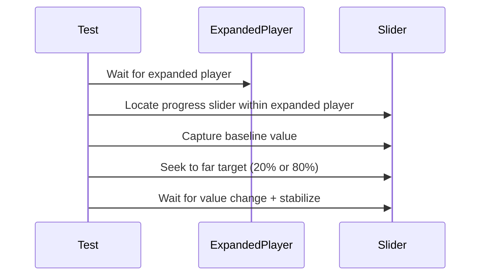
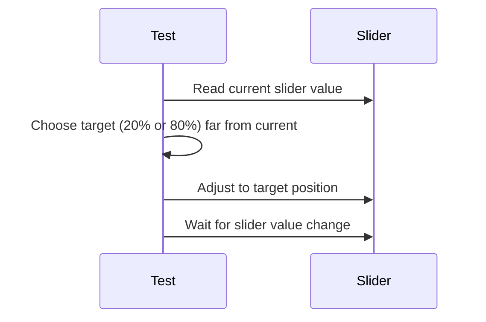

# 03.3.2.1-03.3.2.3 Test Suite Gaps and Resolutions

**Date**: 2026-01-04 (ET)
**Issues**: 03.3.2.1, 03.3.2.2, 03.3.2.3
**Status**: Gaps identified and resolved

## 2026-01-16 - Deprecated PlaybackPositionUITests Seek Stabilization

**Intent**: Make the deprecated `PlaybackPositionUITests.testSeekingUpdatesPositionImmediately` reliable by scoping slider queries to the expanded player and seeking to a target far from the current position.

**Hypothesis**: `app.sliders.matching(identifier: "Progress Slider").firstMatch` can bind to the Player tab slider (offscreen but still in the hierarchy), so seek updates never propagate to the expanded player slider value the test is watching.



**Plan**:
- Scope slider lookups to the expanded player container.
- Wait for baseline advancement before seeking.
- Choose a target far from the current ratio to guarantee a significant delta.

**Result**: `PlaybackPositionUITests` passes after scoping slider queries and using far-target seeks (`TestResults/TestResults_20260116_192812_test_zpodUITests-PlaybackPositionUITests.log`).

## 2026-01-12 - Ticker Seek Stability Follow-up

**Intent**: Reduce local flakiness in `PlaybackPositionTickerTests.testSeekingUpdatesPositionImmediately` by ensuring the seek target is materially different from the current position, even with short audio assets.

**Hypothesis**: When the current position is already near 50% of a short clip, seeking to 50% produces a delta below the minimum threshold, so the slider never registers a "significant" change.



**Result**: Targeted test passes after selecting a far seek target (`TestResults/TestResults_20260113_062722_test_zpodUITests-PlaybackPositionTickerTests-testSeekingUpdatesPositionImmediately.log`).

## Overview

During final review of playback test suites, discovered missing spec coverage, test correctness issues, and launch behavior inconsistencies across issues 03.3.2.1-3.

## Issues Discovered

### 1. Missing Spec Coverage

**Problem**: Tests didn't cover all spec scenarios.

**Spec Requirements Not Implemented**:
- Line 83: "Given: episode is **playing or paused**" → No "seek while paused" tests
- Line 59: "position starts at 0 (or last saved position)" → No initial position validation

**Impact**: Critical seeking behavior untested, could miss regressions where seek fails when paused.

**Resolution**:
- Added `testSeekingWhilePausedUpdatesPosition()` to both ticker and AVPlayer suites
- Added `testInitialPositionStartsAtZero()` to ticker suite (deterministic, reliable)
- Skipped initial position test for AVPlayer (buffering delays make it flaky)

### 2. Silent Test Failure Risk (AVPlayer Suite)

**Problem**: Seek test could pass silently if position parsing failed.

```swift
// BEFORE - Silent failure
if let seekedPosition = extractCurrentPosition(from: seekedValue),
   let totalDuration = extractTotalDuration(from: seekedValue) {
    // assertions
}  // ← Test passes even if parsing fails!

// AFTER - Hard failure
if let seekedPosition = extractCurrentPosition(from: seekedValue),
   let totalDuration = extractTotalDuration(from: seekedValue) {
    // assertions
} else {
    XCTFail("Failed to parse seek positions from '\(seekedValue ?? "nil")'")
    return
}
```

**Impact**: Could hide UI bugs where slider value is malformed or unavailable.

**Resolution**: Added explicit failure branch in `testSeekingUpdatesPositionImmediately()`.

### 3. Tolerance Constant Inconsistency

**Problem**: `avplayerPositionTolerance` constant defined but barely used.

```swift
private let avplayerPositionTolerance: TimeInterval = 0.5

// Used once:
verifyPositionStable(at: pausedValue, forDuration: 2.0, tolerance: avplayerPositionTolerance)

// Hardcoded elsewhere:
XCTAssertGreaterThanOrEqual(updated - initial, 0.5, ...)
```

**Decision**: **Remove constant, keep hardcoded values**.
- Rationale: Values are clear in context, no benefit to indirection
- Simpler than wiring constant everywhere
- Follows pattern in ticker tests (all hardcoded)

**Resolution**: Deleted constant definition, reverted to explicit `0.5` values throughout.

### 4. Launch Behavior Inconsistency

**Problem**: Both test suites bypassed `launchConfiguredApp()` helper.

```swift
// BEFORE - Direct XCUIApplication configuration
app = .configuredForUITests(playbackMode: .ticker, environmentOverrides: [...])
app.launch()

// Missed:
// - forceTerminateAppIfRunning()
// - ensureSpringboardReady()
// - Overlay handling
// - Tab bar wait
```

**Impact**: Tests could fail due to leftover app state, Springboard delays, or timing issues.

**Resolution**: 
1. Added `launchWithPlaybackMode()` helper to `SmartUITesting` protocol
2. Helper routes through `launchConfiguredApp()` with proper environment setup
3. Updated both test suites to use unified helper

```swift
// AFTER - Unified launch pattern
@MainActor
private func launchApp() {
    app = launchWithPlaybackMode(.ticker, environmentOverrides: [
        "UITEST_POSITION_DEBUG": "1"
    ])
}
```

### 5. Acceptance Criteria Ambiguity

**Problem**: Issue 03.3.2.3 said "launch WITHOUT UITEST_DISABLE_AUDIO_ENGINE flag".

**Ambiguity**: Did "without flag" mean:
- Don't set it at all (relies on absence)
- Set it to "0" explicitly (active override)

**Resolution**: Clarified to "set UITEST_DISABLE_AUDIO_ENGINE=0 explicitly" in acceptance criteria. Explicit is better than implicit for test reliability.

## Changes Made

### Code Changes

**Files Modified**:
1. `zpodUITests/PlaybackPositionTickerTests.swift`
   - Added `testSeekingWhilePausedUpdatesPosition()` (Test 6)
   - Added `testInitialPositionStartsAtZero()` (Test 7)
   - Updated launch to use `launchWithPlaybackMode(.ticker)`
   
2. `zpodUITests/PlaybackPositionAVPlayerTests.swift`
   - Removed `avplayerPositionTolerance` constant
   - Added hard failure for seek parsing errors
   - Added `testSeekingWhilePausedUpdatesPosition()` (Test 6)
   - Updated launch to use `launchWithPlaybackMode(.avplayer)`
   
3. `zpodUITests/UITestHelpers.swift`
   - Added `launchWithPlaybackMode()` helper to `SmartUITesting` protocol

**Test Count Changes**:
- Ticker suite: 5 tests → **7 tests**
- AVPlayer suite: 5 tests → **6 tests**

### Documentation Changes

**Issue Status Updates**:
- 03.3.2.1: ✅ Complete (was Proposed)
- 03.3.2.2: ⚠️ In Review (was Proposed)
- 03.3.2.3: ⚠️ In Review, blocked by 03.3.2.6 (was Proposed)

**Acceptance Criteria Updates**:
- Issue 03.3.2.1: All criteria checked off, clarified `launchWithPlaybackMode` integration
- Issue 03.3.2.2: Added criteria for 2 new tests, updated test count and timeout expectations
- Issue 03.3.2.3: Added criterion for seek-while-paused test, clarified environment flag wording

## Verification Status

### Completed
- ✅ Syntax check passes (all 3 files compile)
- ✅ Code committed with clear message
- ✅ Issue acceptance criteria updated
- ✅ Dev log created

### Pending
- ⏳ Run ticker tests locally (need to verify 7 tests pass)
- ⏳ Verify execution time < 30s for ticker suite
- ⏳ AVPlayer tests blocked by 03.3.2.6 (no audio URLs)

## Next Steps

1. **Immediate**: Run ticker test suite to verify new tests pass
   ```bash
   ./scripts/run-xcode-tests.sh -t PlaybackPositionTickerTests
   ```

2. **Before Merge**: Ensure ticker suite passes 3 consecutive times (no flakiness)

3. **Follow-up (03.3.2.6)**: Add test audio infrastructure so AVPlayer tests can pass

4. **CI Integration (03.3.2.4)**: Add both suites to CI workflow after local validation

## Lessons Learned

1. **Always cross-reference specs**: Initial implementation missed "playing or paused" qualifier
2. **Prefer explicit failures**: Silent passes are worse than false negatives
3. **Extract patterns early**: Launch helper should have existed from day 1
4. **Constants need justification**: If only used once, inline it
5. **Ambiguous acceptance wording is dangerous**: "Without flag" had two interpretations

## Related Issues

- **03.3.2.6**: Test Audio Infrastructure (blocks AVPlayer test execution)
- **03.3.2.4**: CI Integration (depends on local test success)
- **03.3.2.5**: Documentation and Cleanup (can proceed in parallel)
