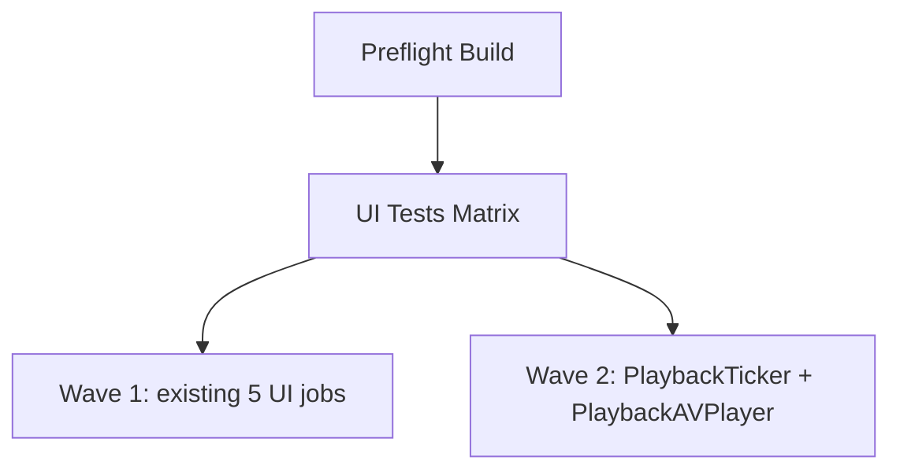

# 03.3.2.4 - CI Configuration for Dual-Mode Playback Tests

**Issue**: 03.3.2.4 - CI Configuration for Dual-Mode Playback Tests
**Parent**: 03.3.2 - AVPlayer Playback Engine
**Status**: In progress

## 2026-01-06 — Design

### Intent
- Add CI coverage for both playback position suites (Ticker + AVPlayer).
- Keep both jobs blocking and parallel with existing UI matrix.
- Add a workflow-dispatch option to run only playback position tests.

### Constraints
- Must use existing simulator provisioning flow and shared preflight artifact.
- Keep UI jobs blocking (no `continue-on-error`).
- Total CI time should stay under 35 minutes.

### Design
- Extend the UI test matrix in `.github/workflows/ci.yml` with two entries:
  - `UITests-PlaybackTicker` -> `zpodUITests/PlaybackPositionTickerTests`
  - `UITests-PlaybackAVPlayer` -> `zpodUITests/PlaybackPositionAVPlayerTests`
- Add a `ui-playback` workflow dispatch option and include it in the UI job condition.
- Keep max-parallel at 5; the two new jobs will run in a second wave.

### TDD Plan
- Use workflow-level validation (CI) as the test harness:
  1. Update `ci.yml` matrix and dispatch option.
  2. Trigger `ui-playback` workflow dispatch to validate only the two new jobs.
  3. Push branch to run full CI and confirm both jobs appear and pass.

### Implementation Plan
1. Update `.github/workflows/ci.yml` matrix with the two playback suites.
2. Add `ui-playback` to workflow dispatch inputs.
3. Update UI job condition to include `ui-playback`.
4. Confirm no `continue-on-error` in the new jobs.
5. Run CI validations (manual dispatch + full run).

## 2026-01-06 — Implementation

- Added `ui-playback` workflow dispatch option and updated UI/Unit/Package job gating.
- Moved playback suites into a dedicated `ui-tests-playback` matrix job.
- Added host app restore and simulator pre-warm steps to match existing UI jobs.
