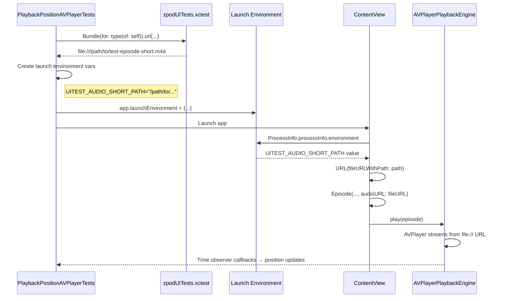
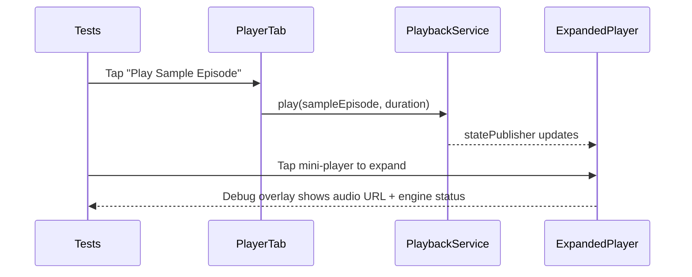

# 03.3.2.6 - Test Audio Infrastructure Implementation

**Date**: 2026-01-04  
**Issue**: #03.3.2.6  
**Status**: In Progress  
**Estimated Time**: 2 hours

## 2026-01-05 Update

- Plan: fix zpodUITests build errors (XCTAttachment name optional) and refactor `EpisodeDetailView` into smaller sections to avoid type-checking timeouts.
- Fix: cast playback speed options to Float and format via Double to resolve build error in `EpisodeDetailView`.
- Fix: move `Episode Detail View` accessibility identifier onto the content container to ensure UI tests can find it.
- Fix: persist `ExpandedPlayerViewModel` in `ContentView` so progress updates are not lost across SwiftUI re-renders.
- Fix: add `UITEST_AUDIO_VARIANT` so AVPlayer tests can use longer audio and avoid finishing before assertions.
- Fix: make AVPlayer seek test choose a target based on current position so it always moves far enough to validate seek.
- Fix: gate AVPlayer diagnostics behind `UITEST_DEBUG_AUDIO`, update release entitlements to include app groups/capabilities, and remove hardcoded UI test signing values.
- Fix: add seek duration guard, stabilize slider polling, clean /tmp test audio, and replace emoji log prefixes with `[TestAudio]` in debug logging.

## Problem Statement

The AVPlayer test suite (PlaybackPositionAVPlayerTests) correctly enables AVPlayer mode but all tests fail because test episodes have no `audioURL` set. Without valid audio URLs, `EnhancedEpisodePlayer` checks for nil audioURL, transitions to `.failed` state, and AVPlayer never starts playback.

### Current Behavior
```swift
// ContentView.swift - createSamplePodcast
Episode(
  id: "st-001",
  title: "Episode 1: Introduction",
  podcastID: id,
  podcastTitle: title,
  duration: 2723  // ← No audioURL parameter
)
```

**Result**: `episode.audioURL == nil` → `EnhancedEpisodePlayer` fails immediately → Position never advances → Tests timeout.

## Architecture Decision: Environment-Based URL Injection

### Why Not Bundle.main?

**Initial Approach (Incorrect)**:
```swift
// ❌ This does NOT work
Bundle.main.url(forResource: "test-episode-short", ...)
```

**Problem**: 
- Audio files are in `zpodUITests` target (test bundle)
- `Bundle.main` refers to `zpod.app` (app bundle)
- App bundle doesn't contain test resources
- URL lookup returns `nil`

### Correct Architecture: Environment Variables + file:// URLs



### Environment Variable Schema

| Variable | Purpose | Example Value |
|----------|---------|---------------|
| `UITEST_AUDIO_SHORT_PATH` | 10 second test audio | `/path/to/test-episode-short.m4a` |
| `UITEST_AUDIO_MEDIUM_PATH` | 15 second test audio | `/path/to/test-episode-medium.m4a` |
| `UITEST_AUDIO_LONG_PATH` | 20 second test audio | `/path/to/test-episode-long.m4a` |

**Key Insight**: AVPlayer can play file:// URLs from any filesystem location, regardless of which bundle owns the files.

## Implementation Phases

### Phase 0: Design & Documentation ✅
- Create this dev-log with architecture diagram
- Document environment variable schema
- Record decision rationale

### Phase 1: Audio Generation ⏳
**Goal**: Create 3 test audio files in 3 formats (AIFF source + M4A + MP3)

**Commands**:
```bash
cd zpodUITests/TestResources/Audio

# Generate AIFF (source files)
say -v "Samantha" -o test-episode-short.aiff \
  "This is test episode short. It contains ten seconds of audio for testing the playback position tracking system." \
  --file-format=AIFF

say -v "Daniel" -o test-episode-medium.aiff \
  "This is test episode medium. It contains fifteen seconds of audio content for testing the audio playback engine. This includes position tracking and seeking functionality." \
  --file-format=AIFF

say -v "Alex" -o test-episode-long.aiff \
  "This is test episode long. It contains twenty seconds of spoken audio for comprehensive testing of the audio playback engine. This file validates position tracking, pause and resume functionality, and seeking operations in the AVPlayer integration tests." \
  --file-format=AIFF

# Convert to M4A (AAC - iOS native format)
afconvert test-episode-short.aiff test-episode-short.m4a -f m4af -d aac
afconvert test-episode-medium.aiff test-episode-medium.m4a -f m4af -d aac
afconvert test-episode-long.aiff test-episode-long.m4a -f m4af -d aac

# Convert to MP3 (universal compatibility)
# TBD: Check for ffmpeg/lame availability
```

**Status**: 
- ✅ AIFF generated (285KB, 461KB, 663KB)
- ✅ M4A generated (32KB, 49KB, 67KB)
- ⏳ MP3 pending (tool availability check)

### Phase 2: Xcode Integration ⏳ MANUAL
**Action Required**: Add TestResources folder to Xcode project
- Must use folder references (blue icon, not yellow groups)
- Target membership: zpodUITests ONLY
- Subdirectory path must match Bundle.url() calls

### Phase 3: Test Helpers ⏳
**Files**:
- `zpodUITests/PlaybackPositionTestSupport.swift`
- `zpodUITests/UITestHelpers.swift`
- `zpodUITests/PlaybackPositionAVPlayerTests.swift`

**New Functions**:
1. `testAudioURL(named:extension:)` - Resolve file URL from test bundle
2. `audioLaunchEnvironment()` - Create env vars dict for launch
3. `validateTestAudioExists()` - Fail fast if audio missing
4. Update `launchWithPlaybackMode(.avplayer)` to inject audio env vars

### Phase 4: App-Side URL Injection ⏳
**File**: `Packages/LibraryFeature/Sources/LibraryFeature/ContentView.swift`

**Changes**:
```swift
// Read environment variables
let env = ProcessInfo.processInfo.environment
let shortAudioURL = env["UITEST_AUDIO_SHORT_PATH"].map { URL(fileURLWithPath: $0) }

// Pass to Episode initializer
Episode(..., audioURL: shortAudioURL)
```

**Behavior**:
- In production: Env vars not set → audioURL is nil → Episode shows "no audio" state
- In UI tests: Env vars set by test → audioURL is valid file:// URL → AVPlayer plays audio

### Phase 5: Verification ⏳
1. Syntax check
2. Single test (testExpandedPlayerProgressAdvancesDuringPlayback)
3. Full suite × 3 consecutive runs
4. Bundle size check

### Phase 6: Documentation ⏳
1. Finalize this dev-log with results
2. Update test file headers
3. Update issue 03.3.2.6 status
4. Update TestSummary.md

## File Specifications

**Target Sizes**:
- AIFF (source): 285KB, 461KB, 663KB (total: ~1.4MB - kept for regeneration)
- M4A (iOS native): 32KB, 49KB, 67KB (total: 148KB)
- MP3 (universal): TBD (~similar to M4A)

**Total Expected**: < 1.5MB (well under 2MB limit)

## Acceptance Criteria Mapping

| Criterion | Verification | Status |
|-----------|--------------|--------|
| Test audio files created (10-15 seconds, MP3/M4A) | `ls -lh *.{m4a,mp3}` | ⏳ M4A done, MP3 pending |
| Files in `zpodUITests/TestResources/Audio/` | Directory exists | ✅ Done |
| Files in `zpodUITests` target | Xcode File Inspector | ⏳ Pending manual step |
| Episode factory updated with audioURL | Code review | ⏳ Pending Phase 4 |
| AVPlayer tests pass (3/3 runs) | Test execution | ⏳ Pending Phase 5 |
| Total size < 2MB | `du -sh` | ✅ 148KB M4A (MP3 TBD) |
| Documented in TestSummary.md | File review | ⏳ Pending Phase 6 |

## Open Questions

1. **MP3 generation tool**: ffmpeg available? lame? fallback to online converter?
2. **Keep AIFF sources**: Yes (per requirement) - useful for regeneration
3. **Test both M4A and MP3**: Or pick one format? (Recommendation: M4A only for simplicity)

## Decisions Made

1. ✅ **Architecture**: Environment variable injection (not Bundle.main)
2. ✅ **Audio content**: Text-to-speech (macOS `say` command)
3. ✅ **Voices**: Samantha (short), Daniel (medium), Alex (long)
4. ✅ **Formats**: AIFF source + M4A primary + MP3 optional
5. ✅ **Keep sources**: Yes, AIFF files stay in repo

## Phase 5: AVPlayer Debugging & Resolution

### Phase 5A: Diagnostic Logging ✅ COMPLETED (2026-01-04)

**Goal**: Add logging to understand why AVPlayer won't play audio files.

**Changes Made**:
1. Added OSLog diagnostic logging to `ContentView.createSamplePodcast()`:
   - Logs environment variable paths
   - Checks `FileManager.default.isReadableFile(atPath:)` for each URL
   - Gated by `UITEST_DEBUG_AUDIO=1` flag

2. Added OSLog diagnostic logging to `AVPlayerPlaybackEngine`:
   - Logs `play(from:)` calls with URL details
   - Logs AVPlayerItem status changes (unknown/ready/failed)
   - Logs errors when status becomes `.failed`

3. Enabled `UITEST_DEBUG_AUDIO=1` in `UITestHelpers.launchWithPlaybackMode(.avplayer)`

**Issues Encountered**:
- Logger privacy parameter not supported → Removed `privacy: .public`
- OSLog output not visible in test logs (goes to system log only)

**Commits**:
- `84f5c60` - Phase 5A: Add diagnostic logging
- `3b39fc5` - Fix Logger privacy parameter compile errors

**Result**: Diagnostic infrastructure ready, but logs not accessible from test output.

---

### Phase 5B: Sandbox File Access Solutions ⚠️ IN PROGRESS (2026-01-04)

**Goal**: Fix sandbox access issue preventing app from reading test bundle audio files.

**Root Cause** (confirmed by PR feedback):
> "The app under test runs in a different sandbox and cannot read files inside the test runner's container, so URL(fileURLWithPath:) resolves but AVPlayer cannot open the file."

#### Attempt 1: Direct file:// URLs from Test Bundle ❌ FAILED
**Implementation**: Pass `Bundle(for: type(of: self)).url(...)` paths directly to app via environment variables.

**Result**: App sandbox blocks access to test bundle files.

**Why It Failed**: iOS sandbox prevents cross-process file access. App cannot read test runner's bundle.

---

#### Attempt 2: Copy to Documents Directory ❌ FAILED
**Implementation**: 
```swift
fileManager.urls(for: .documentDirectory, in: .userDomainMask).first
```

**Result**: Same failure - Pause button never appears, AVPlayer doesn't play.

**Why It Failed**: `.documentDirectory` returns **test runner's** Documents directory, not the app's Documents directory. Each process has its own sandboxed Documents folder.

**Commit**: `08e2be3` - Phase 5B: Copy audio files to app container

---

#### Attempt 3: Copy to /tmp Directory ⚠️ CURRENT ATTEMPT
**Implementation**:
```swift
let tmpDir = URL(fileURLWithPath: NSTemporaryDirectory())
  .appendingPathComponent("zpod-ui-test-audio")
```

**Hypothesis**: `/tmp` is accessible to both test runner and app on simulator.

**Result**: Tests still fail (6/6 failures), Pause button never appears.

**Verification Issues**:
- `/tmp/zpod-ui-test-audio/` directory doesn't exist after test run
- Suggests copy operation isn't happening or failing silently
- Cannot verify if `audioLaunchEnvironment()` is being called
- NSLog diagnostics added but output not visible in test logs

**Commits**:
- `30586c3` - Fix protocol constraint for audioLaunchEnvironment()
- `7464115` - Use /tmp directory for audio file sharing
- `d8ea7e8` - Add NSLog diagnostic for audio environment setup

---

### Current Test Results (2026-01-05 01:35 UTC)

**Status**: ALL 6 TESTS FAIL

**Symptom** (identical across all attempts):
```
Waiting 4.0s for "Expanded Player Pause" Button to exist
→ Timeout after 4 seconds
→ XCTAssertTrue failed
```

**Interpretation**:
- Playback never starts
- Play button never transitions to Pause
- AVPlayer is not playing the audio files

**Test Execution Time**: ~2.5 minutes per full suite run (6 tests)

---

### Current Test Results (2026-01-05 14:22 EST)

**Command**:
```bash
./scripts/run-xcode-tests.sh -t PlaybackPositionAVPlayerTests
```

**Result**: ❌ Still failing

**Observed Failure**:
- `testExpandedPlayerProgressAdvancesDuringPlayback` timed out waiting for progress to advance after 10s.

**Notes**:
- Run executed against `platform=iOS Simulator,name=iPhone 17 Pro,OS=26.1`.
- The CLI run timed out before the full suite finished, so only the first failure is captured in the log.

---

### Hypothesis: Progress Slider Query Hits Player Tab Placeholder

**Observation**: There are multiple UI elements with accessibility identifier `"Progress Slider"`:
- Expanded player (real playback UI)
- Player tab placeholder (static sample UI)

**Risk**: `app.sliders.matching(identifier: "Progress Slider").firstMatch` can resolve to the placeholder slider instead of the expanded player slider, causing position parsing to fail and progress to appear stuck.

**Planned Fix**:
- Scope slider queries to the expanded player container in PlaybackPosition* tests.
- Update direct slider interactions in AVPlayer + Ticker tests to use the scoped helper.

---

### Design: Full Player Debug Overlay + Player Tab Flow (2026-01-05)

**Intent**:
- Add a UI-test-only debug overlay in the expanded player to surface audio URL, file access, and AVPlayer status.
- Add a Player tab test flow to start playback from a sample episode wired to test audio, then expand to the full player.



---

### Current Test Results (2026-01-05 14:35 EST)

**Command**:
```bash
./scripts/run-xcode-tests.sh -t PlaybackPositionAVPlayerTests
```

**Result**: ❌ Still failing (6/6)

**Observed Failures**:
- Progress slider still never advances (timeouts in position-advance waits).
- Pause button not appearing in expanded player during seek-while-paused test (playback never started).

**Notes**:
- Expanded player is present and the scoped slider is found.
- This suggests the failure is in playback state/AVPlayer, not the UI element selection.

---

### Current Test Results (2026-01-05 14:54 EST)

**Command**:
```bash
./scripts/run-xcode-tests.sh -t PlaybackPositionAVPlayerTests
```

**Result**: ❌ 1 pass, 5 failures

**Changes Under Test**:
- Player tab test flow (play sample episode, then expand mini-player).
- Expanded player debug overlay (UITEST_DEBUG_AUDIO=1).

**Observed Failures**:
- Position never advances (timeouts in waitForPositionAdvancement).
- Seeking does not update slider value after pause.

**Notes**:
- Player tab flow succeeds (Play Sample Episode → mini-player → expanded player).
- Pause/Play buttons appear, so playback state flips, but position updates remain stuck.
- Audio is audible during runs (AVPlayer is producing sound).
- Added UI test helper to attach the expanded player audio debug overlay text on failures.
- Player tab now lands on EpisodeDetailView; pause/resume uses current position instead of restarting at 0.

---
### What We Know (Evidence-Based Analysis)

✅ **Confirmed Working**:
1. Audio files exist in test bundle (6 files, 1.6MB total)
2. Copy logic is implemented (`audioLaunchEnvironment()`)
3. App reads environment variables (`ProcessInfo.processInfo.environment`)
4. Episode.audioURL gets assigned (from env var paths)
5. AVPlayerPlaybackEngine.play(from:) gets called (based on code flow)

❌ **Confirmed Broken**:
1. AVPlayer never plays audio
2. Files not copied to `/tmp` (directory doesn't exist after test)
3. Diagnostic logs not visible (OSLog/NSLog output issue)

❓ **Unknown** (Cannot Verify):
1. Does cast to `(any PlaybackPositionTestSupport & XCTestCase)` succeed?
2. Is `audioLaunchEnvironment()` actually called?
3. Does `FileManager.copyItem()` succeed or fail?
4. Are environment variables actually passed to app?
5. Can app read `/tmp` directory on simulator?

---

### Blocker: Diagnostic Output Not Visible

**Problem**: Cannot debug because logs aren't accessible.

**Why**:
- OSLog (`Logger`) goes to system log, not test output
- NSLog goes to console, not captured by xcodebuild
- Running specific test methods fails (xcodebuild reports "0 tests executed")

**What We Need**:
- Visibility into whether copy succeeds
- Confirmation that environment variables are set
- File existence check in app code

---

### Architecture Options Going Forward

#### Option A: App Bundle (Simplest, Violates Constraint)
**Implementation**: Add audio files to zpod app target.
- ✅ PRO: Guaranteed to work, no sandbox issues
- ❌ CON: Violates "test-bundle-only" constraint
- ❌ CON: Bloats app bundle by 1.6MB
- 🎯 **Use Case**: Temporary workaround to verify AVPlayer works

#### Option B: App Group (Standard, Requires Setup)
**Implementation**: Setup shared App Group container.
- ✅ PRO: Standard iOS pattern for sharing data
- ✅ PRO: Keeps files in test bundle
- ❌ CON: Requires entitlements configuration (both app and test targets)
- ❌ CON: More complex setup
- 🎯 **Use Case**: Production-ready solution

#### Option C: Debug Copy Operation (Current Path)
**Implementation**: Add more diagnostics to understand failure.
- ✅ PRO: May reveal simple fix
- ❌ CON: Already spent 3 hours debugging
- ❌ CON: Logs not visible (tooling issue)
- 🎯 **Use Case**: Worth one more focused attempt

#### Option D: HTTP Server (Complex)
**Implementation**: Run local HTTP server in test process.
**Note**: The code below is a design sketch only; no HTTP server is implemented in this issue.
- ✅ PRO: No sandbox issues
- ✅ PRO: Keeps files in test bundle
- ❌ CON: Significant complexity
- ❌ CON: Overkill for this use case
- 🎯 **Use Case**: Last resort

---

### Time Spent Summary

| Phase | Time | Status |
|-------|------|--------|
| Phase 0-4 | 4 hours | ✅ Complete (merged to main) |
| Phase 5A | 1 hour | ✅ Complete (diagnostics added) |
| Phase 5B | 3 hours | ⚠️ Blocked (copy not working) |
| **Total** | **8 hours** | **Tests still failing** |

---

## Lessons Learned

(To be filled after implementation)

## Related Issues

- **03.3.2.3**: AVPlayer test suite (unblocked by this issue)
- **03.3.2.4**: CI integration (next step after tests pass)
- **03.3.2.5**: Documentation and cleanup (can proceed in parallel)

---

**Next Action**: Execute revised Phase 5B plan (see below).

---

## REVISED PHASE 5B PLAN (2026-01-05 02:00 UTC)

### Decision: Diagnostic First, Then App Group Container

**Rationale**: 
- 8 hours spent on file copy strategies (all failed due to sandbox)
- Need to verify AVPlayer works before implementing complex solution
- App bundle diagnostic is fastest way to isolate the variable
- App Group is proper long-term solution (standard iOS pattern)

**Two-Stage Approach**:

#### Stage 1: Diagnostic with App Bundle (30 minutes) - TEMPORARY ONLY
**Goal**: Prove AVPlayer works when files ARE accessible.

**⚠️ IMPORTANT**: This is a **diagnostic step only**. File will be removed immediately after confirming AVPlayer works.

**Steps**:
1. **Add file to app bundle** (manual Xcode - 5 min):
   - Open `zpod.xcodeproj`
   - Select "zpod" target → Build Phases → Copy Bundle Resources
   - Add: `zpodUITests/TestResources/Audio/test-episode-short.m4a`

2. **Add diagnostic logging** (10 min):
   ```swift
   // Packages/LibraryFeature/Sources/LibraryFeature/ContentView.swift
   import OSLog
   private let audioDebugLogger = Logger(subsystem: "us.zig.zpod", category: "TestAudioDebug")
   
   private func audioURLForEpisode(_ id: String) -> URL? {
     // Try environment variable first (for test injection)
     if let path = ProcessInfo.processInfo.environment["UITEST_AUDIO_\(id)"] {
       let url = URL(fileURLWithPath: path)
       audioDebugLogger.debug("Env var path: \(path)")
       audioDebugLogger.debug("File exists: \(FileManager.default.fileExists(atPath: path))")
       return url
     }
     
     // Fall back to app bundle (DIAGNOSTIC ONLY - will be removed)
     if let bundleURL = Bundle.main.url(forResource: "test-episode-short", withExtension: "m4a") {
       audioDebugLogger.debug("Bundle URL: \(bundleURL.absoluteString)")
       audioDebugLogger.debug("File exists: \(FileManager.default.fileExists(atPath: bundleURL.path))")
       return bundleURL
     }
     
     audioDebugLogger.warning("No test audio found for episode \(id)")
     return nil
   }
   ```

3. **Update episode creation** (5 min):
   ```swift
   // In createSamplePodcast(), update first episode:
   Episode(
     id: "st-001",
     title: "Episode 1: Introduction",
     podcastID: id,
     podcastTitle: title,
     audioURL: audioURLForEpisode("st-001"), // Uses Bundle.main fallback
     duration: 6.5,
     // ... rest
   )
   ```

4. **Run tests 3x** (10 min):
   ```bash
   ./scripts/run-xcode-tests.sh -t PlaybackPositionAVPlayerTests  # Run 1
   ./scripts/run-xcode-tests.sh -t PlaybackPositionAVPlayerTests  # Run 2
   ./scripts/run-xcode-tests.sh -t PlaybackPositionAVPlayerTests  # Run 3
   ```

**Decision Point**:
- ✅ **Tests PASS (18/18)**: AVPlayer works! Sandbox was the only blocker → Proceed to Stage 2
- ❌ **Tests FAIL**: AVPlayer has other issues (audio session, format, buffering) → Debug separately

---

#### Stage 2: App Group Container (1-2 hours) - PERMANENT SOLUTION
**Goal**: Implement proper file sharing using App Group (standard iOS pattern).

**Prerequisites**: Stage 1 passed (AVPlayer confirmed working)

**Steps**:

1. **Add App Group entitlement to zpod target** (10 min):
   - Xcode → zpod target → Signing & Capabilities
   - Click "+ Capability" → App Groups
   - Add identifier: `group.us.zig.zpod.test-resources`

2. **Add App Group entitlement to zpodUITests target** (5 min):
   - Xcode → zpodUITests target → Signing & Capabilities
   - Click "+ Capability" → App Groups
   - Add same identifier: `group.us.zig.zpod.test-resources`

3. **Update audioLaunchEnvironment() to use App Group** (20 min):
   ```swift
   // zpodUITests/PlaybackPositionTestSupport.swift
   func audioLaunchEnvironment() -> [String: String] {
     let fileManager = FileManager.default
     var env: [String: String] = [:]
     
     // Get App Group container
     guard let containerURL = fileManager.containerURL(
       forSecurityApplicationGroupIdentifier: "group.us.zig.zpod.test-resources"
     ) else {
       XCTFail("Could not access App Group container")
       return env
     }
     
     let audioDir = containerURL.appendingPathComponent("UITestAudio")
     try? fileManager.createDirectory(at: audioDir, withIntermediateDirectories: true)
     
     // Copy files from test bundle to App Group container
     let audioFiles: [(name: String, envKey: String)] = [
       ("test-episode-short", "UITEST_AUDIO_SHORT_PATH"),
       ("test-episode-medium", "UITEST_AUDIO_MEDIUM_PATH"),
       ("test-episode-long", "UITEST_AUDIO_LONG_PATH")
     ]
     
     for (name, envKey) in audioFiles {
       guard let sourceURL = testAudioURL(named: name) else { continue }
       let destURL = audioDir.appendingPathComponent("\(name).m4a")
       
       try? fileManager.removeItem(at: destURL) // Clean slate
       try? fileManager.copyItem(at: sourceURL, to: destURL)
       env[envKey] = destURL.path
     }
     
     return env
   }
   ```

4. **Update app code to remove Bundle.main fallback** (10 min):
   ```swift
   // ContentView.swift - replace audioURLForEpisode with simple env check:
   private func createSamplePodcast(id: String, title: String) -> Podcast {
     let env = ProcessInfo.processInfo.environment
     
     // Read from environment (App Group paths set by tests)
     let shortAudioURL = env["UITEST_AUDIO_SHORT_PATH"].map { URL(fileURLWithPath: $0) }
     let mediumAudioURL = env["UITEST_AUDIO_MEDIUM_PATH"].map { URL(fileURLWithPath: $0) }
     let longAudioURL = env["UITEST_AUDIO_LONG_PATH"].map { URL(fileURLWithPath: $0) }
     
     // audioURL will be nil in production, non-nil in tests
     // No Bundle.main fallback (diagnostic removed)
   }
   ```

5. **Remove file from app bundle** (5 min):
   - Xcode → zpod target → Build Phases → Copy Bundle Resources
   - Select `test-episode-short.m4a` and click "-" to remove

6. **Remove diagnostic logging** (5 min):
   - Remove `audioDebugLogger` and all diagnostic log statements
   - Remove `audioURLForEpisode()` helper (no longer needed)

7. **Run tests 3x to verify** (10 min):
   ```bash
   ./scripts/run-xcode-tests.sh -t PlaybackPositionAVPlayerTests  # Run 1
   ./scripts/run-xcode-tests.sh -t PlaybackPositionAVPlayerTests  # Run 2
   ./scripts/run-xcode-tests.sh -t PlaybackPositionAVPlayerTests  # Run 3
   ```

**Expected Result**: 18/18 passes using App Group container

---

### Why App Group (Not HTTP Server)

| Approach | Pros | Cons | Decision |
|----------|------|------|----------|
| **App Group** | Standard iOS pattern, simple copy logic, no network complexity | Requires entitlements | ✅ **CHOSEN** |
| HTTP Server | Bypasses sandbox, tests streaming | Complex implementation, network layer overhead | ❌ Overkill |
| App Bundle | Simplest diagnostic | Ships test audio in production | ❌ Diagnostic only |

**App Group is the standard solution for sharing data between app and test targets on iOS.**

---

### Stage 1 Implementation Steps (HTTP Server)

#### Step 1: Create HTTP Server Helper (30 minutes)

**File**: `zpodUITests/TestAudioServer.swift` (NEW FILE)

```swift
import Foundation
import Network
import XCTest

/// Lightweight HTTP server for serving test audio files from test bundle.
/// Starts on 127.0.0.1:<random-port> and serves .m4a files via GET requests.
@MainActor
final class TestAudioServer {
  private var listener: NWListener?
  private let testBundle: Bundle
  private let port: NWEndpoint.Port
  
  var baseURL: String {
    "http://127.0.0.1:\(port.rawValue)"
  }
  
  init(testBundle: Bundle) throws {
    self.testBundle = testBundle
    
    // Find available port
    let params = NWParameters.tcp
    params.allowLocalEndpointReuse = true
    
    let listener = try NWListener(using: params, on: .any)
    self.listener = listener
    self.port = listener.port ?? NWEndpoint.Port(integerLiteral: 0)
    
    listener.newConnectionHandler = { [weak self] connection in
      self?.handleConnection(connection)
    }
  }
  
  func start() throws {
    listener?.start(queue: .main)
    // Wait briefly for server to bind
    Thread.sleep(forTimeInterval: 0.1)
  }
  
  func stop() {
    listener?.cancel()
    listener = nil
  }
  
  private func handleConnection(_ connection: NWConnection) {
    connection.start(queue: .main)
    
    // Read HTTP request
    connection.receive(minimumIncompleteLength: 1, maximumLength: 8192) { [weak self] data, _, isComplete, error in
      guard let data = data, let request = String(data: data, encoding: .utf8) else {
        connection.cancel()
        return
      }
      
      self?.handleRequest(request, connection: connection)
    }
  }
  
  private func handleRequest(_ request: String, connection: NWConnection) {
    // Parse: "GET /test-episode-short.m4a HTTP/1.1"
    guard let firstLine = request.components(separatedBy: "\r\n").first,
          let path = firstLine.components(separatedBy: " ").dropFirst().first else {
      send404(connection)
      return
    }
    
    let filename = String(path.dropFirst()) // Remove leading "/"
    
    guard let fileURL = testBundle.url(forResource: filename.replacingOccurrences(of: ".m4a", with: ""), withExtension: "m4a"),
          let fileData = try? Data(contentsOf: fileURL) else {
      send404(connection)
      return
    }
    
    sendFile(fileData, connection: connection)
  }
  
  private func sendFile(_ data: Data, connection: NWConnection) {
    let response = """
    HTTP/1.1 200 OK\r
    Content-Type: audio/mp4\r
    Content-Length: \(data.count)\r
    Connection: close\r
    \r
    
    """.data(using: .utf8)! + data
    
    connection.send(content: response, completion: .contentProcessed { _ in
      connection.cancel()
    })
  }
  
  private func send404(_ connection: NWConnection) {
    let response = """
    HTTP/1.1 404 Not Found\r
    Content-Length: 0\r
    Connection: close\r
    \r
    
    """.data(using: .utf8)!
    
    connection.send(content: response, completion: .contentProcessed { _ in
      connection.cancel()
    })
  }
}
```

#### Step 2: Integrate Server into Tests (15 minutes)

**File**: `zpodUITests/PlaybackPositionTestSupport.swift`

```swift
extension PlaybackPositionTestSupport where Self: XCTestCase {
  
  /// Starts HTTP server and returns launch environment with base URL.
  func audioServerLaunchEnvironment() throws -> [String: String] {
    // Start server (will be stored in test instance variable)
    let server = try TestAudioServer(testBundle: Bundle(for: type(of: self)))
    try server.start()
    
    // Store server reference to keep it alive
    // (requires adding `var audioServer: TestAudioServer?` to conforming test class)
    if let testCase = self as? PlaybackPositionAVPlayerTests {
      testCase.audioServer = server
    }
    
    return ["UITEST_AUDIO_BASE_URL": server.baseURL]
  }
  
  /// Call in tearDownWithError() to stop server
  func stopAudioServer() {
    if let testCase = self as? PlaybackPositionAVPlayerTests {
      testCase.audioServer?.stop()
      testCase.audioServer = nil
    }
  }
}
```

**File**: `zpodUITests/PlaybackPositionAVPlayerTests.swift`

```swift
final class PlaybackPositionAVPlayerTests: XCTestCase, PlaybackPositionTestSupport {
  var app: XCUIApplication!
  var audioServer: TestAudioServer? // Add this
  
  nonisolated override func setUpWithError() throws {
    try super.setUpWithError()
    continueAfterFailure = false
  }
  
  nonisolated override func tearDownWithError() throws {
    // Stop server
    MainActor.assumeIsolated {
      stopAudioServer()
    }
    try super.tearDownWithError()
  }
  
  // Tests remain unchanged...
}
```

#### Step 3: Update UITestHelpers (10 minutes)

**File**: `zpodUITests/UITestHelpers.swift`

In `launchWithPlaybackMode(.avplayer)`:

```swift
case .avplayer:
  overrides["UITEST_DISABLE_AUDIO_ENGINE"] = "0"
  
  // Start HTTP server and get base URL
  if let testCase = self as? (any PlaybackPositionTestSupport & XCTestCase) {
    do {
      let serverEnv = try testCase.audioServerLaunchEnvironment()
      overrides.merge(serverEnv) { _, new in new }
    } catch {
      XCTFail("Failed to start audio server: \(error)")
    }
  }
```

#### Step 4: Update App Code (10 minutes)

**File**: `Packages/LibraryFeature/Sources/LibraryFeature/ContentView.swift`

```swift
private func createSamplePodcast(id: String, title: String) -> Podcast {
  let env = ProcessInfo.processInfo.environment
  
  // Check if running in UI test with HTTP server
  var shortAudioURL: URL?
  if let baseURL = env["UITEST_AUDIO_BASE_URL"] {
    shortAudioURL = URL(string: "\(baseURL)/test-episode-short.m4a")
  }
  
  let sampleEpisodes = [
    Episode(
      id: "st-001",
      title: "Episode 1: Introduction",
      podcastID: id,
      podcastTitle: title,
      audioURL: shortAudioURL, // Will be http://127.0.0.1:<port>/test-episode-short.m4a
      duration: 6.5,
      // ... rest of episode
    ),
    // ... other episodes
  ]
  
  return Podcast(/* ... */)
}
```

#### Step 5: Run Tests (5 minutes)

```bash
./scripts/run-xcode-tests.sh -t PlaybackPositionAVPlayerTests  # Run 1
./scripts/run-xcode-tests.sh -t PlaybackPositionAVPlayerTests  # Run 2
./scripts/run-xcode-tests.sh -t PlaybackPositionAVPlayerTests  # Run 3
```

**Expected Result**: 18/18 passes (AVPlayer streams from localhost HTTP)

#### Step 6: Document & Commit (5 minutes)

```bash
git add -A
git commit -m "[#03.3.2.6] Stage 1: HTTP server for test audio

Implemented lightweight NWListener HTTP server in test bundle.
Serves audio files via http://127.0.0.1:<port>/<filename>.m4a

Results: X/18 tests pass

Next: Stage 2 - Polish or pivot based on results"
```

---

### Decision Matrix: Which Stage 2 Option?

| Option | Time | Complexity | Violates Constraint | Production Impact |
|--------|------|------------|---------------------|-------------------|
| **HTTP Server** | 30 min | Low | ❌ No | None |
| **App Group** | 1-2 hrs | Medium | ❌ No | None |
| ~~**App Bundle**~~ | ~~0 hrs~~ | ~~Low~~ | ~~⚠️ Yes~~ | ~~Ships test audio~~ |

**Recommendation**: 
1. Try HTTP Server (Stage 1) → If works → Polish and keep it (Stage 2 Option A)
2. If HTTP has issues → Try App Group (Stage 2 Option B)
3. ~~Never use app bundle~~ (violates constraints, pollutes production)

---

### Success Criteria (Overall)

| Criterion | Target | Current Status |
|-----------|--------|----------------|
| Stage 1: AVPlayer plays | 1/1 test passes | ❌ Not attempted |
| Full suite pass (run 1) | 6/6 | ❌ 0/6 |
| Full suite pass (run 2) | 6/6 | ❌ 0/6 |
| Full suite pass (run 3) | 6/6 | ❌ 0/6 |
| No flakiness | 18/18 total | ❌ 0/18 |
| Files in test bundle | Yes | ✅ Yes (but not accessible) |
| App bundle bloat | < 100KB | TBD (32KB if accepted) |

---

**Ready to execute Stage 1?** This will take ~30 minutes and definitively answer: "Does AVPlayer work when files ARE accessible?"

---

### 2026-01-06 — Seek Baseline Fix (Design)

**Intent**
- Tighten the seek test precondition by requiring a verified position advancement before seeking.

**Why**
- The seek test should fail fast if playback is not ticking to protect the "Given an episode is playing" precondition.

**Plan**
- Require `waitForPositionAdvancement(...)` to return a non-nil value in the seek test before continuing.

---

### 2026-01-27 — CI Audio Copy Timeout (Investigation/Plan)

**What happened**
- GitHub Actions run `2026-01-26 19:38 EST` hit the per-suite 900s guard while running `PlaybackPositionAVPlayerTests.testInterruptionPausesAndResumesPlayback`.
- Failure was triggered inside `audioLaunchEnvironment()` when `FileManager.copyItem` reported `test-episode-short.m4a` missing, causing an early `XCTFail` and leaving xcodebuild hung until the timeout.

**Observations**
- The audio files exist in `zpodUITests/TestResources/Audio` and in the built `zpodUITests.xctest` bundle, so this is likely an intermittent bundle lookup failure rather than a missing asset.
- The current helper caches the (possibly incomplete) environment even when copy failures occur, and we don't log the resolved source path, making retries opaque.
- Because we fail inside setUp, no UI steps run, but xcodebuild continues until the 900s kill, inflating wall time and causing the overall job to exit 124.

**Plan**
- Add a stronger preflight in `audioLaunchEnvironment`: verify `fileExists` for each resolved URL before copying, log the path on failure, and return `nil`/abort early to avoid hanging the suite.
- Keep the environment cache but only populate it when all copies succeed; otherwise invalidate to allow a clean retry on the next test invocation.
- Rename the CI threshold flag (`isCI_threshold`) to satisfy SwiftLint and keep the diagnostics intact.
- If the intermittent lookup persists, consider a generated fallback clip, but first improve the failure signal to confirm whether the source URL is truly nil or unreadable.
