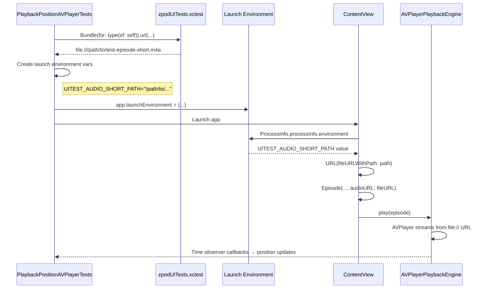

# 03.3.2.6 - Test Audio Infrastructure Implementation

**Date**: 2026-01-04  
**Issue**: #03.3.2.6  
**Status**: In Progress  
**Estimated Time**: 2 hours

## Problem Statement

The AVPlayer test suite (PlaybackPositionAVPlayerTests) correctly enables AVPlayer mode but all tests fail because test episodes have no `audioURL` set. Without valid audio URLs, `EnhancedEpisodePlayer` checks for nil audioURL, transitions to `.failed` state, and AVPlayer never starts playback.

### Current Behavior
```swift
// ContentView.swift - createSamplePodcast
Episode(
  id: "st-001",
  title: "Episode 1: Introduction",
  podcastID: id,
  podcastTitle: title,
  duration: 2723  // ← No audioURL parameter
)
```

**Result**: `episode.audioURL == nil` → `EnhancedEpisodePlayer` fails immediately → Position never advances → Tests timeout.

## Architecture Decision: Environment-Based URL Injection

### Why Not Bundle.main?

**Initial Approach (Incorrect)**:
```swift
// ❌ This does NOT work
Bundle.main.url(forResource: "test-episode-short", ...)
```

**Problem**: 
- Audio files are in `zpodUITests` target (test bundle)
- `Bundle.main` refers to `zpod.app` (app bundle)
- App bundle doesn't contain test resources
- URL lookup returns `nil`

### Correct Architecture: Environment Variables + file:// URLs



### Environment Variable Schema

| Variable | Purpose | Example Value |
|----------|---------|---------------|
| `UITEST_AUDIO_SHORT_PATH` | 10 second test audio | `/path/to/test-episode-short.m4a` |
| `UITEST_AUDIO_MEDIUM_PATH` | 15 second test audio | `/path/to/test-episode-medium.m4a` |
| `UITEST_AUDIO_LONG_PATH` | 20 second test audio | `/path/to/test-episode-long.m4a` |

**Key Insight**: AVPlayer can play file:// URLs from any filesystem location, regardless of which bundle owns the files.

## Implementation Phases

### Phase 0: Design & Documentation ✅
- Create this dev-log with architecture diagram
- Document environment variable schema
- Record decision rationale

### Phase 1: Audio Generation ⏳
**Goal**: Create 3 test audio files in 3 formats (AIFF source + M4A + MP3)

**Commands**:
```bash
cd zpodUITests/TestResources/Audio

# Generate AIFF (source files)
say -v "Samantha" -o test-episode-short.aiff \
  "This is test episode short. It contains ten seconds of audio for testing the playback position tracking system." \
  --file-format=AIFF

say -v "Daniel" -o test-episode-medium.aiff \
  "This is test episode medium. It contains fifteen seconds of audio content for testing the audio playback engine. This includes position tracking and seeking functionality." \
  --file-format=AIFF

say -v "Alex" -o test-episode-long.aiff \
  "This is test episode long. It contains twenty seconds of spoken audio for comprehensive testing of the audio playback engine. This file validates position tracking, pause and resume functionality, and seeking operations in the AVPlayer integration tests." \
  --file-format=AIFF

# Convert to M4A (AAC - iOS native format)
afconvert test-episode-short.aiff test-episode-short.m4a -f m4af -d aac
afconvert test-episode-medium.aiff test-episode-medium.m4a -f m4af -d aac
afconvert test-episode-long.aiff test-episode-long.m4a -f m4af -d aac

# Convert to MP3 (universal compatibility)
# TBD: Check for ffmpeg/lame availability
```

**Status**: 
- ✅ AIFF generated (285KB, 461KB, 663KB)
- ✅ M4A generated (32KB, 49KB, 67KB)
- ⏳ MP3 pending (tool availability check)

### Phase 2: Xcode Integration ⏳ MANUAL
**Action Required**: Add TestResources folder to Xcode project
- Must use folder references (blue icon, not yellow groups)
- Target membership: zpodUITests ONLY
- Subdirectory path must match Bundle.url() calls

### Phase 3: Test Helpers ⏳
**Files**:
- `zpodUITests/PlaybackPositionTestSupport.swift`
- `zpodUITests/UITestHelpers.swift`
- `zpodUITests/PlaybackPositionAVPlayerTests.swift`

**New Functions**:
1. `testAudioURL(named:extension:)` - Resolve file URL from test bundle
2. `audioLaunchEnvironment()` - Create env vars dict for launch
3. `validateTestAudioExists()` - Fail fast if audio missing
4. Update `launchWithPlaybackMode(.avplayer)` to inject audio env vars

### Phase 4: App-Side URL Injection ⏳
**File**: `Packages/LibraryFeature/Sources/LibraryFeature/ContentView.swift`

**Changes**:
```swift
// Read environment variables
let env = ProcessInfo.processInfo.environment
let shortAudioURL = env["UITEST_AUDIO_SHORT_PATH"].map { URL(fileURLWithPath: $0) }

// Pass to Episode initializer
Episode(..., audioURL: shortAudioURL)
```

**Behavior**:
- In production: Env vars not set → audioURL is nil → Episode shows "no audio" state
- In UI tests: Env vars set by test → audioURL is valid file:// URL → AVPlayer plays audio

### Phase 5: Verification ⏳
1. Syntax check
2. Single test (testExpandedPlayerProgressAdvancesDuringPlayback)
3. Full suite × 3 consecutive runs
4. Bundle size check

### Phase 6: Documentation ⏳
1. Finalize this dev-log with results
2. Update test file headers
3. Update issue 03.3.2.6 status
4. Update TestSummary.md

## File Specifications

**Target Sizes**:
- AIFF (source): 285KB, 461KB, 663KB (total: ~1.4MB - kept for regeneration)
- M4A (iOS native): 32KB, 49KB, 67KB (total: 148KB)
- MP3 (universal): TBD (~similar to M4A)

**Total Expected**: < 1.5MB (well under 2MB limit)

## Acceptance Criteria Mapping

| Criterion | Verification | Status |
|-----------|--------------|--------|
| Test audio files created (10-15 seconds, MP3/M4A) | `ls -lh *.{m4a,mp3}` | ⏳ M4A done, MP3 pending |
| Files in `zpodUITests/TestResources/Audio/` | Directory exists | ✅ Done |
| Files in `zpodUITests` target | Xcode File Inspector | ⏳ Pending manual step |
| Episode factory updated with audioURL | Code review | ⏳ Pending Phase 4 |
| AVPlayer tests pass (3/3 runs) | Test execution | ⏳ Pending Phase 5 |
| Total size < 2MB | `du -sh` | ✅ 148KB M4A (MP3 TBD) |
| Documented in TestSummary.md | File review | ⏳ Pending Phase 6 |

## Open Questions

1. **MP3 generation tool**: ffmpeg available? lame? fallback to online converter?
2. **Keep AIFF sources**: Yes (per requirement) - useful for regeneration
3. **Test both M4A and MP3**: Or pick one format? (Recommendation: M4A only for simplicity)

## Decisions Made

1. ✅ **Architecture**: Environment variable injection (not Bundle.main)
2. ✅ **Audio content**: Text-to-speech (macOS `say` command)
3. ✅ **Voices**: Samantha (short), Daniel (medium), Alex (long)
4. ✅ **Formats**: AIFF source + M4A primary + MP3 optional
5. ✅ **Keep sources**: Yes, AIFF files stay in repo

## Lessons Learned

(To be filled after implementation)

## Related Issues

- **03.3.2.3**: AVPlayer test suite (unblocked by this issue)
- **03.3.2.4**: CI integration (next step after tests pass)
- **03.3.2.5**: Documentation and cleanup (can proceed in parallel)

---

**Next Action**: Complete MP3 generation (Phase 1), then proceed to Phase 2 (Xcode integration).
