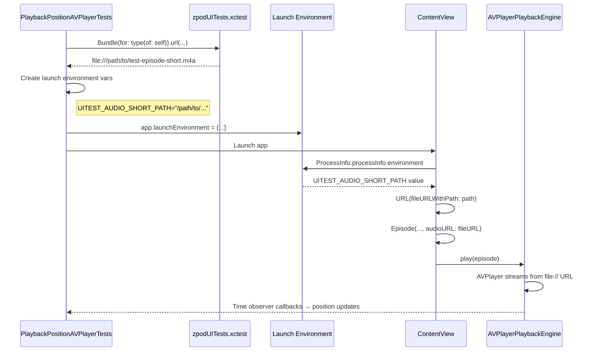

# 03.3.2.6 - Test Audio Infrastructure Implementation

**Date**: 2026-01-04  
**Issue**: #03.3.2.6  
**Status**: In Progress  
**Estimated Time**: 2 hours

## Problem Statement

The AVPlayer test suite (PlaybackPositionAVPlayerTests) correctly enables AVPlayer mode but all tests fail because test episodes have no `audioURL` set. Without valid audio URLs, `EnhancedEpisodePlayer` checks for nil audioURL, transitions to `.failed` state, and AVPlayer never starts playback.

### Current Behavior
```swift
// ContentView.swift - createSamplePodcast
Episode(
  id: "st-001",
  title: "Episode 1: Introduction",
  podcastID: id,
  podcastTitle: title,
  duration: 2723  // ← No audioURL parameter
)
```

**Result**: `episode.audioURL == nil` → `EnhancedEpisodePlayer` fails immediately → Position never advances → Tests timeout.

## Architecture Decision: Environment-Based URL Injection

### Why Not Bundle.main?

**Initial Approach (Incorrect)**:
```swift
// ❌ This does NOT work
Bundle.main.url(forResource: "test-episode-short", ...)
```

**Problem**: 
- Audio files are in `zpodUITests` target (test bundle)
- `Bundle.main` refers to `zpod.app` (app bundle)
- App bundle doesn't contain test resources
- URL lookup returns `nil`

### Correct Architecture: Environment Variables + file:// URLs



### Environment Variable Schema

| Variable | Purpose | Example Value |
|----------|---------|---------------|
| `UITEST_AUDIO_SHORT_PATH` | 10 second test audio | `/path/to/test-episode-short.m4a` |
| `UITEST_AUDIO_MEDIUM_PATH` | 15 second test audio | `/path/to/test-episode-medium.m4a` |
| `UITEST_AUDIO_LONG_PATH` | 20 second test audio | `/path/to/test-episode-long.m4a` |

**Key Insight**: AVPlayer can play file:// URLs from any filesystem location, regardless of which bundle owns the files.

## Implementation Phases

### Phase 0: Design & Documentation ✅
- Create this dev-log with architecture diagram
- Document environment variable schema
- Record decision rationale

### Phase 1: Audio Generation ⏳
**Goal**: Create 3 test audio files in 3 formats (AIFF source + M4A + MP3)

**Commands**:
```bash
cd zpodUITests/TestResources/Audio

# Generate AIFF (source files)
say -v "Samantha" -o test-episode-short.aiff \
  "This is test episode short. It contains ten seconds of audio for testing the playback position tracking system." \
  --file-format=AIFF

say -v "Daniel" -o test-episode-medium.aiff \
  "This is test episode medium. It contains fifteen seconds of audio content for testing the audio playback engine. This includes position tracking and seeking functionality." \
  --file-format=AIFF

say -v "Alex" -o test-episode-long.aiff \
  "This is test episode long. It contains twenty seconds of spoken audio for comprehensive testing of the audio playback engine. This file validates position tracking, pause and resume functionality, and seeking operations in the AVPlayer integration tests." \
  --file-format=AIFF

# Convert to M4A (AAC - iOS native format)
afconvert test-episode-short.aiff test-episode-short.m4a -f m4af -d aac
afconvert test-episode-medium.aiff test-episode-medium.m4a -f m4af -d aac
afconvert test-episode-long.aiff test-episode-long.m4a -f m4af -d aac

# Convert to MP3 (universal compatibility)
# TBD: Check for ffmpeg/lame availability
```

**Status**: 
- ✅ AIFF generated (285KB, 461KB, 663KB)
- ✅ M4A generated (32KB, 49KB, 67KB)
- ⏳ MP3 pending (tool availability check)

### Phase 2: Xcode Integration ⏳ MANUAL
**Action Required**: Add TestResources folder to Xcode project
- Must use folder references (blue icon, not yellow groups)
- Target membership: zpodUITests ONLY
- Subdirectory path must match Bundle.url() calls

### Phase 3: Test Helpers ⏳
**Files**:
- `zpodUITests/PlaybackPositionTestSupport.swift`
- `zpodUITests/UITestHelpers.swift`
- `zpodUITests/PlaybackPositionAVPlayerTests.swift`

**New Functions**:
1. `testAudioURL(named:extension:)` - Resolve file URL from test bundle
2. `audioLaunchEnvironment()` - Create env vars dict for launch
3. `validateTestAudioExists()` - Fail fast if audio missing
4. Update `launchWithPlaybackMode(.avplayer)` to inject audio env vars

### Phase 4: App-Side URL Injection ⏳
**File**: `Packages/LibraryFeature/Sources/LibraryFeature/ContentView.swift`

**Changes**:
```swift
// Read environment variables
let env = ProcessInfo.processInfo.environment
let shortAudioURL = env["UITEST_AUDIO_SHORT_PATH"].map { URL(fileURLWithPath: $0) }

// Pass to Episode initializer
Episode(..., audioURL: shortAudioURL)
```

**Behavior**:
- In production: Env vars not set → audioURL is nil → Episode shows "no audio" state
- In UI tests: Env vars set by test → audioURL is valid file:// URL → AVPlayer plays audio

### Phase 5: Verification ⏳
1. Syntax check
2. Single test (testExpandedPlayerProgressAdvancesDuringPlayback)
3. Full suite × 3 consecutive runs
4. Bundle size check

### Phase 6: Documentation ⏳
1. Finalize this dev-log with results
2. Update test file headers
3. Update issue 03.3.2.6 status
4. Update TestSummary.md

## File Specifications

**Target Sizes**:
- AIFF (source): 285KB, 461KB, 663KB (total: ~1.4MB - kept for regeneration)
- M4A (iOS native): 32KB, 49KB, 67KB (total: 148KB)
- MP3 (universal): TBD (~similar to M4A)

**Total Expected**: < 1.5MB (well under 2MB limit)

## Acceptance Criteria Mapping

| Criterion | Verification | Status |
|-----------|--------------|--------|
| Test audio files created (10-15 seconds, MP3/M4A) | `ls -lh *.{m4a,mp3}` | ⏳ M4A done, MP3 pending |
| Files in `zpodUITests/TestResources/Audio/` | Directory exists | ✅ Done |
| Files in `zpodUITests` target | Xcode File Inspector | ⏳ Pending manual step |
| Episode factory updated with audioURL | Code review | ⏳ Pending Phase 4 |
| AVPlayer tests pass (3/3 runs) | Test execution | ⏳ Pending Phase 5 |
| Total size < 2MB | `du -sh` | ✅ 148KB M4A (MP3 TBD) |
| Documented in TestSummary.md | File review | ⏳ Pending Phase 6 |

## Open Questions

1. **MP3 generation tool**: ffmpeg available? lame? fallback to online converter?
2. **Keep AIFF sources**: Yes (per requirement) - useful for regeneration
3. **Test both M4A and MP3**: Or pick one format? (Recommendation: M4A only for simplicity)

## Decisions Made

1. ✅ **Architecture**: Environment variable injection (not Bundle.main)
2. ✅ **Audio content**: Text-to-speech (macOS `say` command)
3. ✅ **Voices**: Samantha (short), Daniel (medium), Alex (long)
4. ✅ **Formats**: AIFF source + M4A primary + MP3 optional
5. ✅ **Keep sources**: Yes, AIFF files stay in repo

## Phase 5: AVPlayer Debugging & Resolution

### Phase 5A: Diagnostic Logging ✅ COMPLETED (2026-01-04)

**Goal**: Add logging to understand why AVPlayer won't play audio files.

**Changes Made**:
1. Added OSLog diagnostic logging to `ContentView.createSamplePodcast()`:
   - Logs environment variable paths
   - Checks `FileManager.default.isReadableFile(atPath:)` for each URL
   - Gated by `UITEST_DEBUG_AUDIO=1` flag

2. Added OSLog diagnostic logging to `AVPlayerPlaybackEngine`:
   - Logs `play(from:)` calls with URL details
   - Logs AVPlayerItem status changes (unknown/ready/failed)
   - Logs errors when status becomes `.failed`

3. Enabled `UITEST_DEBUG_AUDIO=1` in `UITestHelpers.launchWithPlaybackMode(.avplayer)`

**Issues Encountered**:
- Logger privacy parameter not supported → Removed `privacy: .public`
- OSLog output not visible in test logs (goes to system log only)

**Commits**:
- `84f5c60` - Phase 5A: Add diagnostic logging
- `3b39fc5` - Fix Logger privacy parameter compile errors

**Result**: Diagnostic infrastructure ready, but logs not accessible from test output.

---

### Phase 5B: Sandbox File Access Solutions ⚠️ IN PROGRESS (2026-01-04)

**Goal**: Fix sandbox access issue preventing app from reading test bundle audio files.

**Root Cause** (confirmed by PR feedback):
> "The app under test runs in a different sandbox and cannot read files inside the test runner's container, so URL(fileURLWithPath:) resolves but AVPlayer cannot open the file."

#### Attempt 1: Direct file:// URLs from Test Bundle ❌ FAILED
**Implementation**: Pass `Bundle(for: type(of: self)).url(...)` paths directly to app via environment variables.

**Result**: App sandbox blocks access to test bundle files.

**Why It Failed**: iOS sandbox prevents cross-process file access. App cannot read test runner's bundle.

---

#### Attempt 2: Copy to Documents Directory ❌ FAILED
**Implementation**: 
```swift
fileManager.urls(for: .documentDirectory, in: .userDomainMask).first
```

**Result**: Same failure - Pause button never appears, AVPlayer doesn't play.

**Why It Failed**: `.documentDirectory` returns **test runner's** Documents directory, not the app's Documents directory. Each process has its own sandboxed Documents folder.

**Commit**: `08e2be3` - Phase 5B: Copy audio files to app container

---

#### Attempt 3: Copy to /tmp Directory ⚠️ CURRENT ATTEMPT
**Implementation**:
```swift
let tmpDir = URL(fileURLWithPath: NSTemporaryDirectory())
  .appendingPathComponent("zpod-ui-test-audio")
```

**Hypothesis**: `/tmp` is accessible to both test runner and app on simulator.

**Result**: Tests still fail (6/6 failures), Pause button never appears.

**Verification Issues**:
- `/tmp/zpod-ui-test-audio/` directory doesn't exist after test run
- Suggests copy operation isn't happening or failing silently
- Cannot verify if `audioLaunchEnvironment()` is being called
- NSLog diagnostics added but output not visible in test logs

**Commits**:
- `30586c3` - Fix protocol constraint for audioLaunchEnvironment()
- `7464115` - Use /tmp directory for audio file sharing
- `d8ea7e8` - Add NSLog diagnostic for audio environment setup

---

### Current Test Results (2026-01-05 01:35 UTC)

**Status**: ALL 6 TESTS FAIL

**Symptom** (identical across all attempts):
```
Waiting 4.0s for "Expanded Player Pause" Button to exist
→ Timeout after 4 seconds
→ XCTAssertTrue failed
```

**Interpretation**:
- Playback never starts
- Play button never transitions to Pause
- AVPlayer is not playing the audio files

**Test Execution Time**: ~2.5 minutes per full suite run (6 tests)

---

### What We Know (Evidence-Based Analysis)

✅ **Confirmed Working**:
1. Audio files exist in test bundle (6 files, 1.6MB total)
2. Copy logic is implemented (`audioLaunchEnvironment()`)
3. App reads environment variables (`ProcessInfo.processInfo.environment`)
4. Episode.audioURL gets assigned (from env var paths)
5. AVPlayerPlaybackEngine.play(from:) gets called (based on code flow)

❌ **Confirmed Broken**:
1. AVPlayer never plays audio
2. Files not copied to `/tmp` (directory doesn't exist after test)
3. Diagnostic logs not visible (OSLog/NSLog output issue)

❓ **Unknown** (Cannot Verify):
1. Does cast to `(any PlaybackPositionTestSupport & XCTestCase)` succeed?
2. Is `audioLaunchEnvironment()` actually called?
3. Does `FileManager.copyItem()` succeed or fail?
4. Are environment variables actually passed to app?
5. Can app read `/tmp` directory on simulator?

---

### Blocker: Diagnostic Output Not Visible

**Problem**: Cannot debug because logs aren't accessible.

**Why**:
- OSLog (`Logger`) goes to system log, not test output
- NSLog goes to console, not captured by xcodebuild
- Running specific test methods fails (xcodebuild reports "0 tests executed")

**What We Need**:
- Visibility into whether copy succeeds
- Confirmation that environment variables are set
- File existence check in app code

---

### Architecture Options Going Forward

#### Option A: App Bundle (Simplest, Violates Constraint)
**Implementation**: Add audio files to zpod app target.
- ✅ PRO: Guaranteed to work, no sandbox issues
- ❌ CON: Violates "test-bundle-only" constraint
- ❌ CON: Bloats app bundle by 1.6MB
- 🎯 **Use Case**: Temporary workaround to verify AVPlayer works

#### Option B: App Group (Standard, Requires Setup)
**Implementation**: Setup shared App Group container.
- ✅ PRO: Standard iOS pattern for sharing data
- ✅ PRO: Keeps files in test bundle
- ❌ CON: Requires entitlements configuration (both app and test targets)
- ❌ CON: More complex setup
- 🎯 **Use Case**: Production-ready solution

#### Option C: Debug Copy Operation (Current Path)
**Implementation**: Add more diagnostics to understand failure.
- ✅ PRO: May reveal simple fix
- ❌ CON: Already spent 3 hours debugging
- ❌ CON: Logs not visible (tooling issue)
- 🎯 **Use Case**: Worth one more focused attempt

#### Option D: HTTP Server (Complex)
**Implementation**: Run local HTTP server in test process.
- ✅ PRO: No sandbox issues
- ✅ PRO: Keeps files in test bundle
- ❌ CON: Significant complexity
- ❌ CON: Overkill for this use case
- 🎯 **Use Case**: Last resort

---

### Time Spent Summary

| Phase | Time | Status |
|-------|------|--------|
| Phase 0-4 | 4 hours | ✅ Complete (merged to main) |
| Phase 5A | 1 hour | ✅ Complete (diagnostics added) |
| Phase 5B | 3 hours | ⚠️ Blocked (copy not working) |
| **Total** | **8 hours** | **Tests still failing** |

---

## Lessons Learned

(To be filled after implementation)

## Related Issues

- **03.3.2.3**: AVPlayer test suite (unblocked by this issue)
- **03.3.2.4**: CI integration (next step after tests pass)
- **03.3.2.5**: Documentation and cleanup (can proceed in parallel)

---

**Next Action**: Execute revised Phase 5B plan (see below).

---

## REVISED PHASE 5B PLAN (2026-01-05)

### Decision: Use App Bundle Temporarily, Then Iterate

**Rationale**: 
- 8 hours spent debugging sandbox/copy issues with no solution
- Need to verify AVPlayer actually works before investing more time
- Can always move files later once tests pass

**Two-Stage Approach**:

#### Stage 1: Verify AVPlayer Works (30 minutes)
**Goal**: Confirm AVPlayer can play audio when files ARE accessible.

1. **Add audio files to app bundle**:
   - Add `test-episode-short.m4a` to zpod app target (32KB)
   - Update `ContentView.createSamplePodcast()` to use `Bundle.main.url()`
   - Remove environment variable logic temporarily

2. **Run tests**:
   - If tests PASS → AVPlayer works, sandbox was the only issue
   - If tests FAIL → AVPlayer has additional issues to debug

3. **Outcome**:
   - ✅ Tests pass → Proceed to Stage 2
   - ❌ Tests fail → Debug AVPlayer itself (audio session, buffering, etc.)

#### Stage 2: Proper Solution (1-2 hours)
**Goal**: Move files back to test bundle using working approach.

**If Stage 1 succeeds, choose ONE**:

**Option A: App Group (Recommended)**
- Add App Group entitlement to both zpod and zpodUITests
- Copy files to App Group container in test setup
- App reads from App Group container
- ✅ Standard pattern, no violations

**Option B: Fix /tmp Approach**
- Add explicit verification that copy succeeds
- Use XCTestAttachment to capture file paths
- Add app-side file existence check with clear error messages
- Debug why current /tmp copy fails

**Option C: Accept App Bundle**
- Document as acceptable tradeoff (32KB vs hours of debugging)
- Only include short file (10 seconds sufficient for tests)
- Mark issue as "optimizable later" if needed

---

### Stage 1 Implementation Steps

#### Step 1: Add File to App Bundle (5 minutes)
1. In Xcode: Select `zpod` target → Build Phases → Copy Bundle Resources
2. Click `+`, navigate to `zpodUITests/TestResources/Audio/test-episode-short.m4a`
3. Verify file appears in zpod target membership

#### Step 2: Update App Code (10 minutes)
```swift
// ContentView.swift - createSamplePodcast()
private func createSamplePodcast(id: String, title: String) -> Podcast {
  let env = ProcessInfo.processInfo.environment
  
  // Try environment variable first (for test bundle approach)
  var shortAudioURL: URL? = env["UITEST_AUDIO_SHORT_PATH"].map { URL(fileURLWithPath: $0) }
  
  // Fall back to app bundle (temporary workaround)
  if shortAudioURL == nil {
    shortAudioURL = Bundle.main.url(forResource: "test-episode-short", withExtension: "m4a")
  }
  
  let sampleEpisodes = [
    Episode(
      id: "st-001",
      audioURL: shortAudioURL ?? URL(string: "https://example.com/episode1.mp3")
      // ...
    )
  ]
}
```

#### Step 3: Run Tests (10 minutes)
```bash
./scripts/run-xcode-tests.sh -t PlaybackPositionAVPlayerTests
./scripts/run-xcode-tests.sh -t PlaybackPositionAVPlayerTests
./scripts/run-xcode-tests.sh -t PlaybackPositionAVPlayerTests
```

**Expected Result**: 18/18 passes (6 tests × 3 runs)

#### Step 4: Document Outcome (5 minutes)
- Update dev-log with results
- If tests pass: Mark Stage 1 complete, plan Stage 2
- If tests fail: Document AVPlayer-specific issues, debug separately

---

### Decision Matrix: Which Stage 2 Option?

| Option | Time | Complexity | Violates Constraint | Maintenance |
|--------|------|------------|---------------------|-------------|
| **App Group** | 1-2 hrs | Medium | ❌ No | Low |
| **Fix /tmp** | 1-2 hrs | Medium | ❌ No | Medium |
| **Accept Bundle** | 0 hrs | Low | ⚠️ Yes | None |

**Recommendation**: 
1. Try App Bundle → Tests pass? → Choose App Group for proper solution
2. App Bundle → Tests fail? → Debug AVPlayer, then revisit
3. Time constrained? → Accept App Bundle, document as tech debt

---

### Success Criteria (Overall)

| Criterion | Target | Current Status |
|-----------|--------|----------------|
| Stage 1: AVPlayer plays | 1/1 test passes | ❌ Not attempted |
| Full suite pass (run 1) | 6/6 | ❌ 0/6 |
| Full suite pass (run 2) | 6/6 | ❌ 0/6 |
| Full suite pass (run 3) | 6/6 | ❌ 0/6 |
| No flakiness | 18/18 total | ❌ 0/18 |
| Files in test bundle | Yes | ✅ Yes (but not accessible) |
| App bundle bloat | < 100KB | TBD (32KB if accepted) |

---

**Ready to execute Stage 1?** This will take ~30 minutes and definitively answer: "Does AVPlayer work when files ARE accessible?"
