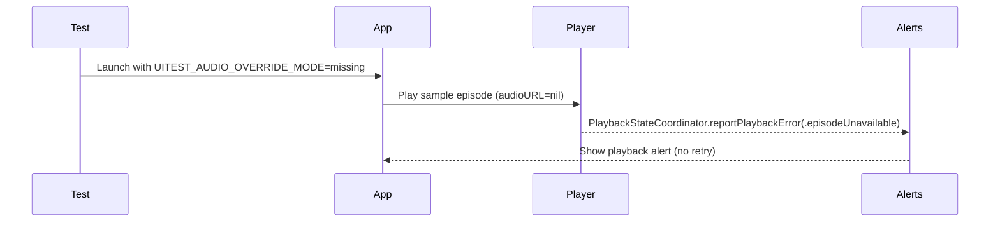
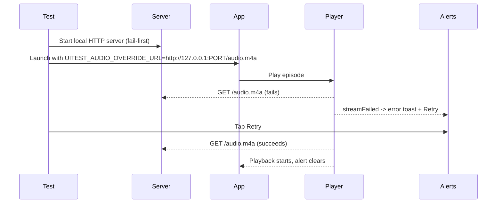
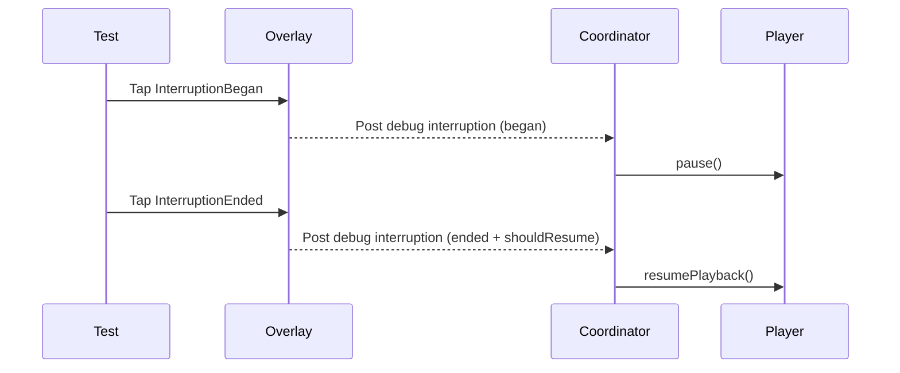

# 03.3.2.7 - AVPlayer Edge-Case Spec Coverage Tests

**Issue**: 03.3.2.7 - AVPlayer Edge-Case Spec Coverage Tests  
**Parent**: 03.3.2 - AVPlayer Playback Engine  
**Status**: Complete (10/10 tests)

## 2026-01-07 - Design

### Intent
- Add AVPlayer UI/integration coverage for playback spec edge cases not covered by position/seek tests.
- Focus on user-visible playback errors, interruption handling, and playback speed effects.
- Keep tests deterministic in CI and simulator (no external network).

### Spec Scenarios (Playback.md)
- **Audio Interruption Handling**: pause on interruption; resume if allowed.
- **Headphone Disconnect**: pause on route change; manual resume.
- **Episode Missing Audio URL**: error message, no retry.
- **Network Error During Playback**: error message + retry.
- **Successful Retry After Error**: retry clears error and playback starts.
- **Playing an Episode with Custom Speed**: position advances faster/slower.

### Constraints & Dependencies
- Error UI message text and retry visibility depend on **03.3.4 Unplayable Episode UX**.
- Playback speed UI exists; need to confirm AVPlayer rate effect is measurable in UI.
- Interruption/route-change simulation must be app-local (tests cannot post notifications into app process).
- Keep environment-gated hooks (no compile-time flags).

### Test Matrix (Targeted)
| Scenario | Test Type | Status | Notes |
| --- | --- | --- | --- |
| Missing Audio URL | UI | ✅ Complete | Error UI surfaces via 03.3.4 |
| Network Error + Retry | UI | ✅ Complete | Retry button accessible via 03.3.4 |
| Audio Interruption | UI | ✅ Complete | Debug trigger via environment-gated overlay |
| Playback Speed Affects Rate | UI | ✅ Complete | Uses audio debug overlay for fractional precision |
| Headphone Disconnect | Manual | ✅ Complete | Checklist documented in issue file |

### Design Decisions
1. **Environment-controlled audio URL overrides**
   - Add support for an HTTP/HTTPS audio URL override via env (for controlled test server).
   - Add a mode to force `audioURL = nil` without falling back to bundle audio.
   - Proposed env keys:
     - `UITEST_AUDIO_OVERRIDE_URL` -> absolute URL string (http/file).
     - `UITEST_AUDIO_OVERRIDE_MODE=missing` -> returns `nil`.
     - `UITEST_AUDIO_DISABLE_BUNDLE=1` -> skips bundle fallback.

2. **Local test HTTP server for network error + retry**
   - Provide a tiny HTTP server in `zpodUITests` that:
     - Fails the first request (500 or connection drop).
     - Serves valid audio on subsequent requests.
   - Pass server URL to app via `UITEST_AUDIO_OVERRIDE_URL`.
   - Avoid external network dependency; runs on localhost.

3. **Interruption simulation via debug overlay**
   - Add an env-gated debug overlay in the player UI (`UITEST_PLAYBACK_DEBUG=1`).
   - Overlay exposes buttons:
     - `Playback.Debug.InterruptionBegan`
     - `Playback.Debug.InterruptionEnded` (with shouldResume)
   - Buttons post a custom notification consumed by `SystemMediaCoordinator`,
     which routes through the same pause/resume logic as AVAudioSession interruptions.

4. **Playback alert identification for UI tests**
   - Add accessibility identifiers to `PlaybackAlertToastView` for:
     - container (e.g., `Playback Alert Toast`)
     - title + message
     - primary action (Retry) and dismiss button

### Sequence Diagrams

**Missing URL -> Error (Blocked)**

**Network Error -> Retry -> Success (Blocked)**

**Audio Interruption Handling**

### TDD Outline
1. Add a new UI test suite `PlaybackEdgeCaseAVPlayerTests`:
   - `testInterruptionPausesAndResumesPlayback()`
   - `testPlaybackSpeedChangesPositionRate()` (AVPlayer only)
   - `testMissingAudioURLShowsErrorNoRetry()` -> `XCTSkip` until 03.3.4
   - `testNetworkErrorShowsRetryAndRecovers()` -> `XCTSkip` until 03.3.4
2. Update `zpodUITests/TestSummary.md` with new coverage.
3. Add manual checklist section for headphone disconnect (if not automatable).

### Implementation Plan
1. Update `ContentView` sample episode resolution:
   - Respect `UITEST_AUDIO_OVERRIDE_MODE=missing`.
   - Accept `UITEST_AUDIO_OVERRIDE_URL` (http/file).
   - Respect `UITEST_AUDIO_DISABLE_BUNDLE=1`.
2. Add playback debug overlay + identifiers in Player UI.
3. Add debug notification handling in `SystemMediaCoordinator`.
4. Add test HTTP server helper in `zpodUITests`.
5. Implement tests and wire launch environments.
6. Run targeted suites.

### Open Questions
- Can the simulator route-change notification be simulated reliably? If not, use manual checklist.
- Should the error UI messages be matched strictly or by identifiers once 03.3.4 lands?

## 2026-01-07 - TDD + Implementation (In Progress)

- Added interruption + speed coverage to `PlaybackPositionAVPlayerTests` and left error/retry placeholders skipped (blocked by 03.3.4).
- Added playback debug controls to `EpisodeDetailView` and debug interruption notification wiring in `SystemMediaCoordinator`.
- Added playback speed option accessibility identifiers for UI tests.
- Added shared playback debug notification types for cross-module debug hooks.
- Added audio override environment handling for missing/URL-based playback inputs.

## 2026-01-12 - Interruption Test Unblocked

- Found the interruption buttons were exposed with the container identifier (`Playback Debug Controls`) in the UI hierarchy, so `Playback.Debug.InterruptionBegan` was never discoverable.
- Removed the container accessibility identifier in `PlaybackDebugControlsView` so the per-button identifiers surface.
- Re-enabled `testInterruptionPausesAndResumesPlayback` and verified it passes in a targeted AVPlayer run (`TestResults/TestResults_20260112_195405_test_zpodUITests-PlaybackPositionAVPlayerTests-testInterruptionPausesAndResumesPlayback.log`).
- Ran the full AVPlayer UI suite (`PlaybackPositionAVPlayerTests`) with 10/10 passing (`TestResults/TestResults_20260112_200726_test_zpodUITests-PlaybackPositionAVPlayerTests.log`).
