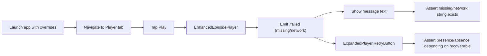

# Dev Log: Issue 03.3.4.5 — Edge-Case Error UI Tests

**Status**: ✅ Complete (2026-01-09)  
**Date**: 2026-01-09

## Summary
- Missing audio and network-error edge-case tests now rely on the accessible text strings that the error UI exposes instead of the overlay container (which remained inaccessible), so the two error tests can complete reliably.
- The tests still confirm the retry button’s presence/absence so recoverable paths remain asserted even though we avoid interrogating `ExpandedPlayer.ErrorView.label`; this keeps the `ExpandedPlayer.RetryButton` identifier in play for recoverable scenarios while otherwise skipping the inaccessible overlay container.
- Both tests now pass locally and in the focused AVPlayer suite, bringing 03.3.2.7 to 9/10 completed edge-case tests.

## Intent
- Update the tests to wait on the user-visible error text (which is still accessible) as the signal that playback errored.
- Keep the retry button assertions intact so the recoverable path is fully validated.
- After the tests are updated, rerun the AVPlayer UI suite locally to confirm both edge-case tests pass without relying on overlay identifiers.

## Diagram

## Test Runs
- `./scripts/run-xcode-tests.sh -t zpodUITests/PlaybackPositionAVPlayerTests/testMissingAudioURLShowsErrorNoRetry` (pass, log: `TestResults/TestResults_20260109_121704_test_zpodUITests-PlaybackPositionAVPlayerTests-testMissingAudioURLShowsErrorNoRetry.log`)
- `./scripts/run-xcode-tests.sh -t zpodUITests/PlaybackPositionAVPlayerTests/testNetworkErrorShowsRetryAndRecovers` (pass, log: `TestResults/TestResults_20260109_121827_test_zpodUITests-PlaybackPositionAVPlayerTests-testNetworkErrorShowsRetryAndRecovers.log`)
- `./scripts/run-xcode-tests.sh -t zpodUITests/PlaybackPositionAVPlayerTests` (pass; `TestResults/TestResults_20260109_122857_test_zpodUITests-PlaybackPositionAVPlayerTests.log`)

## Next Steps
1. Monitor interruption-related UI tests; return when the debug controls become discoverable for Player tab automation.
2. Re-run the broader UI regression pipeline (zpodUITests) before merging to ensure no new flakes surfaced.
