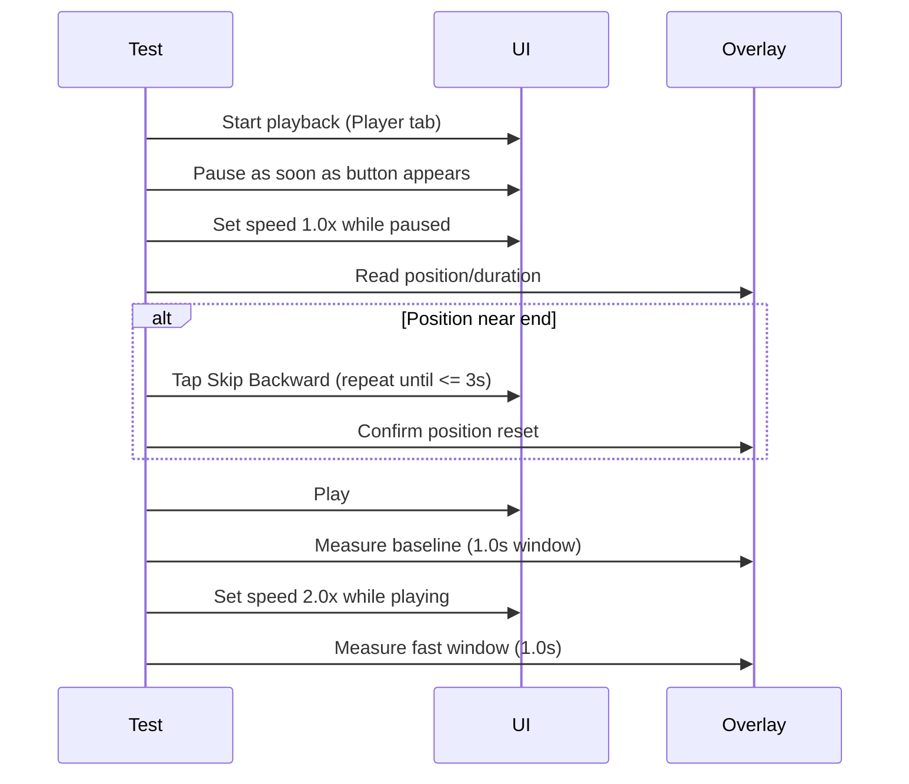

# 03.3.4.5: Stabilize testPlaybackSpeedChangesPositionRate for CI

## 2026-01-10 Update: Deterministic Measurement via Audio Debug Overlay

### Intent

Replace slider-based measurement (integer seconds) with Audio Debug Overlay parsing
to make speed ratios deterministic in CI and to confirm the engine rate is actually
applied. The overlay includes fractional seconds and engine rate, so it can
distinguish measurement artifacts from real playback-rate bugs.

### Measurement Plan

- Pause immediately after playback starts to prevent early advancement.
- Force speed to 1.0x while paused and confirm overlay engine rate ~1.0.
- Ensure position is near start (tap Skip Backward if needed).
- Resume playback and measure baseline using overlay `position` over a 1.0s window.
- Change speed to 2.0x while playback continues; wait for overlay engine rate ≥ 1.8.
- Measure the fast window using overlay `position` over a 1.0s window.
- Keep the 1.7x threshold unless overlay data shows a consistent lower ratio.

## 2026-01-10 Update: Prevent EOF Before Baseline Measurement

### Intent

Avoid hitting end-of-file (20s test audio) before baseline measurement starts by
minimizing pre-measurement playback time and pausing immediately after playback
begins. Use existing playback controls (Skip Backward) if playback is already too
far into the episode.

### Plan

- Start playback from Player tab
- As soon as the Pause button is available, pause playback to freeze position
- Set speed to 1.0x while paused (fast UI step, no time advancement)
- If audio debug overlay shows position near end, tap "Skip Backward" until
  position is within a safe window (<= 3s)
- Resume playback and measure baseline immediately (1.0s window)
- Change speed to 2.0x while playback continues; measure fast window immediately

### Timeline Diagram (Mermaid)

### Implementation Notes (2026-01-10 11:01 ET)

- Paused immediately after playback starts to freeze position before setup.
- Removed the debug seek button dependency; now uses standard "Skip Backward"
  plus audio debug overlay to confirm position is within a safe window.
- Resumes playback only when ready to measure baseline.

### Implementation Notes (2026-01-10 11:12 ET)

- Removed the post-resume wait for slider advancement and the 2.0x rate wait;
  fast measurement now starts immediately after tapping Play.
- Added a headroom check while paused after speed change (later removed once
  pause/resume was dropped).

### Implementation Notes (2026-01-10 11:33 ET)

- Stopped pausing before speed change (pause/resume reset playbackSpeed to 1.0).
- Reused the audio debug overlay element for baseline + fast reads to avoid
  expensive UI queries that inflated the measurement window.
- Baseline now measures ~1.0s delta at 1.0x; fast window measures ~2.2s at 2.0x.
- Removed the fast headroom check to keep the speed-change window minimal.

### Local Verification

- Ran: `./scripts/run-xcode-tests.sh -t zpodUITests/PlaybackPositionAVPlayerTests/testPlaybackSpeedChangesPositionRate`
- Result: ✅ PASS
- Observations:
  - Baseline: 3.00s → 4.00s (delta 1.00s over ~1.03s)
  - Fast: 7.77s → 10.00s (delta 2.23s over ~1.04s)
  - Ratio: 2.23x (passes 1.7x threshold)

### Follow-up Risk

- Absolute deltas are still higher than wall-clock time (possible playback-rate
  mismatch). The test currently validates relative rate change, not absolute
  correctness. If this remains a product issue, track separately under the
  playback-engine speed investigation.

✅ **DO USE**:
- `waitUntil()` for polling
- `waitForExistence()` for UI elements
- `waitForPlayerTabAdvancement()` for playback verification
- `XCTContext.runActivity()` for diagnostic logging
- Audio Debug Overlay parsing when `UITEST_DEBUG_AUDIO=1`
