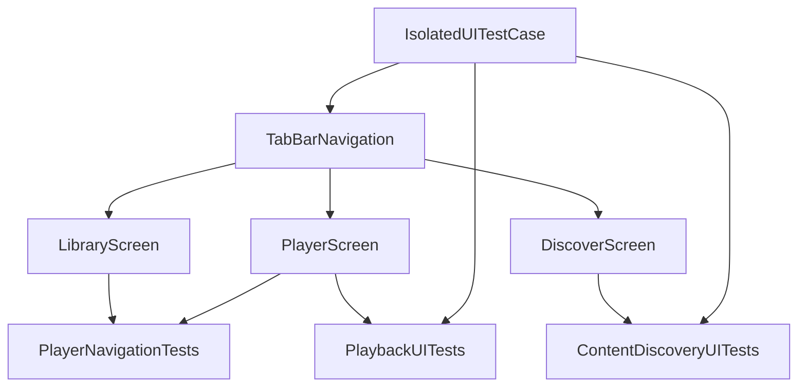

# Phase 3 Design — High-Value Core Tests

**Issue**: #12.3 — UI Test Infrastructure Cleanup
**Created**: 2026-02-05 (Phase 3 kickoff)
**Goal**: Migrate the high-value core suites (`ContentDiscovery`, `PlayerNavigation`, `Playback`) onto `IsolatedUITestCase`, back them with reusable page objects, and lock in the intent before touching production code.

## Intent & Constraints

- Build on the foundational work from Phases 1 and 2: the `IsolatedUITestCase` base, the unified wait helpers, and the existing `TabBarNavigation` page object.
- Bring the most frequently executed UI tests under the same isolation guarantees and navigation helpers so that they are stable and easier to extend.
- Introduce three new page objects (`LibraryScreen`, `PlayerScreen`, `DiscoverScreen`) so that navigation and validation logic lives near the UI it exercises rather than duplicated across tests.
- Preserve the current feature coverage (Discover tab search flow, Library navigation to episodes, and Playback controls) while adopting the new infrastructure.

## Scope of Work

1. **Page object work** — implement screen-specific helpers built on `BaseScreen` that:
   - Encapsulate the library content discovery (`Podcast Cards Container`, episode selections) and expose safe taps.
   - Surface player interface candidates (`Speed Control`, `Player Interface`, progress slider) and the common play-button predicate.
   - Capture discover tab readiness (search field detection, diagnostics) and centralize fallback selectors.
2. **Test migration** — move `ContentDiscoveryUITests`, `PlayerNavigationTests`, and `PlaybackUITests` onto `IsolatedUITestCase`:
   - Keep `continueAfterFailure`/`disableWaitingForIdleIfNeeded()` behavior via `override setUpWithError()` when needed.
   - Replace ad-hoc tab/element discovery with calls into `TabBarNavigation` and the new page objects.
   - Reuse existing wait helpers (e.g., `waitForContentToLoad`, `tapQuickPlayButton`) to keep timing behavior unchanged.
3. **Developer guidance** — update `AGENTS.md` so future contributors know to consult this design note and the `docs/testing/ISOLATED_UITEST_INFRASTRUCTURE.md` doc before extending Phase 3 work.
4. **Verification** — run the targeted suites via `./scripts/run-xcode-tests.sh -t ContentDiscoveryUITests,PlayerNavigationTests,PlaybackUITests` before landing the changes.

## Risks & Mitigation

- **Tab transition races**: SwiftUI tabs can stay stuck during animation, causing element queries to miss. Mitigate by reusing `TabBarNavigation`'s guarded taps and the new page objects' `waitForAny` fallbacks.
- **Page objects duplicating helper logic**: Moving container discovery into page objects duplicates some helper logic. Keep the implementations lean and reuse the existing `waitForAnyElement`/`waitForContentToLoad` helpers from the tests themselves where possible.
- **Test isolation regressions**: Ensuring `IsolatedUITestCase` behaves identically to previous setup means overriding `setUpWithError()` only to add logging/wait adjustments, not to reintroduce custom cleanup.

## Design Diagram (Mermaid)

## Progress

1. Captured the Phase 3 intent in this dev-log entry so work can proceed with documented constraints and success criteria.

## Next Steps

1. Implement `DiscoverScreen`, `LibraryScreen`, and `PlayerScreen` (use `BaseScreen`'s waiting utilities and align fallback selectors with the helpers already used by the tests).
2. Refactor `ContentDiscoveryUITests`, `PlayerNavigationTests`, and `PlaybackUITests` to inherit `IsolatedUITestCase` and call into the new page objects for navigation/verification.
3. Update `AGENTS.md` to highlight this design note and the isolated infrastructure doc for future phases.
4. Run `./scripts/run-xcode-tests.sh -t ContentDiscoveryUITests,PlayerNavigationTests,PlaybackUITests` once the migrations are finished to validate the high-value suites.
