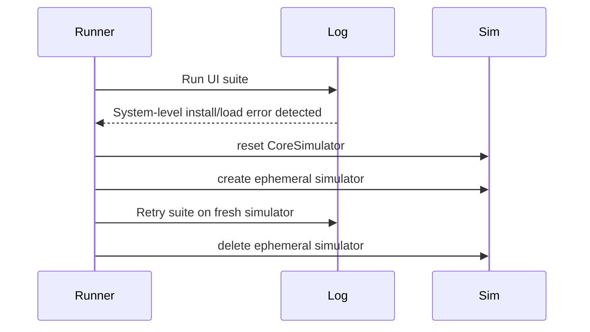
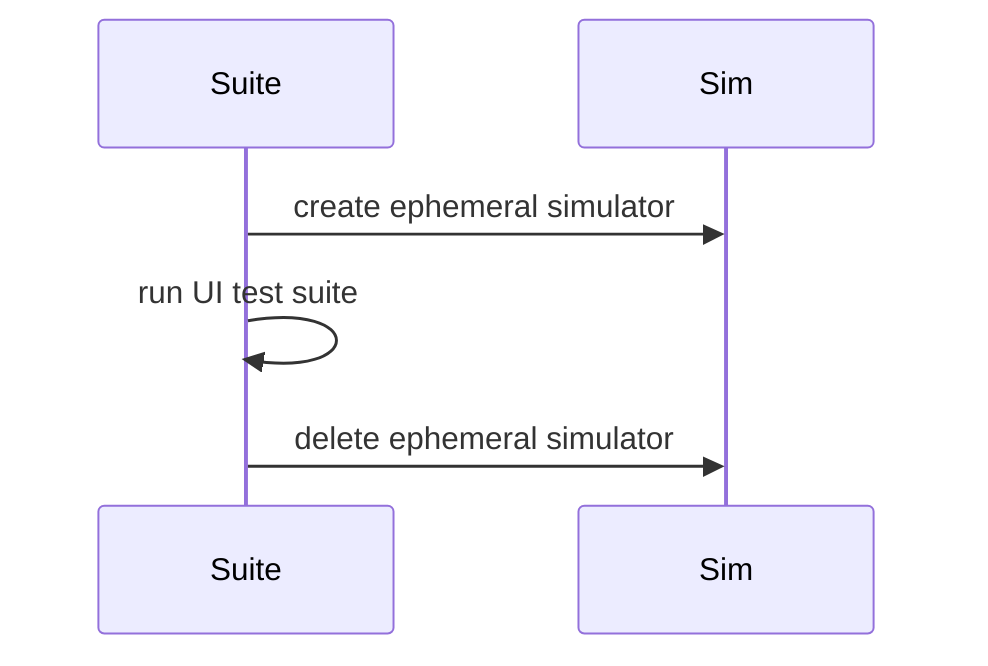

# Dev Log: Issue 12.7.1 — UI Test Runner Retry & Simulator Refresh

**Date**: 2026-01-17 (ET)
**Issue**: 12.7.1
**Branch**: `feature/12.7.1-ui-test-suite-retry`
**Status**: In Progress

## Intent

Add a focused retry path for system-level UI test runner/install/load failures and an opt-in fresh-simulator mode for UI suites. Keep the main test script small by extracting helpers into `scripts/lib/` modules.

## Design Notes

### Goals
- Retry **only** for system-level install/load failures (no test assertions executed).
- Reset CoreSimulator + retry once on a fresh simulator.
- Allow `ZPOD_UI_TEST_FRESH_SIM=1` to run each UI suite on a clean simulator.
- Keep `scripts/run-xcode-tests.sh` minimal; move simulator helpers into a library.

### Non-Goals
- No retries for assertion failures or real test failures.
- No default fresh-simulator mode (opt-in only).

### Proposed Flow (Retry on System Error)

### Proposed Flow (Fresh Sim Per Suite - Opt-In)

## Plan

1. Extract simulator helpers into `scripts/lib/` so the main script stays lean.
2. Add system-level error detection for test runner/install/load failures.
3. Retry once on a fresh simulator when those errors occur.
4. Add opt-in per-suite fresh simulator mode (`ZPOD_UI_TEST_FRESH_SIM=1`).
5. Update script usage/help output and note behavior here.

## Open Questions

- Should we add an opt-in preflight to reset CoreSimulator once before all UI suites?
- Are there additional log patterns we want to capture beyond bundle-instance failures?

## 2026-01-17 - Implementation Progress

- Moved simulator provisioning helpers into `scripts/lib/xcode.sh` to reduce main script size.
- Added system-level test bundle failure detection patterns (`Failed to create a bundle instance`, `xctest could not be loaded`, etc.).
- Wired a single retry path that resets CoreSimulator and retries on a fresh simulator.
- Added `ZPOD_UI_TEST_FRESH_SIM=1` to run each UI suite on a fresh simulator (opt-in).
- Verified script wiring with `./scripts/run-xcode-tests.sh --self-check`.

## Verification

- `ZPOD_UI_TEST_FRESH_SIM=1 ./scripts/run-xcode-tests.sh -t zpodUITests/EpisodeListUITests`
  - xcodebuild reported exit 65 with runner restarts, but log parsing showed tests passed.
  - IOHIDLib plugin warnings observed in the simulator log.
  - Script exit status: 0 (`TestResults/TestResults_20260117_081851_test_zpodUITests-EpisodeListUITests.log`).
