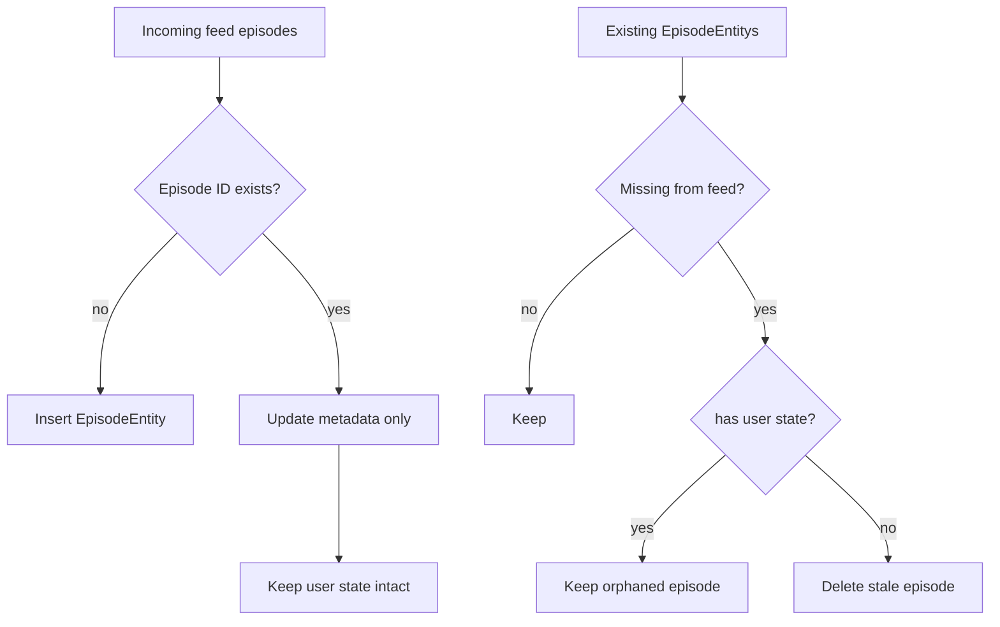

# Dev Log: Issue 27.1.1.2 — Episode Sync (Upsert Rules)

## Intent (2026-02-01)
- Protect user state (playback position, played flag, favorites, bookmarks, downloads, archived, rating) when episodes disappear from refreshed feeds.
- Delete only truly stale episodes with no user-generated state; still insert new episodes and update metadata for existing ones.
- Keep behavior consistent across iPhone 16 simulator (iOS 18) and CI in-memory SwiftData configs.

## Spec Traceability
- Adds scenario to `zpod/spec/spec.md` under **Download and Sync Management**: “Feed refresh preserves user state.”
  - **Given** podcast episodes exist with user state.
  - **When** feed refresh removes episodes.
  - **Then** episodes with user state remain; stateless episodes are removed; new/updated episodes are upserted.

## Design Notes
- Upsert loop keeps metadata updates using `EpisodeEntity.updateMetadataFrom(_:)` (already preserves state).
- Deletion path becomes conditional: only delete when `hasUserState == false`.
- `hasUserState` evaluated on stored entity to avoid trusting incoming payload.

## TDD Plan
1) Add failing tests in `Packages/Persistence/Tests/PersistenceTests/SwiftDataPodcastRepositoryTests.swift`:
   - `testSyncDeletesStaleEpisodesWithoutUserState`
   - `testSyncKeepsEpisodeWithPlaybackPosition`
   - `testSyncKeepsPlayedEpisode`
   - `testSyncKeepsDownloadedEpisode`
   - `testSyncKeepsFavoritedEpisode`
   - `testSyncKeepsBookmarkedEpisode`
   - `testSyncMixedScenarioDeletesOnlyStale`
   - Rename existing `testUpdateRemovesMissingEpisodes` → `testUpdateRemovesMissingEpisodesWithoutUserState`.
   - (Optional helper) `EpisodeEntityTests` case for `hasUserState`.
2) Run targeted suite → expect RED.
3) Implement `hasUserState` on `EpisodeEntity`; gate deletions in `SwiftDataPodcastRepository.update(_:)` using it.
4) Re-run targeted suite → expect GREEN.
5) If time, full `./scripts/run-xcode-tests.sh`.

## Risks / Watch
- Orphaned episodes remain hydrated; UI lists may not surface them (known limitation documented in Issue). Acceptable for this issue.
- Ensure download status comparison uses enum raw value to avoid typos.

## To-Do After Green
- Update issue status and link tests.
- Keep doc & test references aligned with acceptance criteria.

## Results (2026-02-01)
- Added seven sync edge-case tests + `hasUserState` helper coverage; renamed legacy removal test for clarity.
- Implemented conditional deletion in `SwiftDataPodcastRepository.update(_:)` using `EpisodeEntity.hasUserState`.
- Targeted run: `./scripts/run-xcode-tests.sh -t PersistenceTests` ✅ (106 tests, 0 failures). Log: `TestResults/TestResults_20260131_225015_test_pkg_Persistence.log`.
