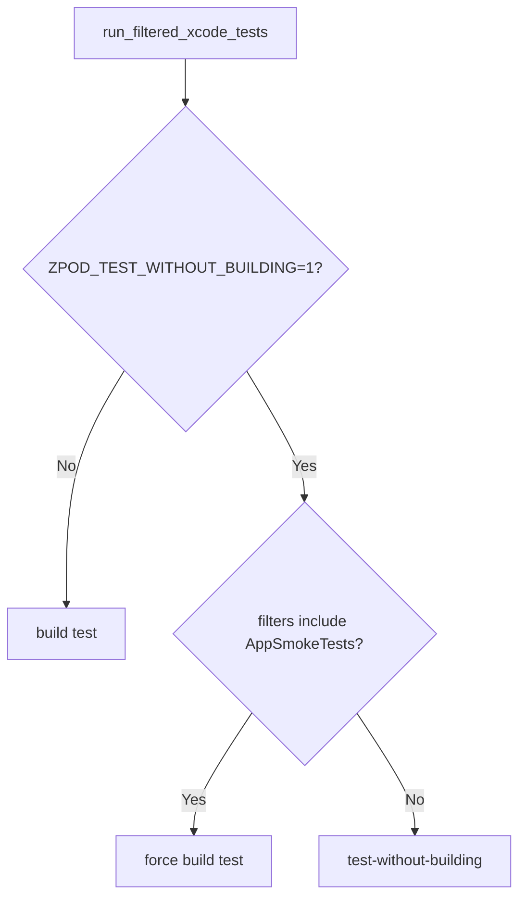
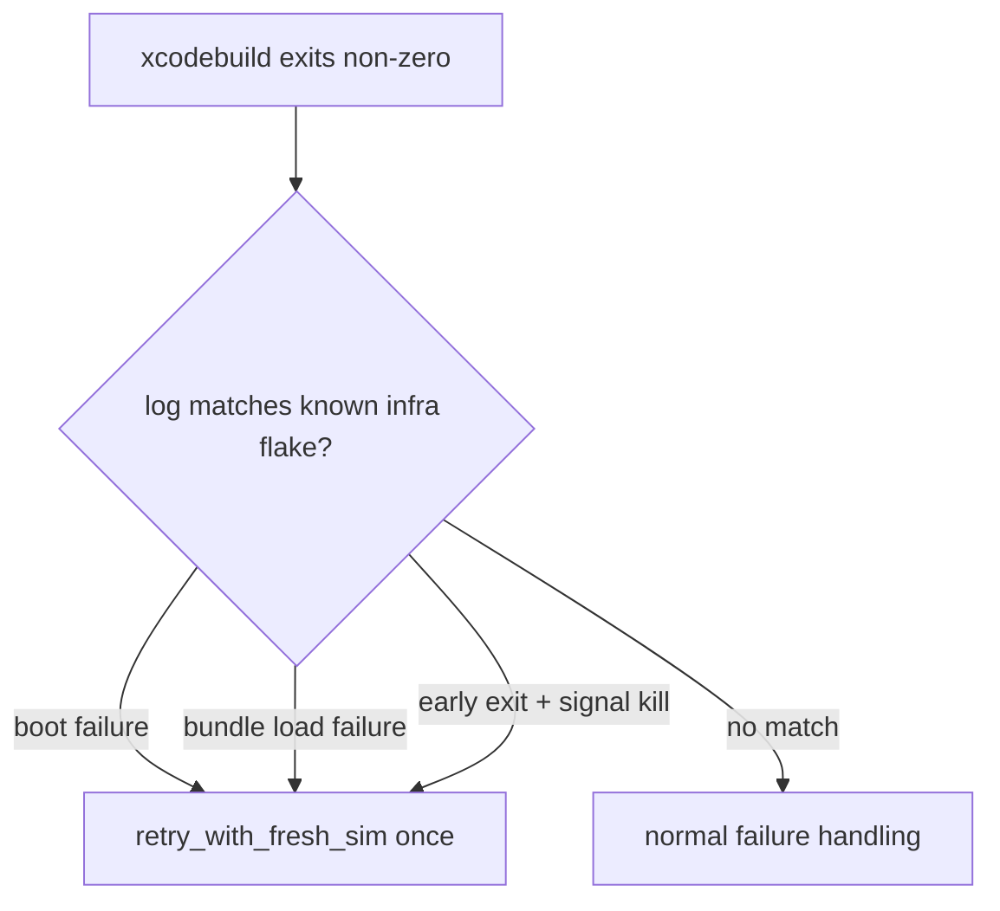
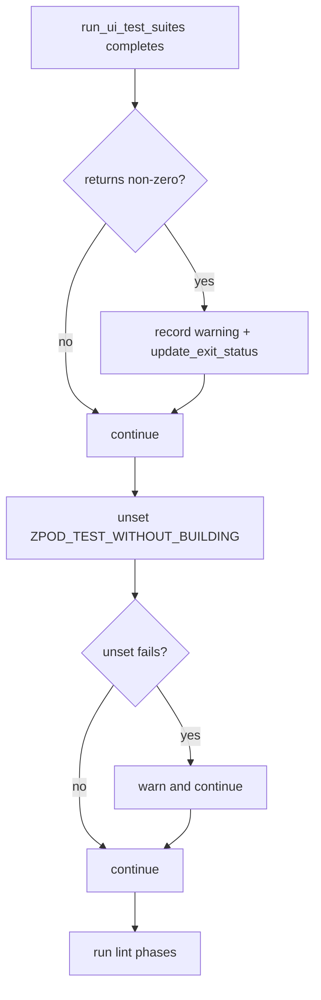

# 28.1.10 — Swipe-to-Delete Download on Episode Rows

**Issue**: [#395](https://github.com/ezigus/zpod/issues/395)
**Branch**: `feature/28.1.10-swipe-delete-download`
**Created**: 2026-02-07

## Intent

Users can download episodes for offline playback but have no per-episode way to remove downloads from the episode list. The only download deletion path is the bulk storage management screen. This issue adds a "Delete Download" swipe action that removes the local audio file and reverts the episode to streaming-only.

## Data Flow

```
User swipes left on downloaded episode row
  → SwipeAction.deleteDownload button appears (only for downloaded episodes)
  → User taps button
  → SwipeActionHandler.performSwipeAction(.deleteDownload, ...)
  → SwipeActionCallbacks.deleteDownload(episode)
  → EpisodeListViewModel.requestDeleteDownload(for:)
  → Sets pendingDeleteDownloadEpisode, shows confirmation dialog

User confirms deletion:
  → EpisodeListViewModel.confirmDeleteDownload()
  → EpisodeListViewModel.deleteDownloadForEpisode(_:)
  → DownloadManaging.deleteDownloadedEpisode(episodeId:)
    → DownloadCoordinatorBridge → DownloadCoordinator (removes local file)
  → Episode.withDownloadStatus(.notDownloaded) → updateEpisode()
  → deletedDownloadEpisodeIDs.insert(episode.id)
  → Download badge disappears from row
```

## Key Design Decision: `deletedDownloadEpisodeIDs`

The `UITEST_DOWNLOADED_EPISODES` env var is read-only at launch. After a user deletes a download during a session, `effectiveStatus` in `EpisodeRowView` would re-apply the env var override and show the badge again. Tracking deleted IDs in a `Set<String>` on the ViewModel prevents this re-application.

## AC ↔ Implementation Mapping

| AC | Implementation |
|----|---------------|
| Swipe left reveals delete action (`SwipeAction.deleteDownload`) | `.deleteDownload` case in `SwipeActionType`, conditional visibility in `swipeButtons(for:episode:)` |
| Confirmation dialog before deletion | `.confirmationDialog` modifier on episode list, `DeleteDownload.Confirm` / `DeleteDownload.Cancel` identifiers |
| Removes local file via DownloadCoordinator | `DownloadManaging.deleteDownloadedEpisode(episodeId:)` → `DownloadCoordinatorBridge` |
| Status reverts to `.notDownloaded` | `Episode.withDownloadStatus(.notDownloaded)` + `updateEpisode()` |
| Badge disappears | `effectiveStatus` checks `deletedDownloadEpisodeIDs` before env var override |
| Non-downloaded episodes hide the action | `shouldShowSwipeAction(.deleteDownload, for:)` checks `isEffectivelyDownloaded` |
| VoiceOver announces correctly | Auto-derived from `SwipeAction.deleteDownload` identifier + "Delete Download" label |

## Files Modified

| File | Changes |
|------|---------|
| `Packages/CoreModels/Sources/CoreModels/SwipeActionSettings.swift` | Added `.deleteDownload` case with display name, icon, color, destructive flag; updated `downloadFocused` preset |
| `Packages/LibraryFeature/Sources/LibraryFeature/BatchOperationManager.swift` | Added `deleteDownloadedEpisode(episodeId:)` to `DownloadManaging` protocol with default no-op |
| `Packages/LibraryFeature/Sources/LibraryFeature/SwipeActionHandler.swift` | Added `deleteDownload` callback + switch case in `performSwipeAction` |
| `Packages/LibraryFeature/Sources/LibraryFeature/EpisodeListViewModel.swift` | Added confirmation state properties, wired callback, added request/confirm/cancel methods, promoted logger to `internal` |
| `Packages/LibraryFeature/Sources/LibraryFeature/EpisodeListViewModel+DownloadManagement.swift` | Added `deleteDownloadForEpisode(_:)` method |
| `Packages/LibraryFeature/Sources/LibraryFeature/EpisodeListViewModel+BatchOperations.swift` | Removed duplicate `logger` (now shares `internal` logger from main file) |
| `Packages/LibraryFeature/Sources/LibraryFeature/EpisodeListView.swift` | Conditional swipe action filtering, confirmation dialog, `isDownloadDeleted` parameter on `EpisodeRowView` |
| `Packages/LibraryFeature/Tests/LibraryFeatureTests/EpisodeStatusProgressTests.swift` | Updated `MockDownloadManager`, added unit tests for delete download |
| `zpodUITests/OfflinePlaybackUITests.swift` | Implemented `testDeletedDownloadRevertsToStreaming` + `testDeleteDownloadHiddenForNonDownloadedEpisode` |
| `zpodUITests/SwipeConfigurationTestSupport.swift` | Added `"Delete Download"` to `rawActionIdentifier` mapping |
| `zpodUITests/TestSummary.md` | Updated Offline Playback test listing, removed 28.1.10 blocker |
| `Issues/28.1.10-swipe-delete-download-episode-rows.md` | Updated AC with implementation identifiers |

## Regression Hardening Plan (2026-02-08 ET)

### Symptom

Full regression runs execute AppSmoke via:

- `build-for-testing` (workspace-wide)
- `test-without-building -only-testing:AppSmokeTests`

The second step can fail with:

- `Early unexpected exit, operation never finished bootstrapping`
- `Test crashed with signal kill while preparing to run tests`
- `xcodebuild exited with status 65 ... result bundle could not be inspected`

### Reproduction Matrix

- `./scripts/run-xcode-tests.sh -t AppSmokeTests` (build+test): ✅ stable
- `ZPOD_TEST_WITHOUT_BUILDING=1 ./scripts/run-xcode-tests.sh -t AppSmokeTests` (test-without-building): ❌ reproducible exit 65

### Design

Keep build-once optimization for Integration/UI suites, but bypass `test-without-building` for AppSmoke filters and always execute AppSmoke with `build test`.



## AppSmoke Bootstrap Crash Retry Plan (2026-02-08 ET)

### Symptom

Even with forced `build test`, AppSmoke can intermittently fail before test execution:

- `Early unexpected exit, operation never finished bootstrapping`
- `Test crashed with signal kill while preparing to run tests`
- `status 65` with no executed tests in summary

### Design

Treat this signature as simulator/test-host startup infrastructure failure (same class as existing boot and system bundle failures), and run one retry on a fresh simulator destination.



## AppSmoke Restart Marker Hardening (2026-02-08 ET)

### Symptom

Some AppSmoke runs log:

- `Restarting after unexpected exit, crash, or test timeout`

and then still exit 65 with uninspectable xcresult, even when all observed `Test Case` entries are passing.

### Design

Add one more infrastructure-retry trigger:

- Match restart marker in the log
- Ensure there are no explicit `Test Case ... failed` entries
- Retry once on a fresh simulator

This keeps real assertion failures surfaced while treating simulator/runner instability as recoverable.

## Full Regression Exit Code 1 Hardening (2026-02-08 10:58 ET)

### Symptom

Latest local full regression completed all UI suites with no failing test cases, but the run ended with:

- `Exit Status: 1`
- no lint phase artifacts for that run timestamp

This indicates the script exited between UI completion and lint execution.

### Design

Harden the post-UI transition in `scripts/lib/harness.sh` so non-critical cleanup failures do not terminate the pipeline under `set -e` before lint runs and summary data is complete.



### Planned Code Changes

- Guard `run_ui_test_suites` invocation in the default pipeline and treat non-zero as a recorded warning path (not immediate shell abort).
- Make `unset ZPOD_TEST_WITHOUT_BUILDING` tolerant of failure (`|| true`) in both default and AppSmoke-failure paths to avoid premature termination in strict shells.

## Implementation Log

- **2026-02-07 (ET)**: Initial design and implementation started.
- **2026-02-08 (ET)**: All production code + tests complete. Syntax, build, and targeted `OfflinePlaybackUITests` pass (7 executed, 6 passed, 1 pre-existing skip for Issue 03.3.4). Logger consolidation: promoted `EpisodeListViewModel.logger` from `private` to `internal` shared across all extension files, removed duplicate in `+BatchOperations.swift`. Full regression pending.
- **2026-02-08 10:59 ET**: Hardened default regression control flow so post-UI cleanup can no longer abort the run before lint (`run_ui_test_suites` now guarded, `unset ZPOD_TEST_WITHOUT_BUILDING` made tolerant in both exit paths). Validation: `bash -n scripts/run-xcode-tests.sh scripts/lib/harness.sh` and `./scripts/run-xcode-tests.sh --self-check` both pass.
