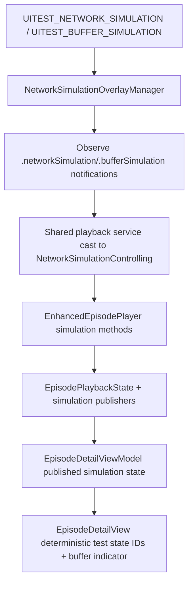

# 2026-02-08 — Issue 28.1.11 Network Simulation Test Hooks

## Intent / Scope
- Implement Issue `28.1.11` by wiring existing `TestHook.*` controls to shared playback state so `StreamingInterruptionUITests` can validate auto-pause/resume and buffer indicators.
- Apply agreed scope change: keep controls in `EpisodeDetailView` (no new rendered button overlay), but use a dedicated env-gated manager for lifecycle/observer ownership.
- Keep Issue `03.3.4` skips unchanged (network error/retry accessibility surface remains out of scope).

## Baseline (2026-02-08)
- Targeted run: `./scripts/run-xcode-tests.sh -t zpodUITests/StreamingInterruptionUITests`
- Result: 7 run, 3 passed, 4 skipped.
- `28.1.11` blockers:
  - `testAutoPauseOnNetworkLoss` skipped at simulation-state normalization.
  - `testAutoResumeOnNetworkRecovery` skipped at auto-pause transition.

## Scope Change Record
- Original issue text references debug overlay pattern with `UIWindow` controls.
- Agreed implementation path: controls remain in `EpisodeDetailView`; lifecycle and simulation wiring move to an env-gated manager (`NetworkSimulationOverlayManager`) using `.appDidInitialize` observer pattern.
- Rationale: controls already exist with stable `TestHook.*` identifiers; missing piece is deterministic engine wiring under ticker-mode UI tests.

## Design

## Key Decisions
1. Target `EnhancedEpisodePlayer` for simulation controls (ticker path), not only `AVPlayerPlaybackEngine`.
2. Add deterministic simulation-state accessibility IDs so UI tests avoid inferring state from container text.
3. Add explicit resume behavior for simulated network recovery in ticker mode.
4. Keep runtime overhead zero when simulation env flags are absent by conditional observer registration.

## TDD Plan
1. Add failing PlaybackEngine tests for simulation pause/resume/buffer behavior.
2. Remove 28.1.11 skip wrappers from streaming interruption UI tests to force red.
3. Implement notifications contract + simulation protocol + manager + view/view-model wiring.
4. Run targeted suites, then full regression.

## Review Follow-up (2026-02-09)
- Accepted: replace `MainActor.assumeIsolated` usage in notification callbacks with explicit `Task { @MainActor ... }` hops in `NetworkSimulationOverlayManager` to avoid relying on queue-thread affinity for actor isolation.
- Accepted: stop strongly capturing a resolved controller inside observer closures; handlers now resolve the current `NetworkSimulationControlling` instance on delivery.
- Accepted: remove dead-write simulation flags in `EnhancedEpisodePlayer` (`isPausedBySimulatedNetworkLoss`, `isBufferingFromSimulation`) and keep Combine subjects as the sole simulation state source.
- Deferred: clock/scheduler injection for simulation recovery timing tests. Current tests intentionally use a short `simulationRecoveryGracePeriod` and bounded waits to validate real async timing behavior; adding a full injectable clock is a broader test-architecture change and can be scoped as a follow-up if flakiness appears.
