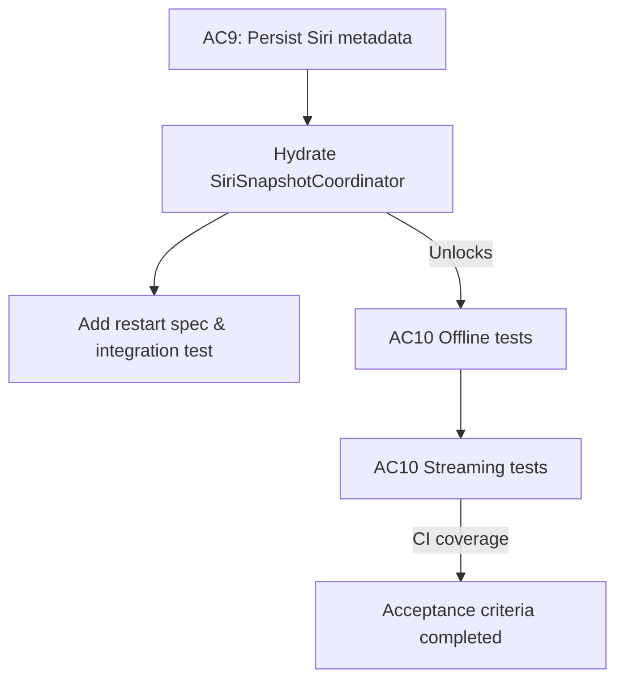

# Issue 28.1.13 Dev Log

## 2026-02-10 07:15 ET — Intent
- Capture the remaining acceptance criteria for Issue 28.1 (offline/streaming playback) and map every test gap back to the existing specs before touching production code.
- Keep the work traceable: metadata persistence first (AC9), then systematically enable/extend the skipped UI suites, and finally fill the missing streaming scenarios (AC10).
- Surface the data flow between persistence, Siri snapshot hydration, and the UI/testing layers so we can validate the work with targeted automations.

### Objectives
1. Persist episode metadata so Siri snapshots survive restarts and add the restart scenario to the spec.
2. Add the missing offline playback UI tests (resume/cancel/fallback indicators) by first seeding swipe configuration metadata.
3. Extend streaming coverage with the outstanding error, seeking, and connection-change behaviors.
4. Maintain dev-log updates and diagrams before touching code or tests.

### Planned Flow

### Immediate Next Steps
- Review `SiriSnapshotCoordinator` and existing persistence boundaries to identify where an `EpisodeEntity` (or JSON cache) should live.
- Draft the restart scenario in `zpod/spec/streaming-playback.md` and `offline-playback.md` so the new tests map cleanly to `Given/When/Then` statements.
- Enumerate the download/streaming tests that are currently skipped and note their blockers in this log so we can un-skip them once dependencies are met.

_Updates will continue here as work progresses._

## 2026-02-10 07:35 ET — Phase 1 progress
- Added a dedicated `SwiftDataEpisodeSnapshotRepository` in `Packages/Persistence` so Siri can read episode metadata directly from the SwiftData store without waiting for feed refreshes. The new repository exposes `EpisodeSnapshotProviding` and shares the same schema as `SwiftDataPodcastRepository`.
- Updated `SiriSnapshotCoordinator` to accept an optional snapshot provider, use persisted episodes when available, and fall back to the podcast manager otherwise; the app now injects the provider in both the live flow and Siri refresh hooks.
- Refreshed `IntegrationTests/PodcastPersistenceIntegrationTests` so the Siri snapshot test now expectations include persisted episodes across restarts and exercises the new provider.
- Noted the new `"Siri Play latest after restart"` scenario under `zpod/spec/playback.md` so test coverage maps directly to the updated acceptance criteria.
- Run `./scripts/run-xcode-tests.sh -t IntegrationTests/PodcastPersistenceIntegrationTests` and all eight tests now pass with the new persistence path.

## 2026-02-10 07:55 ET — Phase 2 intent
- Provide a reusable `SwipeConfigurationSeeding` helper that encodes `UISettings`, so UI tests can emit `UITEST_SEEDED_SWIPE_CONFIGURATION_B64` without hand-crafting JSON and always get download-focused swipe actions.
- Un-skip the download flow UI tests (swipe download, progress UI, downloaded badge, failure/retry, pause/resume) by launching with the seeded download configuration (via `UITestLaunchConfiguration.swipeConfiguration`) and any simulation hooks they need.
- Mirror the seeded swipe configuration in storage/offline tests (delete download, offline playback) so their gestures remain available while they seed downloaded episodes.
- Re-enable `OfflinePlaybackUITests.testNonDownloadedEpisodeFailsOffline` by asserting the `PlaybackError.networkError` surface appears when launching in offline mode with no downloads.
- Document each seed change in this log and re-run the targeted download/offline suites once wiring is complete.

## 2026-02-11 08:10 ET — Phase 2 progress
- Added `SwipeConfigurationSeeding` as a shared helper so tests can emit base64 payloads for download/delete swipe actions instead of hand-raised JSON; `DownloadFlowUITests` now launches with `seededConfiguration: SwipeConfigurationSeeding.downloadFocused` and the download-related assertions use the seeded swipes.
- Updated `OfflinePlaybackUITests` to rely on `UITEST_OFFLINE_MODE` (network overlay simulates `.loss`) plus the new seeding helper for delete-flow tests; `testNonDownloadedEpisodeFailsOffline` now exercises the `PlaybackError.networkError` label, and the storage scenarios still seed swipe rows via `SwipeConfigurationSeeding.custom` for delete/download coverage.
- Hooked `NetworkSimulationOverlayManager` and `ZpodApp` to `UITEST_OFFLINE_MODE` so the offline flag triggers `handleNetworkSimulation(.loss)` as soon as the overlay comes alive, and Siri snapshots now hydrate `SwiftDataEpisodeSnapshotRepository` via `SiriSnapshotCoordinator` so episode metadata survives restart (plus the corresponding integration test checks for persisted episode snapshots and `playback.md` gained the restart scenario).
- Triggered `./scripts/run-xcode-tests.sh -t zpodUITests/OfflinePlaybackUITests` to confirm the new offline/error coverage; the job is still building at the time of this entry, so watch the generated `TestResults/TestResults_20260211_*_OfflinePlaybackUITests.*` files for the final verdict and any `PlaybackError.networkError` mismatches.
