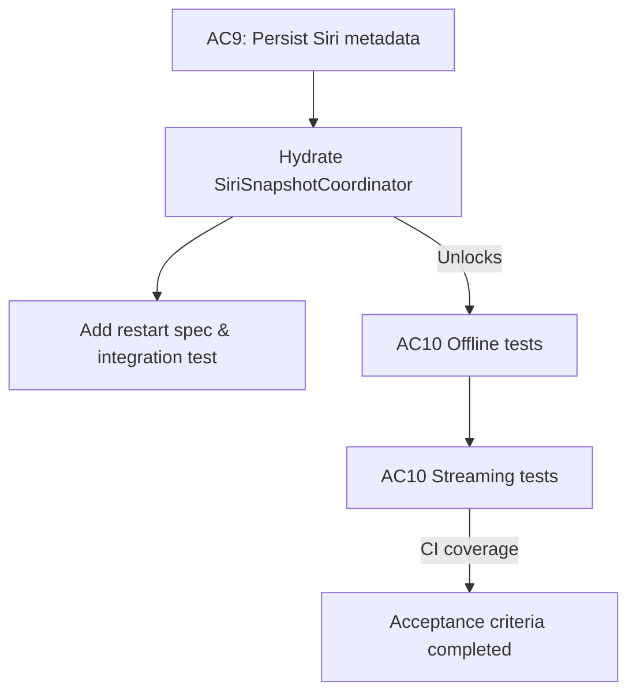
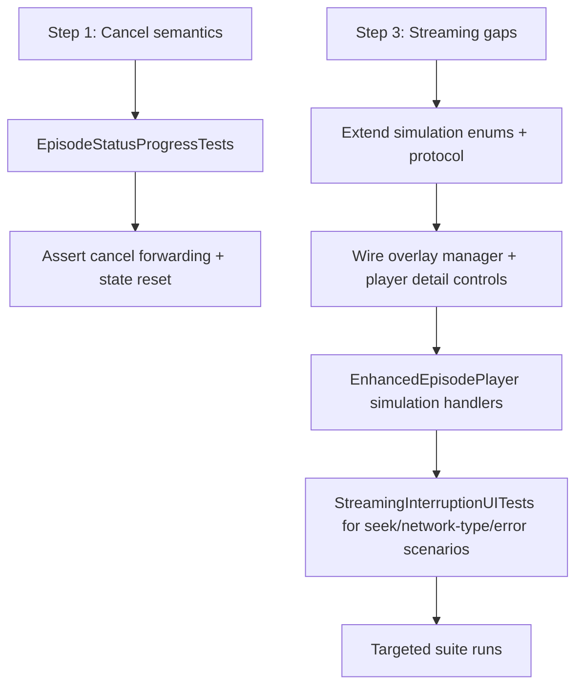

# Issue 28.1.13 Dev Log

## 2026-02-10 07:15 ET — Intent
- Capture the remaining acceptance criteria for Issue 28.1 (offline/streaming playback) and map every test gap back to the existing specs before touching production code.
- Keep the work traceable: metadata persistence first (AC9), then systematically enable/extend the skipped UI suites, and finally fill the missing streaming scenarios (AC10).
- Surface the data flow between persistence, Siri snapshot hydration, and the UI/testing layers so we can validate the work with targeted automations.

### Objectives
1. Persist episode metadata so Siri snapshots survive restarts and add the restart scenario to the spec.
2. Add the missing offline playback UI tests (resume/cancel/fallback indicators) by first seeding swipe configuration metadata.
3. Extend streaming coverage with the outstanding error, seeking, and connection-change behaviors.
4. Maintain dev-log updates and diagrams before touching code or tests.

### Planned Flow

### Immediate Next Steps
- Review `SiriSnapshotCoordinator` and existing persistence boundaries to identify where an `EpisodeEntity` (or JSON cache) should live.
- Draft the restart scenario in `zpod/spec/streaming-playback.md` and `offline-playback.md` so the new tests map cleanly to `Given/When/Then` statements.
- Enumerate the download/streaming tests that are currently skipped and note their blockers in this log so we can un-skip them once dependencies are met.

_Updates will continue here as work progresses._

## 2026-02-10 07:35 ET — Phase 1 progress
- Added a dedicated `SwiftDataEpisodeSnapshotRepository` in `Packages/Persistence` so Siri can read episode metadata directly from the SwiftData store without waiting for feed refreshes. The new repository exposes `EpisodeSnapshotProviding` and shares the same schema as `SwiftDataPodcastRepository`.
- Updated `SiriSnapshotCoordinator` to accept an optional snapshot provider, use persisted episodes when available, and fall back to the podcast manager otherwise; the app now injects the provider in both the live flow and Siri refresh hooks.
- Refreshed `IntegrationTests/PodcastPersistenceIntegrationTests` so the Siri snapshot test now expectations include persisted episodes across restarts and exercises the new provider.
- Noted the new `"Siri Play latest after restart"` scenario under `zpod/spec/playback.md` so test coverage maps directly to the updated acceptance criteria.
- Run `./scripts/run-xcode-tests.sh -t IntegrationTests/PodcastPersistenceIntegrationTests` and all eight tests now pass with the new persistence path.

## 2026-02-10 07:55 ET — Phase 2 intent
- Provide a reusable `SwipeConfigurationSeeding` helper that encodes `UISettings`, so UI tests can emit `UITEST_SEEDED_SWIPE_CONFIGURATION_B64` without hand-crafting JSON and always get download-focused swipe actions.
- Un-skip the download flow UI tests (swipe download, progress UI, downloaded badge, failure/retry, pause/resume) by launching with the seeded download configuration (via `UITestLaunchConfiguration.swipeConfiguration`) and any simulation hooks they need.
- Mirror the seeded swipe configuration in storage/offline tests (delete download, offline playback) so their gestures remain available while they seed downloaded episodes.
- Re-enable `OfflinePlaybackUITests.testNonDownloadedEpisodeFailsOffline` by asserting the `PlaybackError.networkError` surface appears when launching in offline mode with no downloads.
- Document each seed change in this log and re-run the targeted download/offline suites once wiring is complete.

## 2026-02-11 08:10 ET — Phase 2 progress
- Added `SwipeConfigurationSeeding` as a shared helper so tests can emit base64 payloads for download/delete swipe actions instead of hand-raised JSON; `DownloadFlowUITests` now launches with `seededConfiguration: SwipeConfigurationSeeding.downloadFocused` and the download-related assertions use the seeded swipes.
- Updated `OfflinePlaybackUITests` to rely on `UITEST_OFFLINE_MODE` (network overlay simulates `.loss`) plus the new seeding helper for delete-flow tests; `testNonDownloadedEpisodeFailsOffline` now exercises the `PlaybackError.networkError` label, and the storage scenarios still seed swipe rows via `SwipeConfigurationSeeding.custom` for delete/download coverage.
- Hooked `NetworkSimulationOverlayManager` and `ZpodApp` to `UITEST_OFFLINE_MODE` so the offline flag triggers `handleNetworkSimulation(.loss)` as soon as the overlay comes alive, and Siri snapshots now hydrate `SwiftDataEpisodeSnapshotRepository` via `SiriSnapshotCoordinator` so episode metadata survives restart (plus the corresponding integration test checks for persisted episode snapshots and `playback.md` gained the restart scenario).
- Triggered `./scripts/run-xcode-tests.sh -t zpodUITests/OfflinePlaybackUITests` to confirm the new offline/error coverage; the job is still building at the time of this entry, so watch the generated `TestResults/TestResults_20260211_*_OfflinePlaybackUITests.*` files for the final verdict and any `PlaybackError.networkError` mismatches.

## 2026-02-14 09:00 ET — Static Analysis & Truth Baseline

**Findings**: Comprehensive static analysis revealed significant gaps between perceived completion (83%) and actual test quality (37%). Many tests exist but validate placeholder behavior or depend on unimplemented infrastructure.

### Critical Infrastructure Gaps Discovered

1. **Download Test Hooks Not Implemented**
   - `zpodUITests/README_DOWNLOAD_TESTS.md:72` explicitly documents that `UITEST_DOWNLOAD_SIMULATION_MODE`, `UITEST_PREDOWNLOAD_FIRST_EPISODE`, and `UITEST_SIMULATE_DOWNLOAD_FAILURE` are "not yet implemented in the app"
   - Tests using these flags may pass but validate nothing since the app doesn't respond to them
   - Affects 6 download tests (manual/progress/completion/failure/pause-resume/batch)

2. **Retry Delay Spec Mismatch**
   - **Spec** (`spec/streaming-playback.md:220`): Requires 2s, 5s, 10s exponential backoff
   - **Code** (`StreamingErrorHandler.swift:73`): Implements 5s, 15s, 60s exponential backoff
   - Must align implementation with spec OR update spec with rationale for longer delays
   - Affects streaming error handling behavior and user experience

3. **Placeholder Test Assertions**
   - Many tests have comments like "For now, we verify the action was tapped successfully" and "In actual implementation, this would be verified"
   - Examples:
     - `testSwipeToDownloadEpisode:73` - only checks button dismiss, not download start
     - `testDownloadProgressIndicatorDisplays:112` - accepts any download UI, not specific progress %
     - `testDownloadedEpisodeShowsBadge:146` - has comment "In actual implementation, this test would verify"
     - `testFailedDownloadShowsRetryButton:285` - has comment "In actual implementation with failure simulation"

4. **Mismapped Scenario**
   - "Download Resume After Network Loss" currently tested via `testPauseAndResumeDownload` which tests manual pause/resume, not network interruption recovery
   - Need dedicated test for download coordinator behavior during network loss/recovery

5. **Cancellation vs. Pause Confusion**
   - `testPauseAndResumeDownload` tests pause/resume, not cancellation
   - True cancel should:
     - Delete partial download
     - Reset UI to "not downloaded" state
     - Allow download restart from beginning

### Test Quality Matrix (C/P/M)

**Offline Playback**: 4 Complete / 6 Partial / 2 Missing
- Complete: Offline indicators (8,9), Manual deletion (9), Bulk deletion (10), Offline error path (12)
- Partial: Manual download (1), Progress (2), Completion (3), Failure (5), Playing downloaded (6), Network recovery (11)
- Missing: Cancellation (4), Fallback to streaming (7)

**Streaming Playback**: 0 Complete / 2 Partial / 5 Missing
- Partial: Server errors (4), Automatic retry (7)
- Missing: Seeking (1), Network type change (2), HTTP Range (3), 404 error (5), Timeout (6)

### Rebaseline Actions Taken

1. ✅ Updated `Issues/28.1.13-final-acceptance-criteria-completion.md` with:
   - Corrected progress: 37% complete (was 83%)
   - C/P/M matrix for all 19 scenarios with specific line references
   - Critical findings section documenting infrastructure gaps
   - Revised effort estimates: 5-8 days (was 1-2 days)
   - Clear blockers: infrastructure must be implemented before tests are meaningful

2. ⏳ Next: Update dev-log to match (this entry)

3. ⏳ Then: Begin infrastructure work (Step 3 in plan v2)

### Revised Implementation Plan

**Priority 0: Infrastructure & Alignment** (2-3 days)
1. Resolve retry delay spec mismatch
2. Implement download test hooks OR replace with deterministic seeded approaches
3. Rewrite placeholder download tests with strong assertions

**Priority 1: Missing Offline Tests** (1-2 days)
1. Add true download cancellation test
2. Add fallback-to-streaming integration test
3. Fix network-loss recovery scenario mapping

**Priority 2: Missing Streaming Tests** (2-3 days)
1. Seeking within/outside buffered range
2. WiFi↔Cellular seamless continuation
3. HTTP Range request verification
4. Specific 404/5xx/timeout behaviors
5. End-to-end retry with position preservation

This establishes truth before code changes per design-first workflow. Proceeding to Step 3 (infrastructure fixes).

## 2026-02-15 13:01 ET — Option C + Option B execution (no Option A)

### Decision
- Kept all work inside Issue 28.1.13 as requested.
- Executed **Option C first** (contract-layer integration tests for download seeding), then **Option B** (focused rendering-path diagnosis/hardening for UI tests).
- Explicitly skipped Option A (no follow-up issue, no long-term test skips).

### Option C delivered
- Completed and stabilized `IntegrationTests/DownloadStateSeedingIntegrationTests.swift`:
  - Added environment-contract tests for `DownloadStateSeeding.parseSeededStates()` and `DownloadStateSeeding.state(for:)`.
  - Added normalization-path tests for prefixed IDs (`swift-talk:st-001`, `episode-st-001`).
  - Fixed optional progress assertions and added helper-based progress verification.
- Validation run:
  - `./scripts/run-xcode-tests.sh -t IntegrationTests/DownloadStateSeedingIntegrationTests`
  - Result: **27/27 passing**.

### Option B findings and implementation
- Root problem was not missing episode rows; rows consistently existed.
- Repro showed status identifiers were frequently flattened out of direct UI queries by SwiftUI accessibility composition, especially for failed/downloading states.
- Hardened UI test assertions in `zpodUITests/DownloadFlowUITests.swift`:
  - Moved to global status/progress lookup helpers.
  - Added deterministic fallback checks rather than row-descendant-only queries.
- Added env-gated diagnostic marker in `EpisodeRowView`:
  - `UITEST_DOWNLOAD_STATUS_DIAGNOSTICS=1`
  - marker id: `Episode-<id>-DownloadStatusDiagnostic`
  - value: effective `EpisodeDownloadStatus.rawValue`
  - intentionally low-visibility + accessibility-visible, zero impact outside diagnostics mode.
- Validation run:
  - `./scripts/run-xcode-tests.sh -t zpodUITests/DownloadFlowUITests`
  - Result: **6/6 passing**.

### Impact on issue progress
- Download seeding architecture is now testable at contract and UI levels without introducing skip-based debt.
- Remaining 28.1.13 gaps are now the previously identified acceptance-criteria items (true cancel semantics, fallback-to-streaming integration verification, and outstanding streaming-spec scenarios), not the seeding/rendering architecture itself.

## 2026-02-15 15:32 ET — Step 1 + Step 3 design intent (Step 2/4 deferred)

### Scope confirmed for this pass
- Execute **Step 1**: true download cancellation coverage (cancel semantics, not pause/resume).
- Execute **Step 3**: add the missing streaming-spec scenario coverage that is independent of Step 4 retry-delay alignment.
- Defer **Step 2** (fallback-to-streaming integration test) and **Step 4** (retry-delay alignment/final retry E2E assertions) per current execution order.

### Design decisions
1. **Cancellation coverage** will be added at the ViewModel contract layer first (deterministic and actor-safe), asserting:
   - `cancelDownload` is forwarded to `DownloadManaging`.
   - Episode status transitions from active (`.downloading`/`.paused`) to `.notDownloaded`.
   - Cancellation path is distinguishable from pause/resume behavior.
2. **Streaming scenario coverage** will extend existing simulation infrastructure instead of creating parallel test-only paths:
   - Expand simulation enums + controls for network type transition and specific playback error classes.
   - Keep notification-based hooks always present and conditionally activated via runtime env flags.
   - Add targeted UI assertions in `StreamingInterruptionUITests` for new controls/states.
3. **Retry schedule logic is intentionally untouched** in this pass to keep Step 4 isolated.

### Planned flow

### Immediate implementation order
1. Strengthen `EpisodeStatusProgressTests` + mock download manager for true cancel assertions.
2. Extend `NetworkSimulationNotifications`, `NetworkSimulationControlling`, and overlay routing for new simulation types.
3. Add new simulation buttons in `EpisodeDetailView` and implement behavior in `EnhancedEpisodePlayer`.
4. Add/upgrade streaming UI tests to map to the missing spec scenarios in `spec/streaming-playback.md`.
