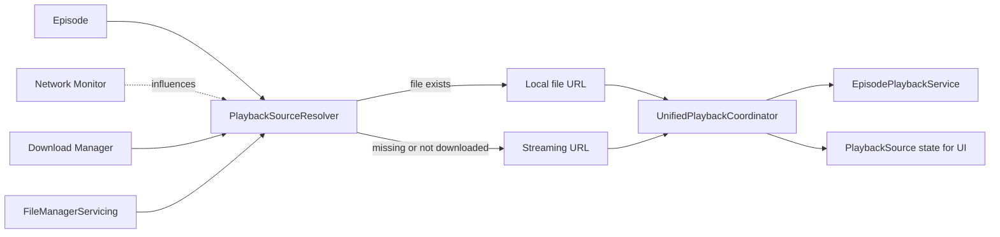

# Dev Log: Issue 28.1.5 - Unified Playback Coordinator

**Issue**: #341 - Unified Playback Coordinator  
**Parent**: 28.1 - Offline and Streaming Playback Infrastructure  
**Status**: Planning

---

## 2026-01-14 — Design Intent

### Intent
- Centralize playback source selection (local vs streaming) behind a single coordinator.
- Keep UI read-only by exposing playback source state instead of raw file checks.
- Ensure resume and error paths use the same source-selection rules.

### Assumptions
- Download manager persists file locations and exposes status.
- File existence checks live behind a FileManagerServicing abstraction.
- Playback engine already accepts a URL and emits position updates.

### Open Questions
- Should source selection fall back to streaming when offline if the local file is missing?
- Do we treat partially downloaded files as playable or always require completion?
- Where should playback source state be stored for UI refresh: view model or coordinator?

### Design Sketch

### Next Steps
- Define PlaybackSource enum and resolver interface.
- Map errors to PlaybackError with recoverability rules.
- Document coordination points in PlaybackEnvironment/CarPlay dependencies.
