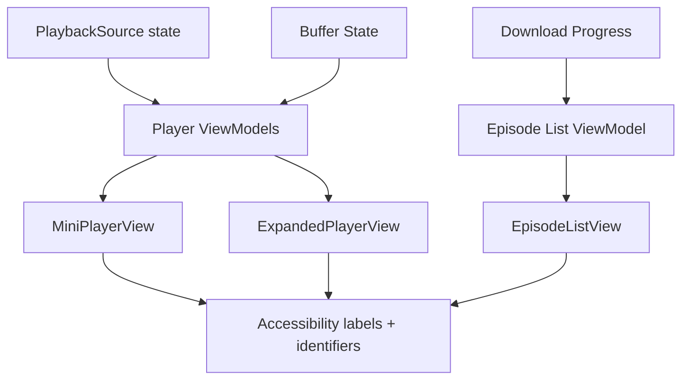

# Dev Log: Issue 28.1.6 - UI Integration (Download/Streaming Indicators)

**Issue**: #342 - UI Integration: Download/Streaming Indicators  
**Parent**: 28.1 - Offline and Streaming Playback Infrastructure  
**Status**: Planning

---

## 2026-01-14 — Design Intent

### Intent
- Surface download/streaming/offline state consistently in lists and players.
- Keep indicators accessible with identifiers and VoiceOver labels.
- Distinguish buffer progress from playback progress during streaming.

### Assumptions
- UnifiedPlaybackCoordinator emits PlaybackSource updates.
- Download progress updates are available via EpisodeDownloadProgressUpdate.
- Player views can render a secondary progress bar for buffer state.

### Open Questions
- Where should buffer state live: playback engine or a streaming coordinator?
- Should episode list show a buffer indicator or only in player surfaces?
- What visual language matches the existing design system for these indicators?

### Design Sketch

### Next Steps
- Define indicator mapping rules (Downloaded/Streaming/No Connection).
- Add accessibility identifiers for new UI elements.
- Update UI tests to cover the new indicator states.
