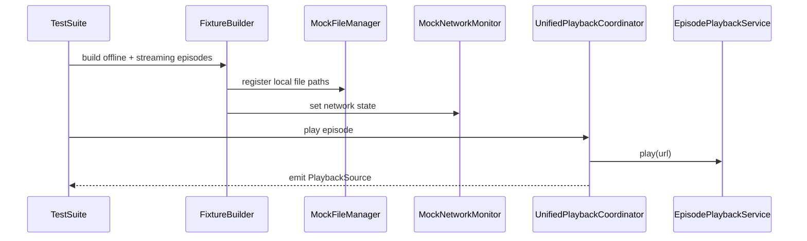

# Dev Log: Issue 28.1.7 - Test Infrastructure for Offline and Streaming Modes

**Issue**: #343 - Test Infrastructure for Offline and Streaming Modes  
**Parent**: 28.1 - Offline and Streaming Playback Infrastructure  
**Status**: Planning

---

## 2026-01-14 — Design Intent

### Intent
- Provide deterministic fixtures for offline vs streaming playback tests.
- Centralize mocks for FileManagerServicing and network monitoring.
- Add coverage mapping to offline/streaming spec scenarios.

### Assumptions
- UnifiedPlaybackCoordinator is the seam for source selection tests.
- TestSupport can host fixture builders without leaking into production.
- UI tests can gate network and file fixtures via launch environment.

### Open Questions
- Do we need a dedicated lightweight HTTP server for streaming tests, or use static URLs?
- Should offline fixtures be bundled in test assets or written to temp directories?
- Which suites own the new UI tests (zpodUITests vs IntegrationTests)?

### Design Sketch

### Next Steps
- Add fixture helpers to TestSupport.
- Add mock FileManagerServicing + network monitor.
- Add integration tests around source selection and fallback behavior.
