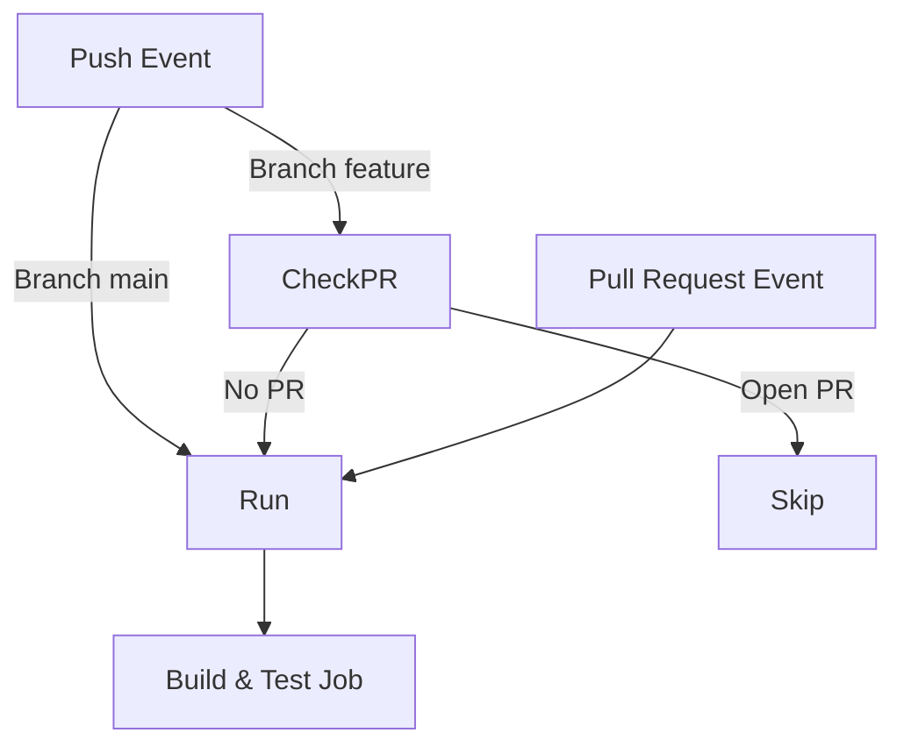
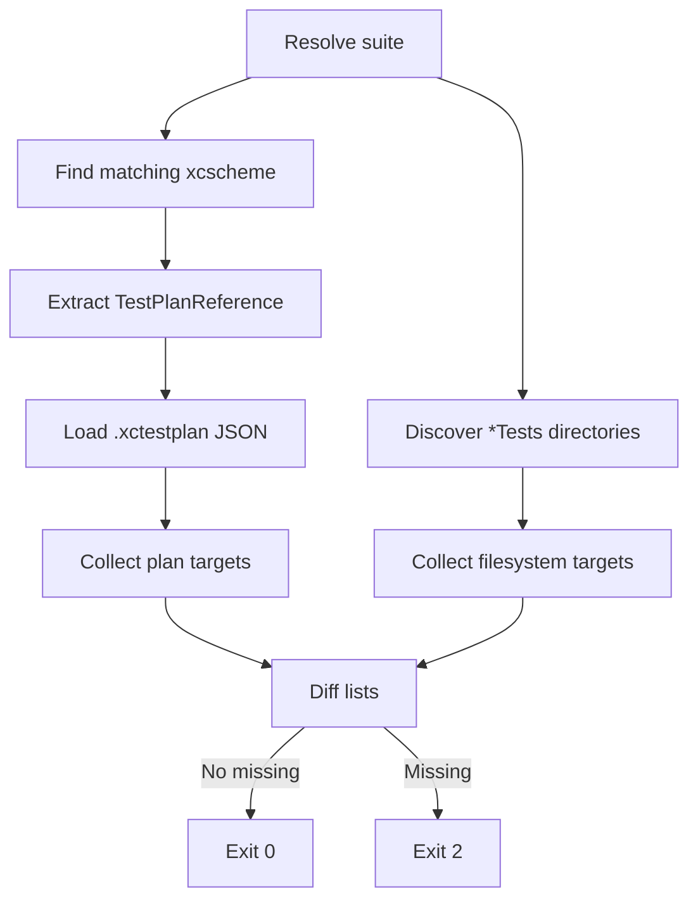

# Dev Log – Issue 01.1.1 Build Script Modernization

## 2025-09-21 13:05 EDT — Planning & Issue Split
- Reviewed legacy Issue 01.1.1 scope; split into two focused work items:
  - **01.1.1.1** (#63) – Introduce shared shell helpers and refactor `run-xcode-tests.sh` with environment detection + self-checks.
  - **01.1.1.2** (#64) – Adopt the new tooling inside GitHub Actions, refresh docs, and align auxiliary scripts.
- Captured parent issue history in `Issues/01.1.1-build-script-modernization.md`; updated GitHub issue #60 accordingly.
- High-level plan for Phase 1 (Issue 01.1.1.1):
  1. Create `scripts/lib/` with `logging.sh`, `env.sh`, and `args.sh` helpers (shellcheck clean).
  2. Rewrite `run-xcode-tests.sh` to source helpers, expose `--self-check`, and centralise build/test orchestration.
  3. Provide fallback adapters (`lib/xcode.sh`, `lib/spm.sh`) so platform differences are encapsulated.
  4. Add lightweight sanity tests (bash-driven) to guard argument parsing and environment detection.
- Phase 2 (Issue 01.1.1.2) will start only after Phase 1 lands so that CI switches to the new entry point with confidence.

Next step: create a working branch for Issue 01.1.1.1 and begin implementing shared helpers + script refactor.

## 2025-09-21 13:55 EDT — Phase 1 Refactor Started
- Created `feature/01.1.1-script-refactor` branch and PR #65 (ties to Issue #63).
- Added `scripts/lib/` with common helpers:
  - `logging.sh` for structured colourised output.
  - `common.sh` for repo/root utilities.
  - `result.sh` for result bundle/log path management.
  - `xcode.sh` and `spm.sh` to encapsulate environment detection and fallback execution.
- Rewrote `scripts/run-xcode-tests.sh` to source helpers, simplify build/test orchestration, add `--self-check`, and centralise xcodebuild/SPM handling.
- Updated `scripts/dev-build-enhanced.sh` to reuse new logging utilities.
- Verified `bash -n` on all scripts and ran `run-xcode-tests.sh --self-check` plus `scripts/dev-build-enhanced.sh syntax` as smoke tests.

Next: iterate on documentation updates and add lightweight shell-based self-tests before tackling CI integration (Issue #64).

## 2025-09-21 14:05 EDT — Full Build Verification
- Added environment guard/`MACOSX_DEPLOYMENT_TARGET` when invoking SwiftPM to avoid macOS availability compilation errors during fallbacks.
- Updated simulator selection to ignore placeholder entries when real devices exist so the script mirrors manual `xcodebuild -showdestinations` behaviour.
- `scripts/run-xcode-tests.sh full_build_and_test` now runs xcodebuild clean+build and UI tests against the concrete simulator (subsequent UI test failure is unrelated test logic, not simulator detection).

## 2025-09-21 15:20 EDT — Kickoff Phase 2 CI Integration
- Created branch `feature/01.1.1.2-ci-integration` for Issue #64 (CI workflow integration).
- Goal: replace duplicated xcodebuild invocations in `.github/workflows/ci.yml` with the new `scripts/run-xcode-tests.sh` entry point, ensure Linux fallback uses SPM, and update contributor docs accordingly.
- Next steps: review existing workflow steps, stage modifications to call the script with flags, and update documentation/test summaries once verified.

## 2025-09-21 15:35 EDT — Workflow & Documentation Updates
- Refactored `.github/workflows/ci.yml` to rely on `./scripts/run-xcode-tests.sh` (`--self-check` + `full_build_and_test`) and added a Linux job that exercises the SwiftPM fallback via `dev-build-enhanced.sh`.
- Tidied macOS steps (removed manual package resolution/xcbeautify install) while keeping simulator installation safeguards.
- Updated `AGENTS.md` to direct developers toward the helper script for local/CI usage.
- Verified via `scripts/run-xcode-tests.sh --self-check` and `scripts/dev-build-enhanced.sh syntax` locally. Full suite run pending CI.

## 2025-09-21 15:45 EDT — CI Trigger Cleanup
- Restricted the workflow triggers so pushes only run CI on `main`; feature branches now rely on the PR event. This prevents duplicate runs on every push + PR update.

## 2025-09-21 17:25 EDT — CI Trigger Rework Plan

### Intent
- Ensure CI runs for `main`, feature branches without PRs, and pull requests while avoiding duplicate build/test jobs when PRs are open.
- Keep a single workflow definition while delegating build orchestration to `scripts/run-xcode-tests.sh`.

### Observations
- Current trigger restricts push coverage to `main`, so feature branches without PRs never undergo CI.
- Adding unrestricted `push` would revive duplicate runs because GitHub fires both `push` and `pull_request` events for PR branches.
- We can inspect open PRs via REST API and early-exit the push-triggered job when a PR already covers the branch, preventing duplicate long-running jobs.

### Plan of Record
1. Expand workflow trigger to include `push` on all branches (excluding tags) alongside existing `pull_request`.
2. Introduce a lightweight "PR presence" check at job start; if the branch has an open PR and the event is `push`, skip the remaining steps.
3. Document the behaviour in workflow comments to aid future maintenance and keep a single build/test job.

### Validation
- After edits, push to a temporary branch without PR to confirm CI triggers once.
- Open a PR and push new commits to verify the push workflow skips while the PR workflow runs.
- Ensure merging to `main` still triggers the standard push run.

## 2025-09-27 09:45 EDT — Test Plan Verification Fix Design
- Regression surfaced: `scripts/run-xcode-tests.sh -p` hard-depends on `xcodebuild -showTestPlans`, which fails on sandboxed/mac-less hosts and prevents the test plan coverage gate from running.
- Goal: keep the `-p` flag portable by parsing the scheme + `.xctestplan` data directly with Python, avoiding `xcodebuild`/`plutil` invocations.
- Plan of record:
  1. Discover the scheme XML (`*.xcscheme`) matching the resolved suite and extract the `TestPlanReference` path.
  2. Load the referenced `.xctestplan` JSON and pull `testTargets[*].target.name`.
  3. Enumerate repo directories matching `*Tests` (excluding result bundles) and diff against the plan list.
  4. Return exit code `2` when coverage is incomplete so CI can flag the gap, otherwise success (`0`).
- Update legacy `scripts/verify-testplan-coverage.sh` to delegate to the new library helper, keeping historical entry points functional while guiding developers to the consolidated script.
- Documentation: refresh `AGENTS.md` usage guidance and append dev-log results after implementation.

## 2025-09-27 10:10 EDT — Test Plan Verification Refactor Complete
- Implemented the new `verify_testplan_coverage` helper inside `scripts/lib/testplan.sh`, replacing the previous `xcodebuild`/`plutil` dependency with pure Python parsing of the scheme XML and `.xctestplan` JSON.
- Removed the legacy `scripts/verify-testplan-coverage.sh` entry point; the `-p` flag in `run-xcode-tests.sh` is now the sole interface for coverage checks.
- Hardened target discovery by walking the repo tree in Python, pruning build artefact folders, and de-duplicating names before diffing against the plan entries.
- Updated `AGENTS.md` tooling guidance to spotlight `./scripts/run-xcode-tests.sh -p [suite]` and discourage manual `xcodebuild` invocations.
- Validation: `./scripts/run-xcode-tests.sh -p` executes entirely within the sandboxed environment (no `xcodebuild` calls) and now relies on the expanded test plan coverage list.
