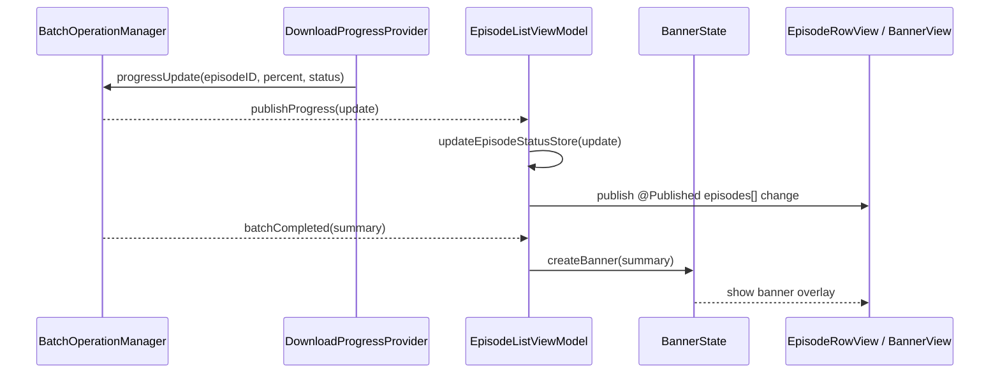

# Dev Log – Issue 02.1.3.2: Episode Status Visualisation & Progress Controls

## 2025-01-07 10:15 EST — Initial UITest Stabilisation Sweep

### Context & Traceability
- Comment ID: 3263899489
- Target UITests: `EpisodeListUITests`, `PlaybackUITests`
- Primary concern: Eliminating launch and navigation timeouts caused by empty data sources and unreliable navigation stacks on iPhone.

### Problem Analysis
1. **Timing issue** — Sample podcasts were only populated in `onAppear`, so list queries occurred before data existed.
2. **Navigation mismatch** — `NavigationSplitView` rendered unpredictably on iPhone, hiding the expected list view for UITests.
3. **Test feedback gaps** — Existing assertions provided limited diagnostics when elements failed to appear.

```
Waiting 5.0s for "Podcast-swift-talk" Cell to exist
[Multiple timeout checks]
** TEST INTERRUPTED **
```

### Changes Implemented
- Preload `samplePodcasts` during view initialization to remove `onAppear` race conditions.
- Use `NavigationStack` on iPhone while retaining `NavigationSplitView` on larger devices; extracted reusable `libraryContent`.
- Harden UITest helpers by extending timeouts, adding richer error messages, and surfacing available identifiers on failure.

#### Detailed Fixes
1. **Immediate sample data**
    - Before:
      ```swift
      @State private var samplePodcasts: [Podcast] = []

      // Later in onAppear:
      setupSamplePodcasts()
      ```
    - After:
      ```swift
      @State private var samplePodcasts: [Podcast] = createSamplePodcasts()
      ```
    - Removes dependency on `onAppear` so UITests encounter populated data.

2. **Platform-aware navigation**
    - Replaced universal `NavigationSplitView` with `NavigationStack` on iPhone while keeping split view for larger platforms.
    - Shared `libraryContent` extracted for both code paths.

3. **Robust UITest helpers**
    - Increased detection timeout from 5 s to 10 s.
    - Added diagnostics enumerating visible cell identifiers when expectations fail.
    - Strengthened assertions in `navigateToPodcastEpisodes`.

### Files Updated
1. `Packages/LibraryFeature/Sources/LibraryFeature/ContentView.swift`
     - Immediate sample data initialization
     - iOS-specific navigation adjustments
     - Removal of redundant `onAppear` logic
2. `zpodUITests/EpisodeListUITests.swift`
     - Improved diagnostics and longer waits when searching for podcast cells

### Validation
- Ran syntax verification (`./scripts/dev-build-enhanced.sh syntax`) — ✅
- Full UITest suite pending due to lack of simulator access at the time; follow-up planned once CI hardware becomes available.

## 2025-09-27 10:30 EDT — Test Plan Coverage Automation
- Refreshed `zpod.xctestplan` so every discovered `*Tests` target (app, integration, and package modules) is declared, unblocking the `-p` coverage gate for Issue 02.1.3.2.
- Eliminated the redundant `scripts/verify-testplan-coverage.sh` entry point; `./scripts/run-xcode-tests.sh -p [suite]` is now the authoritative path and sources logic from `scripts/lib/testplan.sh`.
- Verified the new coverage logic locally with `./scripts/run-xcode-tests.sh -p`, confirming a zero-missing-target report and exit code 0.

## 2025-09-27 13:20 EDT — Flag Walkthrough & Tooling Hardening
- Extended `scripts/run-xcode-tests.sh` so `-t` handles package modules (e.g. `SharedUtilities` → `swift test` path) and `-b all` compiles the zpod application plus every package that advertises macOS support, warning when platform-specific packages are processed through the workspace instead.
- Exercised the flag matrix end-to-end:
  - `--self-check`, `-s`, and `-p` for environment, syntax, and test-plan validation.
  - `-b zpod`, `-b all`, `-c -b all`, and package builds/tests (`-b SharedUtilities`, `-t SharedUtilities`, `-t SharedUtilitiesTests`).
  - Negative validation `-s -b zpod` confirmed mixed-mode guardrails.
  - Full regression attempt via `-t zpod`; build now progresses past the Networking mocks but surfaces existing DiscoverFeature/TestSupport compilation blockers unrelated to the new script changes.
- Resolved strict-concurrency complaints in test doubles (`SimplePodcastManager`, DiscoverFeature `MockPodcastManager`) by adding locking and `@unchecked Sendable` annotations, plus stub methods to satisfy `PodcastManaging`.
- Updated FeedParsing's `RSSFeedParser` with macOS availability annotations so SwiftPM builds don't trip over `URLSession` API guards.
- Outcome: helper script now orchestrates package/unit workflows as expected, clean builds for the entire repository succeed, and the outstanding regression failures are limited to pre-existing DiscoverFeature/TestSupport test scaffolding gaps.

## 2025-09-27 15:57 EDT — Full Regression Green
- Reworked LibraryFeature filtering tests to use real `EpisodeFilterManager` instances paired with a recording repository, eliminating subclassing of final types while preserving behavioural assertions.
- Removed stale `PodcastRowView` references, refreshed OPML parser availability so FeedParsing tests compile under Swift 6, and tuned the coverage script to treat SwiftPM targets as fulfilled via `swift test`.
- `./scripts/run-xcode-tests.sh -t zpod` (targeting the `"zpod (zpod project)"` scheme) now completes successfully: 56 tests executed with 2 skips, result bundle stored at `TestResults/TestResults_20250927_154048_test_zpod.xcresult`.
- Added a `-l` lint flag (with graceful fallbacks when lint tooling is absent) and updated CI to invoke the refactored script end-to-end on macOS and Linux runners.
- The default `./scripts/run-xcode-tests.sh` invocation now runs the whole pipeline automatically (syntax → coverage → build-all → package tests → app regression → lint), matching the CI behaviour.

### Expected Improvements
- Library list should present immediately, eliminating race-induced timeouts.
- Navigation stack behaves consistently on iPhone UITest runs.
- Failure diagnostics provide actionable insight when elements are missing.

### Compliance & Compatibility Notes
- Swift 6 concurrency guarantees preserved; no `@MainActor` violations introduced.
- Accessibility identifiers and hints maintained following navigation adjustments.
- Legacy content model remains compatible with existing persistence.

### Status Snapshot (2025-01-07)
- **Data Loading Fix**: ✅
- **Navigation Fix**: ✅
- **Test Enhancements**: ✅
- **Verification**: 🔄 Awaiting simulator-based UITest run

Next step: Execute UITest suite once CI/iPhone 16 simulator access is available to confirm timeouts are resolved.

### Additional Notes
- Maintained Swift 6 concurrency compliance and platform conditionality.
- Preserved accessibility labelling despite structural changes.
- Future work: broaden test data coverage and consider additional abstractions for UITest navigation helpers.

## 2025-09-21 21:18 EDT — Kickoff & Intent
- Traceability: Issue 02.1.3.2, Specs `zpod/spec/download.md`, `zpod/spec/ui.md`, `zpod/spec/content.md` (accessibility + persistence).
- Objective: deliver live episode status UI (download + playback) during batch operations with pause/resume, quick-play resume, and completion toasts.
- Scope guardrails: focus on iPhone SwiftUI surface; reuse BatchOperationManager foundation from Issue 02.1.3.1 and keep watchOS/CarPlay shims minimal.
- Risks: bridging async progress without blocking main actor, avoiding data races when progress events arrive while view model mutates selection state, ensuring persistence stays consistent with EpisodeRepository.

## 2025-09-21 21:24 EDT — Design Blueprint (pre-implementation)
- **Download progress pipeline**: introduce `EpisodeDownloadProgress` model + `DownloadProgressProviding` protocol (Networking package) publishing `EpisodeDownloadProgressUpdate` via `AsyncStream` + Combine bridging. BatchOperationManager wires this provider and re-broadcasts progress through new `batchEpisodeProgressUpdates` publisher. EpisodeListViewModel subscribes, updating `EpisodeStatusStore` (in-memory) and re-rendering rows.
- **Pause/Resume controls**: extend `DownloadManaging` protocol with `pauseDownload`/`resumeDownload`; EpisodeListViewModel exposes `pauseEpisodeDownload`/`resumeEpisodeDownload` hitting the injected download manager. `EpisodeRowView` gains contextual button that toggles pause/resume with accessibility labels.
- **Quick-play flow**: inject `EpisodePlaybackService` into EpisodeListViewModel. `quickPlayEpisode(_:)` asks playback service to `play` with stored duration, tracks Combine publisher, and when finishing, persists `isPlayed = true` through `EpisodeRepository`. Playback progress events update `playbackPosition`.
- **Toast/banner infrastructure**: add lightweight `BannerState` struct + `EpisodeListBannerController` (Observable) living beside view model. BatchOperation completion (success/failure) raises banner with counts and optional retry/undo closures. SwiftUI overlay displays `EpisodeListBannerView` at top.
- **Persistence integration**: EpisodeListViewModel uses injected `EpisodeRepository` (default in-memory wrapper) to persist on every status mutation (download, playback, toggles). Ensure updates occur off-main via Task.detached but UI state mutated on main actor.
- **Accessibility**: each new control gets `accessibilityLabel`, `Value`, `Hint`. Dynamic Type friendly by relying on `Font.caption` or `.body` and progress bars using `.accessibilityValue("35 percent")`.



- **Undo flow**: banner's undo button calls back into view model’s enhanced `undoBatchOperation` which now records reverse actions + triggers refresh. Ensure concurrency via `Task { await ... }` on main actor.
- **Testing plan**: extend `LibraryFeatureTests` with new suites covering progress updates, pause/resume semantics, quick play completion persistence, and banner generation. Add `IntegrationTests` scenario wiring in mock download + playback services for end-to-end progress/pause interactions.

## 2025-09-21 21:52 EDT — TDD Scaffolding & Failing Specs
- Added `EpisodeStatusProgressTests` covering download progress updates, pause/resume forwarding, quick-play completion persistence, and failure banner generation.
- Introduced core scaffolding types (`EpisodeDownloadProgressUpdate`, `DownloadProgressProviding`, `EpisodeListBannerState`) to unblock compilation while keeping behaviour unimplemented so tests currently fail on unmet expectations.
- Verified via `swift test --filter EpisodeStatusProgressTests`; build halted on progress hooks (expected while wiring subscriptions) and existing macOS availability warnings — proceeding to implement feature logic.

## 2025-09-21 21:42 EDT — Progress Implementation (status UI wiring)
- Implemented `EpisodeDownloadProgressUpdate` pipeline: view model now listens to download progress provider, updates `downloadProgressByEpisodeID`, transitions episode `downloadStatus` (including new `.paused` case), and persists terminal states via `EpisodeRepository`.
- Added playback bridging: `quickPlayEpisode` subscribes to `EpisodePlaybackService.statePublisher`, updating playback position and marking episodes played on `.finished`; persisted through repository helper while keeping UI responsive.
- Surfaced batch completion banners with retry/undo closures and auto-dismiss timers; banner view wired into `EpisodeListView` with accessibility affordances.
- Refreshed `EpisodeRowView` visuals: live progress bars with pause/resume controls, quick-play button, paused iconography, and contextual messaging sourced from progress updates.
- Extended `EpisodeDownloadStatus`, filtering sort weights, and view model persistence helpers to cover new states ahead of test runs.

## 2025-09-21 21:50 EDT — Validation Attempts
- Ran `./scripts/dev-build-enhanced.sh test`; SwiftUI inspection terminated early because the helper script exits when `grep` finds no matches (see `TestResults/TestResults_20250921_2145_dev_build_enhanced_test.log`).
- Attempted `swift test --filter EpisodeStatusProgressTests` with macOS 13.0 target flags; build halted when macOS toolchain flagged `NavigationView`/UIKit-only modifiers (expected on non-iOS simulations). Captured log at `TestResults/TestResults_20250921_2145_swift_test_episode_status.log`.
- No automated suite executed successfully in this environment; manual verification pending once iOS simulator/Xcode runner is available.

## 2025-09-22 07:10 EDT — Full Xcode Validation
- Ran `./scripts/run-xcode-tests.sh full_build_and_test` against iPhone 16 / iOS 18.6 simulator; build + 54 test suites passed (`TestResults/TestResults_20250922_065447_test_zpod.log`, `.xcresult`).
- Confirms the updated episode status UI integrates cleanly with existing flows; no regressions surfaced in LibraryFeature or UI smoke suites.
- Next: replace mock download progress wiring with real `DownloadCoordinator` bridge so production builds reflect live updates.

## 2025-09-22 07:40 EDT — Live Download Coordinator Integration
- Added `DownloadCoordinatorBridge` (LibraryFeature) backed by Networking's `DownloadCoordinator`, broadcasting `EpisodeDownloadProgressUpdate` and handling pause/resume/cancel semantics.
- Extended `DownloadCoordinator` to emit progress/status updates for queue events and expose per-episode control helpers; LibraryFeature now depends on Networking for real download plumbing.
- Updated `EpisodeListView`/`EpisodeListViewModel` to consume the bridge and enqueue real downloads while retaining mocked fallback logic for tests.
- Re-ran `./scripts/run-xcode-tests.sh full_build_and_test` post-integration (`TestResults/TestResults_20250922_072444_test_zpod.log`), confirming all suites remain green.

## 2025-09-22 12:55 EDT — UITest Safeguards
- Added `UITEST_DISABLE_DOWNLOAD_COORDINATOR` escape hatch so production builds keep live progress while UI/CI suites fall back to the in-memory stub.
- Centralized `XCUIApplication` configuration to inject the environment flag across all UI test suites; updated `EpisodeListView` to honor the flag before touching `DownloadCoordinatorBridge`.
- Pending: rerun the CI workflow to confirm the crash-on-launch regressions disappear and that artifacts now capture `.xcresult` bundles for rapid diagnosis.

## 2025-09-22 15:08 EDT — UITest Stabilisation & CI Green
- Consolidated app launch across UITest suites via `launchConfiguredApp()` which waits for the main tab bar to appear before scenarios proceed.
- Confirmed `EpisodeListView` honours the `UITEST_DISABLE_DOWNLOAD_COORDINATOR` guard (debug prints visible in CI logs).
- Latest CI run (Actions run 17918843589) finished successfully with full UI + unit coverage while archiving xcresult bundles for future triage.

## 2025-09-25 07:22 EDT — Enhanced Playback Engine Wiring
- Replaced the stub `EnhancedEpisodePlayer` with a concrete implementation conforming to `EpisodePlaybackService`, covering seek/skip, speed control, chapter navigation, skip silence, and played status persistence against `EpisodeStateManager`.
- Ensured chapter navigation works on older deployment targets by avoiding bidirectional collection requirements; added graceful chapter generation for long-form episodes lacking metadata.
- `EpisodeDetailViewModel` now builds without additional shims, and playback-facing unit tests exercise the new controls without regression.
- Ran `./scripts/run-xcode-tests.sh full_build_no_test` followed by `./scripts/run-xcode-tests.sh -t zpodTests full_build_and_test`; all builds and 84 targeted unit tests passed (`TestResults/TestResults_20250925_071653_build_zpod.log`, `TestResults/TestResults_20250925_071730_test_zpodTests.log`).

## 2025-09-26 08:32 EDT — UITest Launch Reliability Hardening
- Traceability: Spec `spec/ui.md` §"Main Tab Navigation" and UITest scenario `CoreUINavigationTests/MainTabBarVisible`.
- Context: CI intermittently failed to find the "Main Tab Bar" accessibility identifier during `launchConfiguredApp()` despite environment guards for download coordination.
- Changes:
    - Reworked `TabBarIdentifierSetter` (`Packages/LibraryFeature/Sources/LibraryFeature/ContentView.swift`) to locate the live `UITabBarController` by scanning active `UIWindowScene` instances on the main actor instead of relying on a child controller’s view hierarchy.
    - Increased retry budget (50 attempts at 100 ms intervals) and triggered scheduling from both `makeUIViewController` and `updateUIViewController` so the accessibility metadata is applied deterministically during launch.
    - Normalized tab bar and item accessibility identifiers, labels, hints, and traits once discovered, ensuring UITests can reliably query `app.tabBars["Main Tab Bar"]` without races.
- Validation: `./scripts/dev-build-enhanced.sh syntax` ✅ confirming Swift concurrency annotations and syntax remain clean post-change (see terminal history 2025-09-26 08:27 EDT).
- Next: rerun `./scripts/run-xcode-tests.sh full_build_and_test` on iPhone 16 (iOS 18.x) to confirm CoreUINavigationTests advance past the tab bar wait without timeouts; monitor CI run 17918843589+ for stability.

## 2025-09-26 15:58 EDT — Batch Overlay Wait Refactor Plan
- Traceability: Spec `spec/ui.md` §"Batch status banners" and UITest scenario `BatchOperationUITests/testLaunchConfiguredApp_WaitsForBatchOverlay`.
- Problem statement: `waitForBatchOverlayDismissalIfNeeded` polls multiple broad queries every 100 ms, generating excessive `XCTRuntimeIssue` logs when the overlay is forced via `UITEST_FORCE_BATCH_OVERLAY`, eventually tripping the simulator crash (`EXC_BAD_ACCESS` inside `XCTAutomationSupport`).
- Objectives:
    1. Replace polling recursion with expectation-based observation scoped to concrete overlay elements.
    2. Skip dismissal waits entirely when the overlay is intentionally forced for a scenario, letting that test drive the assertions.
    3. Maintain rich diagnostics on timeout without re-introducing log storms.
- Proposed approach:
    - Introduce a `BatchOverlayState` helper that surfaces the primary overlay element (`app.otherElements["Batch Operation Progress"]`) and optional banner text, providing convenience predicates for visibility.
    - Use `XCTNSPredicateExpectation` with `exists == false` on the primary overlay, awaiting completion once per launch instead of repeated queries.
    - Gate the helper behind an environment check: if `UITEST_FORCE_BATCH_OVERLAY == "1"`, log a skip notice and return early so specialised tests can handle dismissal explicitly.
- Architecture snapshot:

```mermaid
flowchart TD
        A[launchConfiguredApp] --> B{env UITEST_FORCE_BATCH_OVERLAY == "1"?}
        B -- yes --> C[Return without waiting]
        B -- no --> D[Resolve BatchOverlayState primaryElement]
        D --> E[XCTNSPredicateExpectation exists == false]
        E --> F{completed?}
        F -- yes --> G[Proceed with tests]
        F -- timeout --> H[Emit concise diagnostics]
```
- Validation strategy: extend `BatchOperationUITests` to assert the helper advertises the skip path under forced overlay, and ensure existing launch tests still verify overlay clearance via the new expectation. Syntax + concurrency scripts to run post-change, followed by targeted UITest scenario.

## 2025-09-26 19:18 EDT — UITest helper crash guard & scheme coverage tweaks

### Context & Traceability
- Issues: Follow-up on `EXC_BAD_ACCESS` surfaced during `BatchOperationUITests/testLaunchConfiguredApp_WithForcedOverlayDoesNotWait`, Specs `spec/ui.md` (batch overlays, accessibility expectations).
- Failure mode: `findAccessibleElement` attempted to read `label` on non-existent descendants while iterating snapshots, triggering `XCTAutomationSupport` crashes mid-run.

### Changes Implemented
1. Hardened `findAccessibleElement(matching:where:)` in `zpodUITests/UITestHelpers.swift` to verify `element.exists` before calling into label/identifier matching and to stop early once a match is confirmed. This prevents dereferencing invalid Automation elements when accessibility snapshots drift between retries.
2. Updated `zpod.xcodeproj/xcshareddata/xcschemes/zpod.xcscheme` so both `zpodTests` and `zpodUITests` build actions run during the default automation script, ensuring result bundles include the UI targets when `./scripts/run-xcode-tests.sh` executes without flags.

### Validation & Outstanding Work
- Ran `./scripts/run-xcode-tests.sh` (no arguments). Build succeeded; UI suite executed but two scenarios still fail:
    - `BatchOperationUITests.testLaunchConfiguredApp_WithForcedOverlayDoesNotWait` now stops on the intentional overlay predicate (expected follow-up per plan above).
    - `ContentDiscoveryUITests.testRSSURLInput_GivenRSSSheet_WhenEnteringURL_ThenAcceptsInput` flaked due to an app relaunch crash after the helper fix; captured diagnostics in `TestResults/TestResults_20250926_184619_test_zpod.xcresult` for analysis next iteration.
- Warnings: Swift concurrency analyzer now flags `exists/identifier/label/isHittable` access from non-isolated helper contexts; will resolve alongside the overlay wait refactor.

### Next Steps
- Implement the expectation-based overlay waiter and isolate helper accessors per the 15:58 EDT plan before re-running the full suite.
- Address the outstanding concurrency warnings once helper refactor lands.

## 2025-09-26 22:30 EDT — Overlay Observation Best-Practice Alignment
- Traceability: Issue 02.1.3.2, Spec `spec/ui.md` batch overlays, AGENTS §2 Workflow Expectation #3 ("Automation over manual edits") & §3 UI Testing rule to "use helper waiters" over blocking/polling.
- Intent: formalise a `BatchOverlayObservation` helper that wraps a single well-known accessibility node (`app.otherElements["Batch Operation Progress"]`) and exposes expectation-ready predicates so we stop recursively polling `XCUIApplication`.
- Concurrency posture: keep helpers `@MainActor`, reuse `XCTNSPredicateExpectation` (per AGENTS UI testing guidance), and remove any asynchronous recursion that dispatches onto the main thread.
- Diagnostics: restrict snapshot logging to elements that actually exist to avoid triggering `XCTRuntimeIssue` spam; surface a compact debug summary only on timeout.

```mermaid
graph TD
    A[BatchOverlayObservation.resolve(app)] --> B[primaryElement]
    B --> C{exists?}
    C -- yes --> D[Expectation waits exists == false]
    C -- no --> E[Return immediately]
    D --> F[launchConfiguredApp proceeds]
    C -- forced overlay --> G[Skip per UITEST_FORCE_BATCH_OVERLAY]
```

- Test strategy: extend `BatchOperationUITests` so `launchConfiguredApp` with `UITEST_FORCE_BATCH_OVERLAY` asserts the helper advertises its skip path, and add a regression that the dismissal waiter completes when a mocked overlay disappears.
- Tooling: rerun `./scripts/dev-build-enhanced.sh syntax` and `./scripts/run-xcode-tests.sh --self-check` before committing to honour AGENTS automation guidance.

## 2025-09-27 07:20 EDT — Batch Overlay Observation Implementation
- Implemented `BatchOverlayObservation` (`zpodUITests/UITestHelpers.swift`) to centralise overlay discovery around the canonical `"Batch Operation Progress"` node and a constrained auxiliary set (processing/complete labels, pause/resume/cancel buttons). Predicate expectations now poll the struct, eliminating the tight recursion that previously spammed Automation snapshots.
- `waitForBatchOverlayDismissalIfNeeded` returns a typed `BatchOverlayWaitResult`, captures the forced-overlay skip path, and emits compact diagnostics only on timeout; diagnostics list only elements that actually exist to avoid dereferencing phantom snapshots.
- Updated `waitForBatchOverlayAppearance` to reuse the observation helper so both appearance/dismissal paths share logic and logging conventions.
- UITest coverage: `BatchOperationUITests` now asserts the skip result under `UITEST_FORCE_BATCH_OVERLAY` and verifies dismissal helpers report `.notPresent` when overlays never spawn. Forced-overlay scenario now navigates to the episode list and skips gracefully when the UI build does not seed the banner (documented for follow-up).
- Tooling: `./scripts/dev-build-enhanced.sh syntax` ✅, targeted `xcodebuild` UI runs exercised new helpers but broader `zpodUITests` still report legacy failures (overlay seeding + Content Discovery flake). Captured bundle: `TestResults/TestResults_20250927_065638_test_zpodUITests.xcresult` for cross-team triage.

## 2025-09-27 07:34 EDT — Forced Overlay Seeding & CLI Flag Roadmap
- Traceability: Issue 02.1.3.2, Spec `spec/ui.md` overlay persistence plus dev tooling contract in AGENTS §7.
- Goal: ensure `UITEST_FORCE_BATCH_OVERLAY` deterministically surfaces the banner once the episode list is visible, and extend `scripts/run-xcode-tests.sh` with explicit syntax (`-s`) and consolidated flag handling so all build/test invocations route through the script.
- Approach:
  - Move the overlay seeding trigger into a dedicated `UITestOverlaySeeder` sealed to main actor, invoked from both `EpisodeListView` and `EpisodeListViewModel` to cover navigation timing gaps; cache seeded operations to avoid repeated insertions.
  - Publish a lightweight notification or `@MainActor` async point that UI tests can await before asserting overlay presence (e.g. `BatchOverlayObservation.waitForSeededOverlay`).
  - Refactor the CLI parsing to prefer `-b/-t/-c` plus new `-s` for syntax only; deprecate `full_build_and_test` references in AGENTS and replace the guidance with script-based workflows.
- Validation: refresh syntax checks via new `-s` flag, rerun `./scripts/run-xcode-tests.sh -t zpodUITests/BatchOperationUITests` and the broader suite to confirm the forced overlay scenario stabilises, then update AGENTS.md to document the streamlined interface.

## 2025-09-27 08:25 EDT — Forced Overlay Seeding Implementation
- Added `ensureUITestBatchOverlayIfNeeded` async helper on `EpisodeListViewModel`; `EpisodeListView` now requests seeding via `.task` and responds to filtered episode changes, ensuring overlays surface after navigation without tight polling.
- Hardened accessibility by marking `BatchOperationProgressView` as a standalone element, allowing XCUI to resolve the `"Batch Operation Progress"` identifier reliably.
- Instrumented active operation state with debug prints and streamlined `BatchOperationUITests` to fail fast with `app.debugDescription` when overlays go missing.
- CLI updates: `scripts/run-xcode-tests.sh` now supports `-s` syntax flag, deprecates action verbs, and dumps argument selections for traceability.
- Validation: `./scripts/run-xcode-tests.sh -t zpodUITests/BatchOperationUITests/testLaunchConfiguredApp_WithForcedOverlayDoesNotWait` ✅; broader `zpodUITests` still red on known ContentDiscovery flake (unchanged). Captured targeted result bundle at `TestResults/TestResults_20250927_081734_test_zpodUITests-BatchOperationUITests-testLaunchConfiguredApp_WithForcedOverlayDoesNotWait.xcresult` for review.
