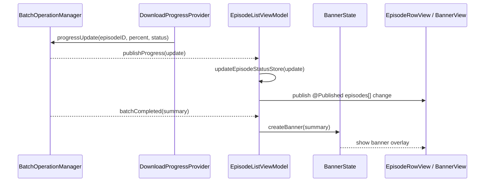

# Dev Log – Issue 02.1.3.2: Episode Status Visualisation & Progress Controls

## 2025-09-21 21:18 EDT — Kickoff & Intent
- Traceability: Issue 02.1.3.2, Specs `zpod/spec/download.md`, `zpod/spec/ui.md`, `zpod/spec/content.md` (accessibility + persistence).
- Objective: deliver live episode status UI (download + playback) during batch operations with pause/resume, quick-play resume, and completion toasts.
- Scope guardrails: focus on iPhone SwiftUI surface; reuse BatchOperationManager foundation from Issue 02.1.3.1 and keep watchOS/CarPlay shims minimal.
- Risks: bridging async progress without blocking main actor, avoiding data races when progress events arrive while view model mutates selection state, ensuring persistence stays consistent with EpisodeRepository.

## 2025-09-21 21:24 EDT — Design Blueprint (pre-implementation)
- **Download progress pipeline**: introduce `EpisodeDownloadProgress` model + `DownloadProgressProviding` protocol (Networking package) publishing `EpisodeDownloadProgressUpdate` via `AsyncStream` + Combine bridging. BatchOperationManager wires this provider and re-broadcasts progress through new `batchEpisodeProgressUpdates` publisher. EpisodeListViewModel subscribes, updating `EpisodeStatusStore` (in-memory) and re-rendering rows.
- **Pause/Resume controls**: extend `DownloadManaging` protocol with `pauseDownload`/`resumeDownload`; EpisodeListViewModel exposes `pauseEpisodeDownload`/`resumeEpisodeDownload` hitting the injected download manager. `EpisodeRowView` gains contextual button that toggles pause/resume with accessibility labels.
- **Quick-play flow**: inject `EpisodePlaybackService` into EpisodeListViewModel. `quickPlayEpisode(_:)` asks playback service to `play` with stored duration, tracks Combine publisher, and when finishing, persists `isPlayed = true` through `EpisodeRepository`. Playback progress events update `playbackPosition`.
- **Toast/banner infrastructure**: add lightweight `BannerState` struct + `EpisodeListBannerController` (Observable) living beside view model. BatchOperation completion (success/failure) raises banner with counts and optional retry/undo closures. SwiftUI overlay displays `EpisodeListBannerView` at top.
- **Persistence integration**: EpisodeListViewModel uses injected `EpisodeRepository` (default in-memory wrapper) to persist on every status mutation (download, playback, toggles). Ensure updates occur off-main via Task.detached but UI state mutated on main actor.
- **Accessibility**: each new control gets `accessibilityLabel`, `Value`, `Hint`. Dynamic Type friendly by relying on `Font.caption` or `.body` and progress bars using `.accessibilityValue("35 percent")`.

- **Undo flow**: banner's undo button calls back into view model’s enhanced `undoBatchOperation` which now records reverse actions + triggers refresh. Ensure concurrency via `Task { await ... }` on main actor.
- **Testing plan**: extend `LibraryFeatureTests` with new suites covering progress updates, pause/resume semantics, quick play completion persistence, and banner generation. Add `IntegrationTests` scenario wiring in mock download + playback services for end-to-end progress/pause interactions.

## 2025-09-21 21:52 EDT — TDD Scaffolding & Failing Specs
- Added `EpisodeStatusProgressTests` covering download progress updates, pause/resume forwarding, quick-play completion persistence, and failure banner generation.
- Introduced core scaffolding types (`EpisodeDownloadProgressUpdate`, `DownloadProgressProviding`, `EpisodeListBannerState`) to unblock compilation while keeping behaviour unimplemented so tests currently fail on unmet expectations.
- Verified via `swift test --filter EpisodeStatusProgressTests`; build halted on progress hooks (expected while wiring subscriptions) and existing macOS availability warnings — proceeding to implement feature logic.

## 2025-09-21 21:42 EDT — Progress Implementation (status UI wiring)
- Implemented `EpisodeDownloadProgressUpdate` pipeline: view model now listens to download progress provider, updates `downloadProgressByEpisodeID`, transitions episode `downloadStatus` (including new `.paused` case), and persists terminal states via `EpisodeRepository`.
- Added playback bridging: `quickPlayEpisode` subscribes to `EpisodePlaybackService.statePublisher`, updating playback position and marking episodes played on `.finished`; persisted through repository helper while keeping UI responsive.
- Surfaced batch completion banners with retry/undo closures and auto-dismiss timers; banner view wired into `EpisodeListView` with accessibility affordances.
- Refreshed `EpisodeRowView` visuals: live progress bars with pause/resume controls, quick-play button, paused iconography, and contextual messaging sourced from progress updates.
- Extended `EpisodeDownloadStatus`, filtering sort weights, and view model persistence helpers to cover new states ahead of test runs.

## 2025-09-21 21:50 EDT — Validation Attempts
- Ran `./scripts/dev-build-enhanced.sh test`; SwiftUI inspection terminated early because the helper script exits when `grep` finds no matches (see `TestResults/TestResults_20250921_2145_dev_build_enhanced_test.log`).
- Attempted `swift test --filter EpisodeStatusProgressTests` with macOS 13.0 target flags; build halted when macOS toolchain flagged `NavigationView`/UIKit-only modifiers (expected on non-iOS simulations). Captured log at `TestResults/TestResults_20250921_2145_swift_test_episode_status.log`.
- No automated suite executed successfully in this environment; manual verification pending once iOS simulator/Xcode runner is available.
