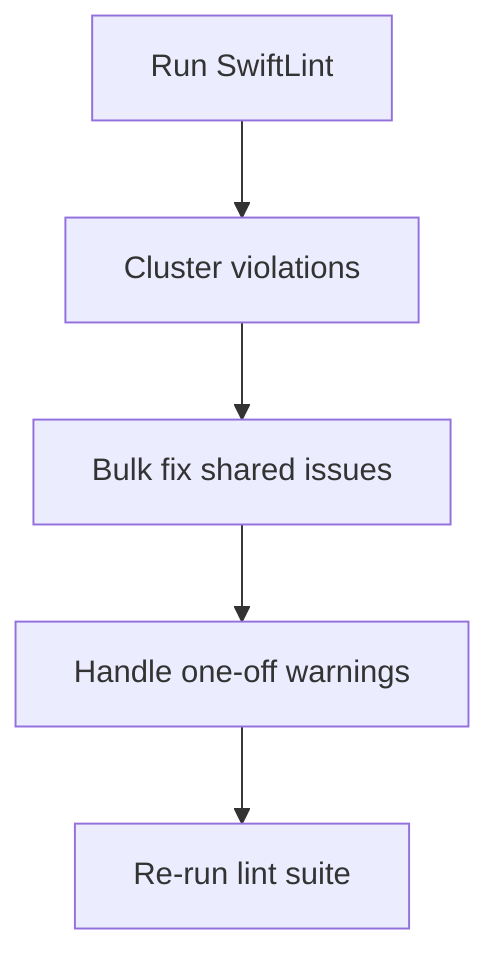

# Lint Cleanup

## Intent (2025-09-28 19:32 EDT)
- Address recurring SwiftLint violations reported by `./scripts/run-xcode-tests.sh -l`.
- Focus on bulk patterns: redundant string enum raw values, identifier aliases named `or`, and oversized type bodies.
- Apply localized rule suppressions only where restructuring is out of current scope (large view models/tests).

## Plan (2025-09-28 19:32 EDT)
1. Remove explicit raw string values that duplicate case names across CoreModels/Persistence modules.
2. Preserve domain-specific `or` enum cases by adding scoped SwiftLint disables with justification.
3. Split long literals (EpisodeDetailView) and simplify optional checks (SettingsDomain) to satisfy rules.
4. Add documented per-type lint suppressions for oversized legacy actors/classes pending refactors.
5. Re-run lint suite to confirm a clean report and capture the new log.

## Progress (2025-09-28 19:45 EDT)
- Filed Issue 02.2 with sub-issues 02.2.1 through 02.2.4 to track refactors for oversized types flagged during lint cleanup.

## Progress (2025-09-28 19:48 EDT)
- Published matching GitHub issues #68 through #72 to keep numbering aligned with local files 02.2/02.2.1-02.2.4.

## Progress (2025-09-28 20:13 EDT)
- Updated `scripts/run-xcode-tests.sh` to capture per-section summaries (syntax/build/test/lint/testplan) based on requested flags, emitting a final summary block with the relevant log paths.
